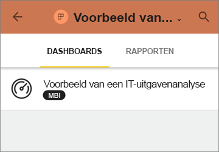
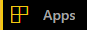
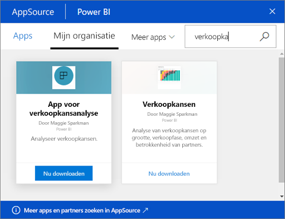

# Apps installeren en gebruiken met dashboards en rapporten in Power BI
Nu u een [basiskennis van apps](end-user-apps.md) hebt, laten we u zien hoe u apps kunt openen en ermee kunt communiceren. 

## Manieren om een ​​nieuwe app te verkrijgen
Vergeet niet dat er verschillende manieren zijn om een ​​nieuwe app te krijgen. Een collega-rapportontwerper kan de app automatisch in uw Power BI-account installeren of u een directe koppeling naar een app sturen. U kunt ook naar AppSource gaan en naar apps zoeken die voor u beschikbaar zijn, zowel binnen als buiten uw bedrijf. 

In Power BI op uw mobiele apparaat kunt u een app alleen installeren via een rechtstreekse koppeling, niet vanuit AppSource. Als de auteur van de app de app automatisch installeert, ziet u deze in uw lijst met apps.

### Een app vanuit een directe koppeling installeren
De eenvoudigste manier om zelf een nieuwe app te installeren is door een directe koppeling in een e-mail te krijgen van de auteur van de app.  

**Op uw computer** 

Wanneer u de koppeling in de e-mail selecteert, wordt Power BI-service ([https://powerbi.com](https://powerbi.com)) in een browser geopend. Bevestig dat u de app wilt installeren en Power BI opent de landingspagina van de app.

**Op uw iOS- of mobiele Android-apparaat** 

Wanneer u de koppeling in de e-mail selecteert op uw mobiele apparaat, wordt de app automatisch geïnstalleerd en wordt de app-inhoudslijst geopend in de mobiele app. 

### De app uit Microsoft AppSource downloaden
U kunt ook apps zoeken en installeren vanuit Microsoft AppSource. Alleen apps waartoe u toegang hebt (de app-auteur heeft u of iedereen toestemming gegeven) worden weergegeven.

1. Selecteer in het linkernavigatievenster de optie **Apps**  > **Apps verkrijgen**. 
   
     
2. In AppSource onder **Mijn organisatie** kunt u zoeken om de resultaten te filteren en de gewenste app vinden.
   
     
3. Selecteer **Nu downloaden** om deze aan uw Apps-inhoudslijst toe te voegen. 

## Interactie met de dashboards en rapporten in de app
U kunt nu de gegevens in de dashboards en rapporten in de app verkennen. U hebt toegang tot de standaard Power BI-interacties zoals filteren, markeren, sorteren en inzoomen. U kunt [de gegevens ook exporteren naar Excel ](end-user-export-data.md) vanuit een tabel of andere visual in een rapport. Meer informatie over [Interactie met rapporten in Power BI](end-user-reading-view.md). 

## Volgende stappen
* [Power BI-apps voor externe services](end-user-connect-to-services.md)
* Vragen? [Misschien dat de Power BI-community het antwoord weet](http://community.powerbi.com/)

