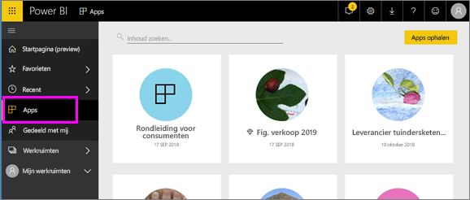

# Apps in Power BI
## Wat is een Power BI-app?
Een *app* is een Power BI-inhoudstype waarmee gerelateerde dashboards en rapporten op één locatie worden gecombineerd. Een app kan één of meer dashboards en één of meer rapporten hebben, die allemaal zijn gebundeld. Apps worden gemaakt door Power BI *-ontwerpers* die de apps distribueren en delen met *gebruikers* zoals u. 

Uw apps zijn georganiseerd in de **Apps**-inhoudslijst.

> [!NOTE]
> Als u de apps-functie wilt gebruiken, is een Power BI Pro-licentie vereist. <!-- add link to how to figure out your license -->

## App-***ontwerpers*** en app-***gebruikers***
Afhankelijk van uw rol bent u mogelijk iemand die apps maakt (ontwerper) voor uw eigen gebruik of om te delen met collega's. Of misschien bent u iemand die apps ontvangt en downloadt (gebruiker) die door anderen zijn gemaakt. Dit artikel is voor app-*gebruikers*.

## Voordelen van apps
Apps zijn gemakkelijk te vinden en te installeren in de Power BI-service ([https://powerbi.com](https://powerbi.com)) en op uw mobiele apparaat. Nadat u een app hebt geïnstalleerd, hoeft u de namen van veel verschillende dashboards niet meer te onthouden omdat ze allemaal bij elkaar staan in de app, in uw browser of op uw mobiele apparaat.

Bij apps ziet u automatisch de wijzigingen wanneer de auteur van de app updates publiceert. De auteur bepaalt ook hoe vaak de gegevens worden gepland om te worden vernieuwd, zodat u zich geen zorgen hoeft te maken over het up-to-date houden van de gegevens. 

<!-- add conceptual art -->
## Een nieuwe app verkrijgen
U kunt apps op verschillende manieren verkrijgen. 
- De auteur van de app kan de app automatisch in uw Power BI-account installeren. De volgende keer dat u Power BI opent, ziet u de nieuwe app in de **Apps**-inhoudslijst. 
- De auteur van de app kan u een rechtstreekse koppeling naar een app sturen. Als u de koppeling selecteert, wordt de app geopend in Power BI.
- U kunt zoeken naar apps in AppSource, waar u alle apps ziet waartoe u toegang hebt. AppSource bevat apps die zijn gepubliceerd door rapportontwerpers zowel binnen als buiten uw bedrijf. U vindt bijvoorbeeld mogelijk een app in AppSource voor een service die u al gebruikt, zoals Google Analytics, GitHub of Microsoft Dynamics. 
- In Power BI op uw mobiele apparaat kunt u een app alleen installeren via een rechtstreekse koppeling, niet vanuit AppSource. Als de auteur van de app de app automatisch installeert, ziet u deze in uw lijst met apps.

## Volgende stap
* [Een app openen en ermee communiceren](end-user-app-view.md)

