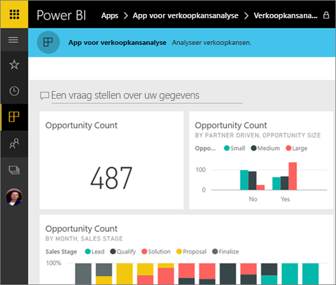
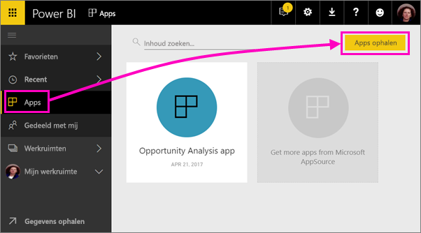
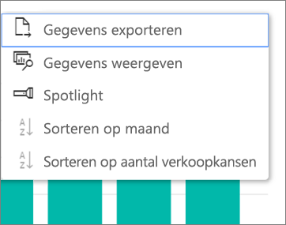

# Apps installeren en gebruiken met dashboards en rapporten in Power BI
*Apps* brengen in Power BI gerelateerde dashboards en rapporten allemaal op één plek samen. Personen in uw organisatie kunnen apps maken en distribueren met belangrijke bedrijfsinformatie. [Externe services](end-user-connect-to-services.md) waar u reeds gebruik van maakt, zoals Google Analytics en Microsoft Dynamics CRM, bieden ook Power BI-apps. 

Apps zijn gemakkelijk te vinden en installeren in de Power BI-service ([https://powerbi.com](https://powerbi.com)) en op uw mobiele apparaat. Nadat u een app hebt geïnstalleerd, hoeft u de namen van veel verschillende dashboards niet meer te onthouden omdat ze allemaal bij elkaar staan in de app, in uw browser of op uw mobiele apparaat.

Bij apps ziet u automatisch de wijzigingen wanneer de auteur van de app updates publiceert. De auteur bepaalt ook hoe vaak de gegevens worden gepland om te worden vernieuwd, zodat u zich geen zorgen hoeft te maken over het up-to-date houden van de gegevens. 

## Een nieuwe app verkrijgen
U kunt apps op verschillende manieren verkrijgen. De auteur van de app kan de app automatisch installeren in uw Power BI-account of u een directe koppeling naar een app sturen, of u kunt er naar zoeken in AppSource, waar u alle apps ziet waar u toegang tot hebt. In Power BI op uw mobiele apparaat kunt u deze alleen installeren via een directe verbinding en niet vanuit AppSource. Als de auteur van de app de app automatisch installeert, ziet u deze in uw lijst met apps.

### Een app vanuit een directe koppeling installeren
De eenvoudigste manier om zelf een nieuwe app te installeren is door een directe koppeling te krijgen van de auteur van de app. Power BI maakt een installatiekoppeling die de auteur naar u kan sturen.

**Op uw computer** 

Selecteer de koppeling in een e-mailbericht om de Power BI-service ([https://powerbi.com](https://powerbi.com)) te openen in een browser. Bevestig dat u de app wilt installeren. Vervolgens wordt de landingspagina van de app geopend.

**Op uw iOS- of mobiele Android-apparaat** 

Wanneer u de koppeling in de e-mail selecteert op uw mobiele apparaat, wordt de app automatisch geïnstalleerd en wordt de app-inhoudslijst geopend in de mobiele app. 

### De app uit Microsoft AppSource downloaden
U kunt ook apps binnen Microsoft AppSource zoeken en installeren. 

1. Selecteer in het linkernavigatievenster de optie **Apps**  > **Apps verkrijgen**. 
   
     
2. Zoek in AppSource onder **Mijn organisatie** om de resultaten te filteren en de gewenste app te vinden.
   
     
3. Selecteer **Nu downloaden** om deze aan uw pagina met apps toe te voegen. 

## Interactie met de dashboards en rapporten in de app
U kunt nu de gegevens in de dashboards en rapporten in de app verkennen. U hebt toegang tot de standaard Power BI-interacties zoals filteren, markeren, sorteren en inzoomen. U kunt [de gegevens ook exporteren naar Excel ](end-user-export-data.md) vanuit een tabel of andere visual in een rapport. Meer informatie over [Interactie met rapporten in Power BI](end-user-reading-view.md). 

## Volgende stappen
* [Power BI-apps voor externe services](end-user-connect-to-services.md)

