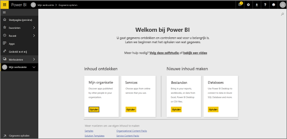
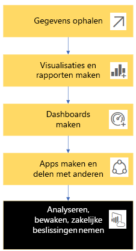
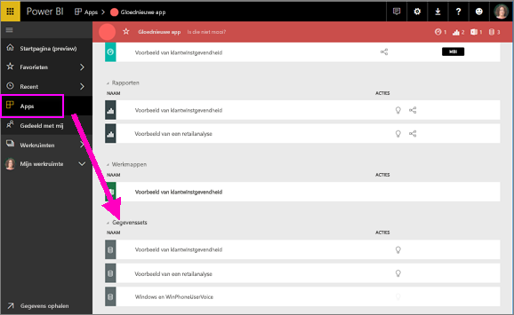
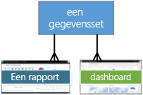
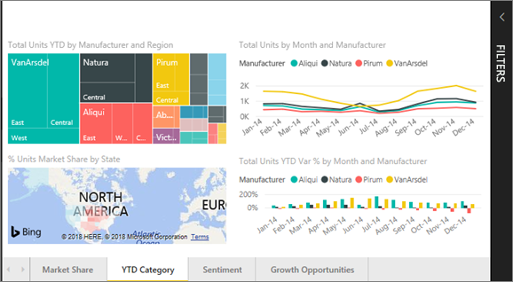
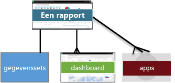
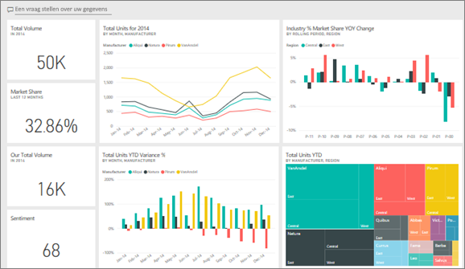
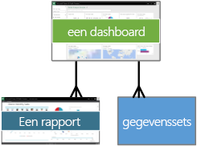
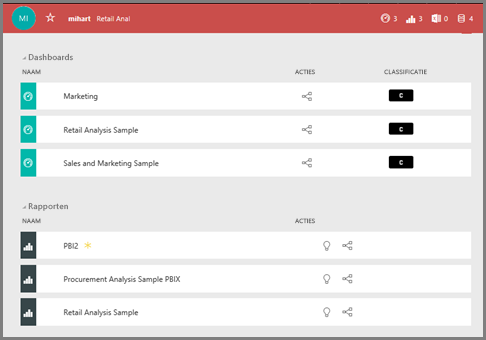

# Basisconcepten voor ***gebruikers*** van de Power BI-service

## *Consumenten* en *ontwerpers* van Power BI
In dit artikel wordt ervan uitgegaan dat u het [Power BI-overzicht](../power-bi-overview.md) al hebt gelezen en u zich hebt geïdentificeerd als een Power BI-***consument***. Consumenten ontvangen Power BI-inhoud, zoals dashboards en rapporten, van collega's. Consumenten maken gebruik van Power BI-service, de websiteversie van Power BI. 

U hebt ongetwijfeld de term 'Power BI Desktop' of gewoon 'Desktop' gehoord. Dat is een zelfstandig hulpprogramma dat wordt gebruikt door *ontwerpers* die dashboards en rapporten maken en met u delen. Het is belangrijk te weten dat er nog meer Power BI-hulpprogramma's zijn. Als u een consument bent, werkt u echter alleen met Power BI-service. Dit artikel is ook alleen van toepassing op Power BI-service. 

## Termen en concepten
Dit artikel is geen visuele rondleiding door Power BI en ook geen praktische zelfstudie. Het is in plaats daarvan een overzichtsartikel om u vertrouwd te maken met de termen en concepten van Power BI. U leert hiermee als het ware het jargon en de grondbeginselen kennen. [Volg een rondleiding](end-user-experience.md) voor een rondleiding door Power BI-service en de navigatiemogelijkheden.

## Power BI-service voor het eerst openen
De meeste Power BI-consumenten verkrijgen Power BI-service omdat 1) hun bedrijf licenties koopt en 2) een beheerder deze licenties aan werknemers als u toewijst. 

Als u wilt beginnen, opent u een browser en typt u **app.powerbi.com**. De allereerste keer dat u Power BI-service opent, ziet u zoiets als dit.

Als u Power BI gebruikt, kunt u aanpassen wat u ziet wanneer u de website in het vervolg opent.  Sommige mensen willen graag dat Power BI wordt geopend met de startpagina, terwijl anderen een favoriet dashboard hebben dat ze het eerst willen zien. Maakt u zich geen zorgen, we leren u hoe u dit doet. 
- [Startpagina (preview)](https://powerbi.microsoft.com/blog/introducing-power-bi-home-and-global-search)    
- [Inhoud instellen als **aanbevolen**](end-user-featured.md) 

Maar voordat we verdergaan, doen we eerst een stapje terug en nemen we de bouwstenen van Power BI-service door.

## Power BI-***inhoud***
### Inleiding tot bouwstenen
De vijf bouwstenen voor een Power BI-consument zijn: ***visualisaties***, ***dashboards***, ***rapporten***, ***apps*** en  ***gegevenssets***. Deze worden soms aangeduid als *Power BI*-***inhoud***. Deze *inhoud* bevindt zich in ***werkruimten***. Een gebruikelijke werkstroom omvat alle volgende bouwstenen:  Een Power BI-*ontwerper* (geel in het onderstaande diagram) verzamelt gegevens uit *gegevenssets*, voert deze in Power BI in voor analyse, maakt  *rapporten* vol *visualisaties* die interessante feiten en inzichten belichten, maakt visualisaties uit rapporten vast aan een dashboard en deelt de rapporten en dashboards met *consumenten* , zoals u, (zwart in het onderstaande diagram) in de vorm van *apps* of andere typen gedeelde inhoud. 

In de eenvoudigste vorm. 
*  Een ***visualisatie*** (of *visual*) is een type diagram dat is gemaakt door Power BI-*ontwerpers* met behulp van de gegevens in *rapporten* en *gegevenssets*. Gewoonlijk maken *ontwerpers* de visuals in Power BI Desktop. 

    Zie [Visualisaties voor Power BI-*consumenten*](end-user-visualizations.md) voor meer informatie

*  Een *gegevensset* is een container met gegevens. Het kan bijvoorbeeld een Excel-bestand van de Wereldgezondheidsorganisatie zijn, een bedrijfsdatabase met klanten of een Salesforce-bestand.  

*  Een *dashboard* is één scherm met interactieve visuals, tekst en grafische weergaven. Op een dashboard worden uw belangrijkste metrische gegevens op één scherm bij elkaar gebracht om een boodschap over te brengen of een vraag te beantwoorden. De inhoud van het dashboard komt uit een of meer rapporten en een of meer gegevenssets.

    Zie [Dashboards voor Power BI-*consumenten*](end-user-dashboards.md) voor meer informatie

*  Een *rapport* bevat een of meer pagina's met interactieve visuals, tekst en grafische weergaven die samen één geheel vormen. Een rapport is gebaseerd op een enkele gegevensset. Vaak komt per rapportpagina een centraal interessegebied of één vraagstuk aan de orde.

    Zie [Rapporten voor Power BI-*consumenten*](end-user-reports.md) voor meer informatie

*  Een *app* is een manier waarop *ontwerpers* gerelateerde dashboards en rapporten bundelen en delen. *Consumenten* ontvangen sommige apps automatisch maar kunnen ook zoeken naar andere apps die zijn gemaakt door collega's of de community. Power BI-apps worden bijvoorbeeld aangeboden door externe services waarvan u mogelijk al gebruikmaakt, zoals Google Analytics en Microsoft Dynamics CRM.

Voor de duidelijkheid: als u een volledig nieuwe gebruiker bent en u zich voor het eerst bij Power BI aanmeldt, hebt u nog geen dashboards, apps of rapporten. 
_______________________________________________________

## Gegevenssets
Een *gegevensset* is een verzameling gegevens die *ontwerpers* importeren of waar ze verbinding mee maken en die ze vervolgens gebruiken om rapporten en dashboards mee te maken. Als consument hebt u geen directe interactie met gegevenssets, maar het is wel handig om inzicht te krijgen in hoe ze in het grotere geheel passen.  

Elke gegevensset vertegenwoordigt één bron van gegevens, bijvoorbeeld een Excel-werkmap in OneDrive, een on-premises SSAS-gegevensset in tabelvorm of een Salesforce-gegevensset. Er worden veel verschillende gegevensbronnen ondersteund.

Wanneer een ontwerper een app met u deelt, kunt u zien welke gegevenssets zijn opgenomen in de app. 

**Eén** dataset

* kan steeds opnieuw worden gebruikt
* kan in tal van verschillende rapporten worden gebruikt
* Visualisaties uit die ene gegevensset kunnen worden weergegeven op een groot aantal verschillende dashboards
  
  

Nu over naar de volgende bouwsteen: visualisaties.
__________________________________________________________

## Visualisaties
Visualisaties (ook wel visuals genoemd) geven inzichten weer die zijn gedetecteerd in de gegevens. Visualisaties maken het gemakkelijker om de inzichten te interpreteren, omdat uw hersenen een afbeelding sneller kunnen doorgronden dan bijvoorbeeld een spreadsheet met getallen.

Enkele van de visualisaties die u in Power BI tegenkomt zijn: watervalgrafieken, linten, treemaps, cirkeldiagrammen, trechterdiagrammen, kaarten, spreidingsdiagrammen en meters. Zie de [volledige lijst met visualisaties in Power BI](../power-bi-visualization-types-for-reports-and-q-and-a.md).

   

Visualisaties zijn ook beschikbaar via de community en heten daar *aangepaste visuals*. Als u een rapport ontvangt met een visual die u niet herkent, is het waarschijnlijk een aangepaste visual. Als u hulp nodig hebt bij het interpreteren van de aangepaste visual, <!--[look up the name of the report or dashboard *designer*](end-user-owner.md)-->zoekt u de naam van de *ontwerper* van het rapport of dashboard en neemt u contact op met hem of haar.

**Eén** visualisatie in een rapport

* kan herhaaldelijk worden gebruikt in hetzelfde rapport met behulp van kopiëren en plakken
* kan worden gebruikt op veel verschillende dashboards
__________________________________________________
## Rapporten
Een Power BI-rapport bestaat uit een of meer pagina's met visualisaties, grafische weergaven en tekst. Alle visualisaties in een rapport zijn afkomstig uit één gegevensset. *Ontwerpers* delen rapporten met *consumenten*, die [met de rapporten kunnen communiceren in de *Leesweergave*](end-user-reading-view.md).

**Eén** rapport

* kan worden gekoppeld aan meerdere dashboards (tegels die zijn vastgemaakt vanuit dat rapport, kunnen worden weergegeven in meerdere dashboards) en
* wordt gemaakt met gegevens uit slechts één gegevensset en  
* kan deel uitmaken van meerdere apps
  
  

________________________________________________

## Dashboards
Een dashboard vertegenwoordigt een aangepaste weergave van een subset van de onderliggende gegevensset(s). *Ontwerpers* bouwen dashboards en delen deze met *consumenten*, afzonderlijk of als onderdeel van een app. Een dashboard is een enkel canvas dat *tegels*, grafische weergaven en tekst bevat. 

  

Een tegel is een weergave van een visual die een *designer* ergens *vastmaakt*, bijvoorbeeld vanuit een rapport aan een dashboard.  Elke vastgemaakte tegel toont een [visualisatie](end-user-visualizations.md) die is gemaakt vanuit een gegevensset en is vastgemaakt aan dat dashboard. Een tegel kan ook een volledige rapportpagina, live gestreamde gegevens of een video bevatten. Er zijn tal van manieren waarop *ontwerpers* tegels aan een dashboard kunnen toevoegen. Het zijn er teveel om in dit overzichtsonderwerp te behandelen. Zie [Dashboardtegels in Power BI](end-user-tiles.md) voor meer informatie. 

Een dashboard kan niet worden bewerkt door een consument. U kunt echter wel opmerkingen toevoegen, gerelateerde gegevens weergeven, een dashboard instellen als favoriet, u erop abonneren en meer. 

Wat voor doelen hebben dashboards?  Hier volgen er slechts enkele:

* U kunt in één oogopslag alle benodigde informatie weergeven om een beslissing te nemen.
* U kunt de belangrijkste informatie over uw bedrijf bewaken
* U kunt er met dashboards voor zorgen dat alle collega's hetzelfde voor ogen hebben en allemaal dezelfde informatie weergeven en gebruiken.
* U kunt met dashboards de status van een bedrijf, product, afdelingen of marketingcampagne, enzovoort in de gaten houden.
* U kunt een gepersonaliseerde weergave van een groter dashboard maken met alle metrische gegevens die voor u belangrijk zijn

**Eén** dashboard

* kan visualisaties weergeven uit diverse gegevenssets,
* uit verschillende rapporten en
* en kan visualisaties weergeven die zijn vastgemaakt vanuit andere hulpprogramma's (bijvoorbeeld Excel).
  
  

________________________________________________

## Apps
Met deze verzamelingen van dashboards en rapporten hebt u gerelateerde inhoud bij elkaar in één pakket. Power BI-*ontwerpers* bouwen ze en delen ze met personen, groepen, een hele organisatie of in het openbaar. Als gebruiker kunt u er zeker van bent dat uw collega's en u met dezelfde gegevens werken: één vertrouwde, onomstreden versie. 

Apps zijn gemakkelijk te vinden en te installeren in de Power BI-service (https://powerbi.com)) en op uw mobiele apparaat. Nadat u een app hebt geïnstalleerd, hoeft u de namen van veel verschillende dashboards niet meer te onthouden omdat ze allemaal bij elkaar staan in de app, in uw browser of op uw mobiele apparaat. 

Deze app biedt drie gerelateerde dashboards en drie gerelateerde rapporten die gezamenlijk één app vormen.

Bij apps ziet u automatisch de wijzigingen wanneer de auteur van de app updates publiceert. De auteur bepaalt ook hoe vaak de gegevens worden gepland om te worden vernieuwd, zodat u zich geen zorgen hoeft te maken over het up-to-date houden van de gegevens.

U kunt apps op verschillende manieren verkrijgen. De ontwerper van de app kan de app automatisch in uw Power BI-account installeren of u een rechtstreekse koppeling naar een app sturen. U kunt er ook naar zoeken in Microsoft AppSource, waar u alle apps ziet waartoe u toegang hebt. In Power BI op uw mobiele apparaat kunt u apps alleen installeren via een rechtstreekse koppeling, niet vanuit AppSource. Als de app-ontwerper de app automatisch installeert, ziet u deze in uw lijst met apps.

Nadat de app is geïnstalleerd, hoeft u deze alleen maar te selecteren in uw lijst met Apps en te selecteren welk dashboard of rapport u het eerst wilt openen en verkennen.   

Hopelijk hebt u enig inzicht gekregen in de bouwstenen van uw Power BI-service voor consumenten. 

## Volgende stappen
- Bekijk de [Woordenlijst](end-user-glossary.md) en voeg deze toe aan favorieten    
- Volg een [rondleiding door Power BI-service](end-user-experience.md)
- Lees het [overzicht van Power BI, speciaal geschreven voor consumenten](end-user-consumer.md)    
- Bekijk een video waarin Will de basisconcepten bespreekt en een rondleiding door Power BI-service geeft. <iframe width="560" height="315" src="https://www.youtube.com/embed/B2vd4MQrz4M" frameborder="0" allowfullscreen></iframe>