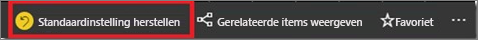

# Wijzigen hoe een diagram in een Power BI-rapport wordt gesorteerd
In een Power BI-rapport kunt u de meeste visualisaties alfabetisch sorteren op namen of categorieën in het diagram, of op de numerieke waarde van elke categorie. Zo is het onderstaande diagram op winkelnaam gesorteerd.

U kunt de sortering eenvoudig wijzigen van een categorie (winkelnaam) in een waarde (verkoop per vierkante meter).

1. Selecteer het beletselteken (...) en kies **Sort by Sales Per Sq Ft**.
2. Selecteer desgewenst het pictogram  om **aflopend** te sorteren.

   

   **OPMERKING**: niet alle visuele elementen kunnen worden gesorteerd.  De volgende visuele elementen kunnen niet worden gesorteerd: treemap, kaart, choropletenkaart, spreidingsdiagram, meter, kaart met meerdere rijen, watervalgrafiek.

## Wijzigingen opslaan die u aan de sorteervolgorde hebt aangebracht
Power BI-rapporten behouden de gemaakte wijzigingen in de filters, slicers, sorteervolgorde en gegevensweergave. Als u dus weg navigeert van een rapport en later terugkeert, worden uw wijzigingen opgeslagen.  Als u uw wijzigingen wilt terugzetten naar de instellingen van de auteur van het rapport, selecteert u **Standaardinstelling herstellen** in de bovenste menubalk. 

Als de knop **Standaardinstelling herstellen** echter in het grijs wordt weergegeven, heeft de auteur van het rapport de mogelijkheid om uw wijzigingen op te slaan (te behouden) uitgeschakeld.

## Sorteren op andere criteria
Af en toe wilt u het visuele element sorteren met behulp van een ander veld of andere criteria.  Stel dat u wilt sorteren op maand (en niet in alfabetische volgorde) of op gehele getallen in plaats van op cijfers (bijvoorbeeld op 0, 1, 9, 20 en niet op 0, 1, 20, 9).  

In sommige gevallen kunt u het visuele element sorteren zoals u dat zelf wilt, bijvoorbeeld op maand.  Als dat niet kan, dan moet u de achterliggende gegevensset enigszins aanpassen. Hier volgen enkele oplossingen:

* Gebruik in Power BI Desktop [het tabblad Data Tools Modeling om op een andere kolom te sorteren](../desktop-sort-by-column.md) (Engelstalig).
* Als u in Excel eigenaar bent van de gegevensset, voegt u een nieuwe kolom toe waaraan de naam van de maand en het getal worden toegevoegd. Vernieuw vervolgens de gegevensset of importeer deze opnieuw. De nieuwe kolom wordt weergegevens in het gedeelte Velden.
* In Excel: zorg ervoor dat de numerieke kolommen met 'geheel getal' of 'decimaal' zijn aangeduid en niet met 'tekst'.

## Volgende stappen
Meer informatie over [visualisaties in Power BI-rapporten](../visuals/power-bi-report-visualizations.md) (Engelstalig).

[Power BI - basisconcepten](end-user-basic-concepts.md)

Hebt u nog vragen? [Misschien dat de Power BI-community het antwoord weet](http://community.powerbi.com/)
