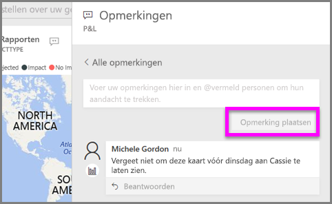
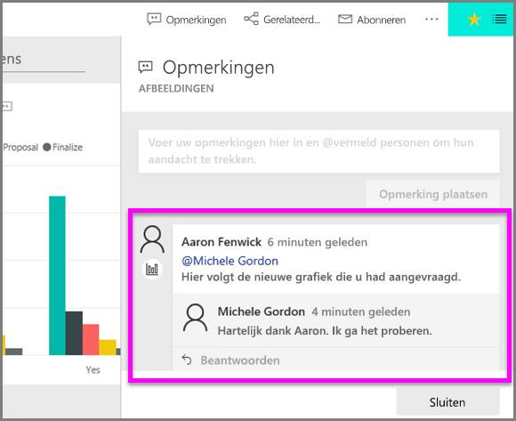

# Opmerkingen toevoegen aan een visualisatie
Voeg een persoonlijke opmerking toe of start een discussie over een visualisatie met uw collega's. De functie **Opmerkingen** is slechts een van de manieren waarop een *gebruiker* interactie kan hebben met een visualisatie. 

## De functie voor opmerkingen gebruiken

1. Beweeg de muisaanwijzer over de visualisatie en selecteer het beletselteken (...).    
2. Selecteer **Een opmerking toevoegen** in de vervolgkeuzelijst.

      

3.  Typ de opmerking en selecteer **Opmerking plaatsen**. Dit is een opmerking voor mijzelf, inclusief spelfout.

      

4. Hier volgt een gesprek dat ik heb met de *ontwerper* van de visualisatie. Hij gebruikt het teken @ om er zeker van te zijn dat ik de opmerking zie. Ik weet zo dat deze opmerking voor mij is. Ik open dit app-dashboard in Power BI en selecteer **Opmerkingen** in de kop. Ons gesprek verschijnt in het deelvenster **Opmerkingen**. 

      

5. Klik op **Sluiten** om terug te gaan naar het dashboard of rapport.

## Volgende stappen
Terug naar [visualisaties voor gebruikers](end-user-visualizations.md)    
<!--[Select a visualization to open a report](end-user-open-report.md)-->