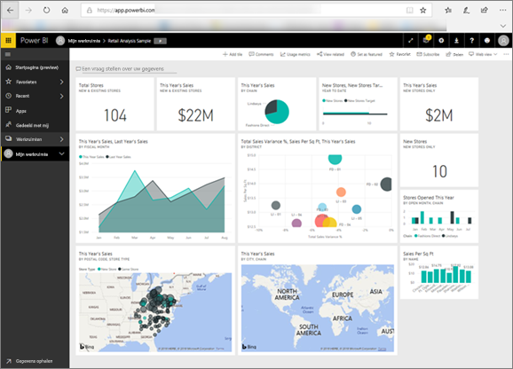

<!-- fold this topic into existing topics -->
# Power BI voor gebruikers
De manier waarop u met Power BI werkt, is afhankelijk van uw functie. Als *eindgebruiker* of *consument* bent u iemand die dashboards, rapporten en apps van collega's ontvangt. U werkt in ***Power BI-service*** om deze inhoud te beoordelen en te gebruiken voor het nemen van zakelijke beslissingen.

Als u nog geen ervaring hebt met Power BI, kunt u het beste beginnen met het lezen van het [Power BI-overzicht](../power-bi-overview.md). Daarin vindt u informatie over de set hulpprogramma’s waaruit Power BI bestaat.

Als consument hebt u geen toegang tot de volledige functionaliteit van Power BI. En dat is prima, omdat het niet uw taak is om dashboards en rapporten te bouwen. Uw taak is het gebruiken van Power BI voor analyses, bewaking, verkennen en besluitvorming.

Tijdens het lezen van de artikelen voor consumenten leert u de terminologie, krijgt u een rondleiding door Power BI-service, ontdekt u hoe u naar inhoud navigeert en leert u om die inhoud te gebruiken.  Laten we aan de slag gaan.

## Volgende stappen

[Terminologie en concepten voor Power BI *-consumenten*](end-user-basic-concepts.md)

<!-- [Get started guide for *consumers*] -->
[Aan de slag met de Power BI-service](../service-get-started.md)

