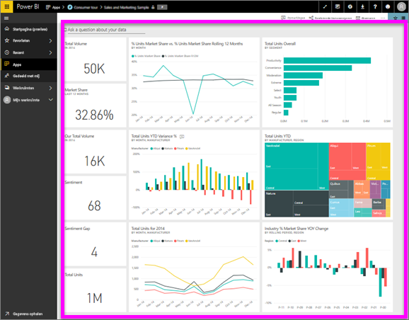

# Een dashboard weergeven
Gebruikers van Power BI besteden veel tijd aan het bekijken van dashboards. Dashboards zijn ontworpen om specifieke informatie uit de onderliggende rapporten en gegevenssets te markeren. Gebruikers van Power BI gebruiken deze informatie voor het bijhouden, controleren en beantwoorden van vragen, het doen van tests, en meer. Allemaal om zakelijke beslissingen te kunnen nemen die zijn gebaseerd op gegevens.

U hebt Power BI Pro nodig om een dashboard te kunnen delen, maar ook om een gedeeld dashboard weer te geven.

## Een dashboard openen

|              |         |
|------------|--------------------------------|
|      |Dashboards kunnen worden geopend vanaf veel locaties in de Power BI-service.   Kijk of dit dashboardpictogram wordt weergegeven. Zodra u hebt een dashboard  hebt gevonden, kunt u dit eenvoudig openen door het dashboard te selecteren. Het dashboard wordt vervolgens automatisch weergegeven  op uw Power BI-canvas. |
|                    |          |

U kunt dashboards vinden in alle containers in de linkernavigatiebalk. 
- **Startpagina** (preview)
- **Favorieten**: als u [een dashboard hebt ingesteld als favoriet](end-user-favorite.md)
- **Recent**: als u recent een dashboard hebt bezocht
- **Apps**: de meeste apps bevatten zowel dashboards als rapporten
- **Gedeeld met mij**, als een collega [een dashboard met u heeft gedeeld](end-user-shared-with-me.md)
- **Mijn werkruimte**: als u een van de [Power BI-voorbeelden](../sample-datasets.md) hebt gedownload

## Volgende stappen
* Maak kennis met dashboards door het bekijken van een van onze [voorbeelddashboards](../sample-tutorial-connect-to-the-samples.md).
* Meer informatie over [dashboardtegels](end-user-tiles.md) en wat er gebeurt als u een tegel selecteert.