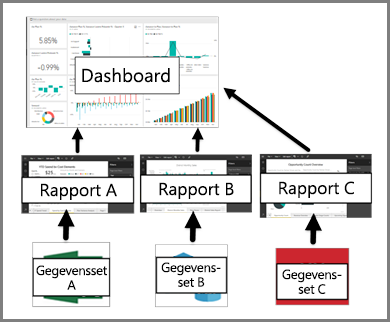

# Dashboards voor gebruikers van de Power BI-service

Een Power BI-***dashboard*** bestaat uit één pagina, ook wel een canvas genoemd, die gebruikmaakt van visualisaties om een verhaal te vertellen. Aangezien het maar één pagina betreft, bevat een goed ontworpen dashboard alleen de belangrijkste elementen van dat verhaal.

De visualisaties die u op het dashboard ziet, worden *tegels* genoemd en zijn vanuit rapporten *vastgemaakt* aan het dashboard. Als u geen ervaring hebt met Power BI kunt u een goede basis leggen door de [basisconcepten van Power BI](end-user-basic-concepts.md) te lezen

> [!NOTE]
> Dashboards zijn een functie van Power BI-service en zijn niet beschikbaar in Power BI Desktop. Dashboards kunnen niet worden gemaakt op mobiele apparaten, maar ze kunnen daar wel worden [bekeken en gedeeld](mobile/mobile-apps-view-dashboard.md).
> 
> 

De visualisaties op een dashboard zijn afkomstig uit rapporten en elk rapport is gebaseerd op één gegevensset. Een dashboard kan dan ook worden gezien als een ingang tot de onderliggende rapporten en gegevenssets. Als u een visualisatie selecteert, gaat u naar het rapport (en de gegevensset) die is gebruikt om de visualisatie te maken.

## Voordelen van dashboards
Dashboards zijn een fantastische manier om uw bedrijf te monitoren, te zoeken naar antwoorden en de belangrijkste metrische gegevens in één oogopslag te zien. De visualisaties op een dashboard kunnen afkomstig zijn uit een of meer onderliggende gegevenssets en rapporten. Een dashboard combineert on-premises gegevens en gegevens in de cloud om zo een geconsolideerde weergave te bieden van uw gegevens, ongeacht waar deze zich bevinden.

Een dashboard is meer dan een mooie visualisatie. Het is een zeer interactieve en aanpasbare oplossing en de tegels worden bijgewerkt wanneer de onderliggende gegevens veranderen.

## Dashboards versus rapporten
Rapporten worden vaak verward met dashboards omdat dit ook canvassen met visualisaties zijn. Er zijn echter een paar belangrijke verschillen.

| **Mogelijkheid** | **Dashboards** | **Rapporten** |
| --- | --- | --- |
| Pagina's |Eén pagina |Een of meer pagina's |
| Gegevensbronnen |Een of meer rapporten en een of meer gegevenssets per dashboard |Eén gegevensset per rapport |
| Beschikbaar in Power BI Desktop |Nee |Ja, u kunt rapporten maken en bekijken in Desktop |
| Vastmaken |U kunt bestaande visualisaties (tegels) alleen vanaf het huidige dashboard aan uw andere dashboards vastmaken |U kunt visualisaties (als tegels) aan elk dashboard vastmaken. U kunt hele rapportpagina's aan uw dashboards vastmaken. |
| Abonneren |U kunt zich niet abonneren op een dashboard |U kunt zich abonneren op een rapportpagina |
| Filteren |U kunt niet filteren of segmenteren |Er zijn verschillende manieren voor filteren, markeren en segmenteren |
| Waarschuwingen instellen |U kunt waarschuwingen aanmaken om u te e-mailen wanneer aan bepaalde voorwaarden is voldaan |Nee |
| Functie |U kunt één dashboard instellen als uw aanbevolen dashboard |U kunt geen aanbevolen rapport aanmaken |
| Query’s in natuurlijke taal |Op dashboard beschikbaar |Niet beschikbaar in rapporten |
| U kunt het visualisatietype wijzigen |Nee. In feite, als een eigenaar van een rapport het visualisatietype in het rapport wijzigt, wordt de vastgemaakte visualisatie op het dashboard niet bijgewerkt |Ja |
| U kunt onderliggende tabellen en velden van de gegevensset bekijken |Nee. U kunt gegevens exporteren maar tabellen en velden niet in het dashboard zelf zien. |Ja. U kunt tabellen en velden en waarden van gegevenssets bekijken. |
| U kunt visualisaties maken |Beperkt tot het toevoegen van widgets aan het dashboard met Tegel toevoegen |U kunt veel verschillende soorten visuele elementen maken, aangepaste visualisaties toevoegen, visualisaties bewerken en meer met Machtigingen bewerken |
| Aanpassen |U kunt dingen doen met de visualisaties (tegels) zoals verplaatsen en rangschikken, vergroten/verkleinen, koppelingen toevoegen, hernoemen, verwijderen en schermvullend weergeven. Maar de gegevens en visualisaties zelf zijn alleen-lezen. |In de leesweergave kunt u publiceren, insluiten, filteren, exporteren, downloaden als .pbix, gerelateerde inhoud weergeven, QR-codes genereren, analyseren in Excel en meer.  In de bewerkingsweergave kunt u alles wat tot nu toe is vermeld en nog veel meer doen. |

## Auteurs en gebruikers van dashboards
Afhankelijk van uw rol bent u mogelijk iemand die dashboards maakt voor uw eigen gebruik of om te delen met collega's. U wilt meer informatie over het maken en delen van dashboards. Of misschien bent u iemand die dashboards van anderen ontvangt. U wilt meer informatie over dashboards in het algemeen en hoe u ze gebruikt.

Hier vindt u enkele onderwerpen per rol zodat u aan de slag kunt.

U hebt Power BI Pro nodig om een dashboard te kunnen delen, maar ook om een gedeeld dashboard weer te geven.

### Als u dashboards ontvangt en gebruikt
* Maak kennis met dashboards door het bekijken van een van onze [voorbeelddashboards](../sample-tutorial-connect-to-the-samples.md).
* Meer informatie over [dashboardtegels](end-user-tiles.md) en wat er gebeurt als u een tegel selecteert.
* Wilt u een bepaalde dashboardtegel monitoren en een e-mail ontvangen wanneer deze een bepaalde drempelwaarde bereikt? [Stel dan een waarschuwing in voor de tegel](end-user-alerts.md).
* Vergroot uw kennis door vragen te stellen aan uw dashboard. Ontdek hoe u [Q&A van Power BI](end-user-q-and-a.md) gebruikt om een vraag te stellen over uw gegevens en antwoord krijgt in de vorm van een visualisatie.

> [!TIP]
> Als u hier niet hebt gevonden wat u zoekt, gebruikt u de inhoudsopgave aan de linkerkant om door alle onderwerpen te bladeren.
> 

## Volgende stappen
[Wat is Power BI?](../power-bi-overview.md)  
[Power BI - basisconcepten](end-user-basic-concepts.md)  