# Quickstart: navigeren in de Power BI-service

Nu u de basisprincipes van Power BI kent, zullen we een kijkje nemen bij de **Power BI-service**. Zoals eerder werd genoemd, brengt iemand in uw team misschien al haar tijd door in **Power BI Desktop**. Ze combineert gegevens en maakt rapporten voor anderen. Maar u, daarentegen, besteedt misschien al uw tijd aan de Power BI-service. U bekijkt en werkt interactief met inhoud die door anderen is gemaakt (de **verbruikservaring**). In deze quickstart gaat u voorbeeldgegevens importeren en die gegevens gebruiken om de Power BI-service te leren gebruiken. 
 
## Vereisten

- Als u zich niet hebt geregistreerd voor Power BI, kunt u zich hier [aanmelden voor een gratis proefversie](https://app.powerbi.com/signupredirect?pbi_source=web) voordat u begint.

- [Basisconcepten van de Power BI-service](end-user-basic-concepts.md) lezen

## De Power BI-service openen en een aantal gegevens downloaden
We nemen een aantal voorbeeldgegevens die we gebruiken voor onze rondleiding in de Power BI-service. We bieden u talloze soorten voorbeeldgegevens die u kunt verkennen; we gebruiken in dit voorbeeld de gegevens over detailhandels.    
1. Open app.powerbi.com en selecteer de koppeling voor **Voorbeelden**. 

    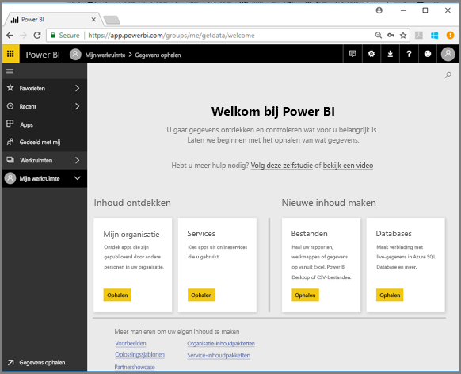

2. Selecteer **Voorbeeld van een retailanalyse > Verbinding maken**.

    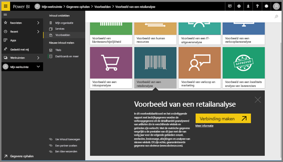

    De Power BI-service importeert het voorbeeld en geeft het dashboard weer. Dashboards zijn de elementen waarmee de Power BI-service zich onderscheidt van Power BI Desktop. Het voorbeeld bevat ook een rapport en een gegevensset, die we later zullen behandelen.

    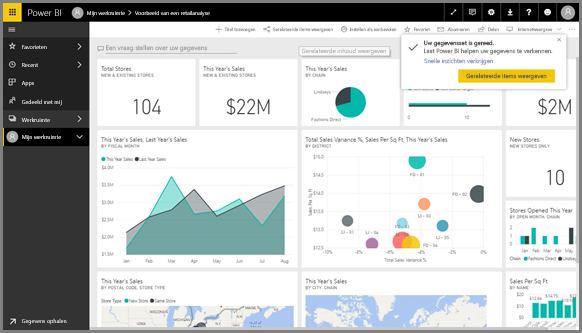

Laat Amanda u meenemen op een rondleiding door de navigatie van de Power BI-service.  Volg vervolgens de stapsgewijze instructies onder de video om zelf op verkenning uit te gaan.

<iframe width="560" height="315" src="https://www.youtube.com/embed/G26dr2PsEpk" frameborder="0" allowfullscreen></iframe>

## Inhoud weergeven (dashboards, rapporten, werkmappen, gegevenssets, werkruimten en apps)
Laten we beginnen door te kijken hoe de basisinhoud (dashboards, rapporten, gegevenssets en werkmappen) wordt geordend. Er wordt inhoud weergegeven binnen de context van een werkruimte. Op dit moment beschikt u over één werkruimte, genaamd **Mijn werkruimte**. Consumenten hebben gewoonlijk geen andere werkruimten nodig of maken er geen gebruik van. Alle inhoud waarvan u de eigenaar bent, wordt opgeslagen in Mijn werkruimte. Deze werkruimte kunt u beschouwen als een persoonlijke sandbox of persoonlijk werkgebied voor uw eigen inhoud. In Mijn werkruimte is het voorbeeld opgeslagen van een retailanalyse die u zojuist hebt gedownload. 

In Mijn werkruimte wordt uw inhoud geordend op 4 tabbladen: Dashboards, Rapporten, Werkmappen en Gegevenssets.

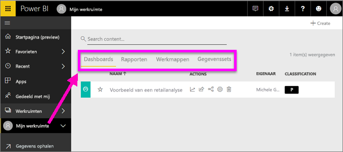

Selecteer in het linkernavigatievenster een werkruimte zodat de tabbladen voor de bijbehorende inhoud (dashboards, rapporten, werkmappen, gegevenssets) worden weergegeven op het Power BI-canvas aan de rechterkant.

Als u een nieuwe gebruiker bent, wordt er slechts één werkruimte weergegeven, namelijk **Mijn werkruimte**.

Op die tabbladen (ook wel *inhoudsweergaven* genoemd), ziet u informatie over de inhoud en acties die u op die inhoud kunt uitvoeren.  Vanaf het tabblad Dashboards kunt u bijvoorbeeld een dashboard openen, zoeken, sorteren en nog veel meer.

Open het dashboard door de dashboardnaam te selecteren.

## Dashboard en een rapport aan favorieten toevoegen
Met **Favorieten** hebt u snel toegang tot uw belangrijkste inhoud.  

1. Open het dashboard en selecteer in de rechterbovenhoek **Aan favorieten toevoegen**.
   
   
   
   **Aan favorieten toevoegen** wordt gewijzigd in **Uit favorieten verwijderen** en het sterpictogram wordt geel weergegeven.
   
   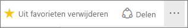

2. Als u een lijst wilt weergeven met alle inhoud die u aan Favorieten hebt toegevoegd, selecteert u in het linkernavigatievenster de pijl rechts van **Favorieten**. Omdat het linkernavigatievenster een permanente functie van de Power BI-service is, hebt u overal in de Power BI-service toegang tot deze lijst.
   
    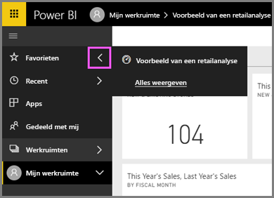
   
    We hebben nu nog maar één favoriet. Favorieten kunnen dashboards, rapporten of apps zijn.  

1. U kunt een dashboard of rapport ook als favoriet markeren via het tabblad **Dashboards** of **Rapporten** van de inhoudsweergave.  Open het tabblad **Rapporten** en selecteer het sterpictogram links naast de rapportnaam.
   
   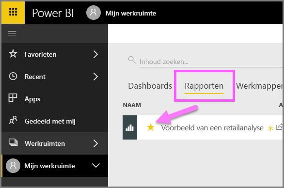

3. Open het *deelvenster* **Favorieten** door **Favorieten** te selecteren in het linkernavigatiedeelvenster of door het sterpictogram  te selecteren.
   
   
   
   U hebt nu twee favorieten: één dashboard en één rapport. Hier kunt u inhoud openen en zoeken, inhoud uit de favorieten verwijderen en inhoud met collega’s delen.

4. Selecteer de naam van het rapport om het in de rapporteditor te openen.

    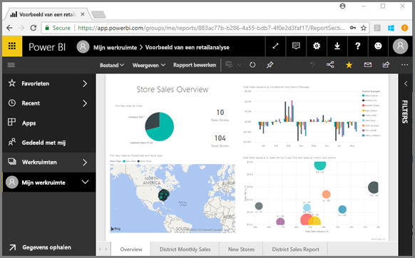

Zie [Favorieten](end-user-favorite.md) voor meer informatie

## Uw meest recente inhoud zoeken

1. Net als bij Favorieten hebt u overal in de Power BI-service snel toegang tot uw recent geopende inhoud door in het linkernavigatievenster de pijl naast **Recent** te selecteren.

   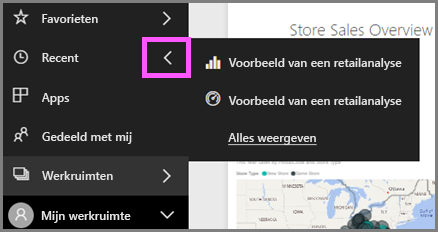

    Selecteer de inhoud in de flyout om deze te openen.

2. Soms wilt u niet simpelweg recente inhoud openen, maar informatie bekijken of een andere actie uitvoeren zoals inzichten weergeven of items exporteren naar Excel. Open in gevallen als deze het deelvenster **Recente items** door **Recent** of het bijbehorende pictogram te selecteren in het linkernavigatiedeelvenster. Als u meerdere werkruimten had, bevat deze lijst inhoud uit al uw werkruimten.

   

Zie [Recent geopende in Power BI](end-user-recent.md) voor meer informatie.

### Inhoud zoeken en sorteren
Met de nieuwe inhoudsweergave kunt u gemakkelijker inhoud zoeken, filteren en sorteren. Als u een dashboard, rapport of werkmap wilt zoeken, typt u in het zoekgebied. Power BI-filters zijn alleen van toepassing op inhoud waarvan de naam uw zoekreeks bevat.

Omdat u maar één voorbeeld hebt, is zoeken en sorteren niet nodig.  Maar indien u lange lijsten met dashboards, rapporten, werkmappen en gegevenssets hebt, is zoeken en sorteren wellicht zeer nuttig.

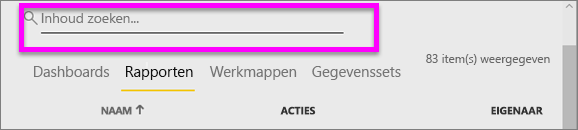

U kunt de inhoud ook sorteren op naam of eigenaar. Let op de pijl-omhoog rechts van **Naam**. Er worden momenteel 83 items alfabetisch op naam gesorteerd, oplopend. Als u de sorteervolgorde wilt wijzigen in aflopend, selecteert u **Naam**. De pijl-omhoog verandert in een pijl-omlaag.

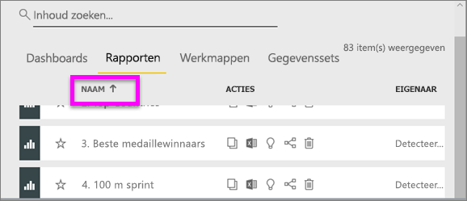

Niet alle kolommen kunnen worden gesorteerd. Beweeg de muisaanwijzer over de kolomkoppen om te zien welke kolommen kunnen worden gesorteerd.

Zie [Power BI-navigatie: zoeken en sorteren](end-user-search-sort.md) voor meer informatie

## Resources opschonen
Als u deze snelstartgids hebt voltooid, kunt u het voorbeelddashboard, het voorbeeldrapport en de voorbeeldgegevensset verwijderen.

1. Open de Power BI-service (app.powerbi.com) en meld u aan.    
2. Selecteer **Werkruimten > Mijn Werkruimte** in het linkerdeelvenster.  
    Met de gele ster wordt aangegeven dat het een favoriet betreft.    
3. Selecteer op het tabblad **Dashboards** het pictogram **Verwijderen** (prullenbak) naast het dashboard voor de retailanalyse.    

    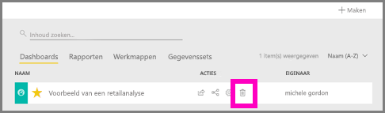

4. Selecteer het tabblad **Rapporten** en doe hetzelfde voor het rapport voor de retailanalyse.
1. Selecteer het tabblad **Gegevenssets** en doe hetzelfde voor het rapport voor de retailanalyse.

## Volgende stappen

> [!div class="nextstepaction"]
> [Leesweergave in de Power BI-service](end-user-reading-view.md)