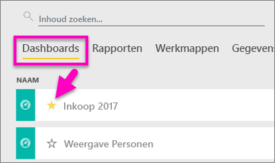
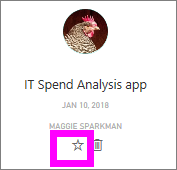
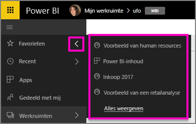
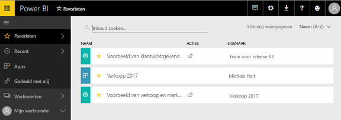
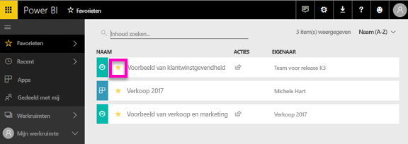

# Favoriete dashboards, rapporten en apps in de Power BI-service
Wanneer u van inhoud een *favoriet* maakt, kunt u deze inhoud openen in al uw werkruimten.  Favorieten zijn doorgaans inhoud die u vaak bezoekt.

> [!NOTE]
> Dit onderwerp is van toepassing op Power BI-service en niet op Power BI Desktop.
> 
> 

U kunt in de Power BI-service ook één dashboard selecteren als een [aanbevolen dashboard](end-user-featured.md).

## Een dashboard of rapport toevoegen als een *favoriet*
Zie hoe Amanda favorieten toevoegt aan haar werkruimte. Volg vervolgens de stapsgewijze instructies onder de video om het zelf te proberen.

<iframe width="560" height="315" src="https://www.youtube.com/embed/G26dr2PsEpk" frameborder="0" allowfullscreen></iframe>

1. Open een dashboard of rapport dat u vaak gebruikt. Ook inhoud die met u is gedeeld, kunnen een *favoriet* zijn.
2. Selecteer in de rechterbovenhoek van de Power BI-service **Favoriet** of het sterpictogram .
   
   
   
   U kunt ook een dashboard of rapport aan uw favorieten toevoegen via het tabblad **Dashboards** of **Rapporten** in uw werkruimte.
   
   

## Een app markeren als *favoriet*

1. Selecteer **Apps** in het linkernavigatievenster.

   

2. Beweeg de muisaanwijzer over een app om meer details weer te geven.  Selecteer het   sterpictogram om de app aan uw favorieten toe te voegen.
   
   

## Werken met *favorieten*
1. Om uw favorieten te zien, uit elke werkruimte, selecteert u de pijl rechts van **Favorieten**.  Hier kunt u een favoriet selecteren om het te openen. Er worden maximaal vijf favorieten weergegeven (alfabetisch). Als u meer dan vijf favorieten hebt, selecteert u **Alles weergeven** om het scherm Favorieten te openen (zie nr. 2 hieronder). 
   
   
2. Om **alle** inhoud te zien die u aan uw favorieten hebt toegevoegd, selecteert u **Favorieten** of het pictogram Favorieten  in het linkernavigatievenster.  
   
    
   
   Hier kunt u acties uitvoeren: favorieten openen, eigenaren identificeren en favorieten delen met collega's.

## Inhoud verwijderen uit favorieten
Gebruikt u een rapport niet meer zo vaak?  U kunt het verwijderen uit favorieten. Wanneer u inhoud verwijdert uit favorieten, wordt dit verwijderd uit uw favorieten maar niet uit Power BI.

1. Selecteer **Favorieten** in het navigatiedeelvenster links om het scherm **Favorieten** te openen.
   
   
2. Selecteer de gele ster naast de inhoud om dit te verwijderen uit favorieten.

> **OPMERKING**: U kunt ook een dashboard, rapport of app zelf verwijderen uit favorieten. Open het dashboard, het rapport of de app en deselecteer het gele pictogram.   
> 
> 

## Volgende stappen
[Wat is Power BI?](../power-bi-overview.md)

[Power BI - basisconcepten](end-user-basic-concepts.md)

Hebt u nog vragen? [Misschien dat de Power BI-community het antwoord weet](http://community.powerbi.com/)

