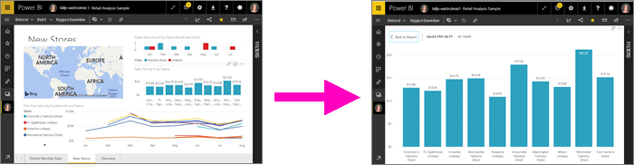
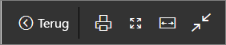
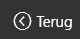
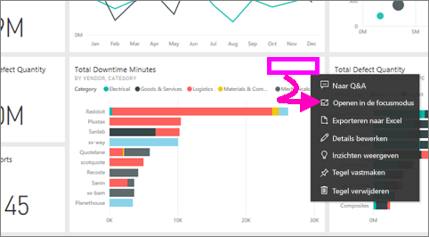
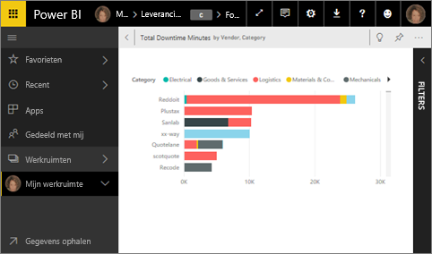
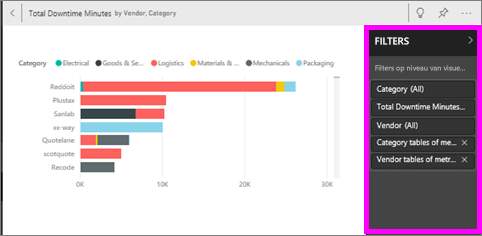
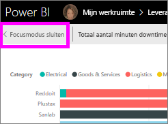
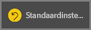
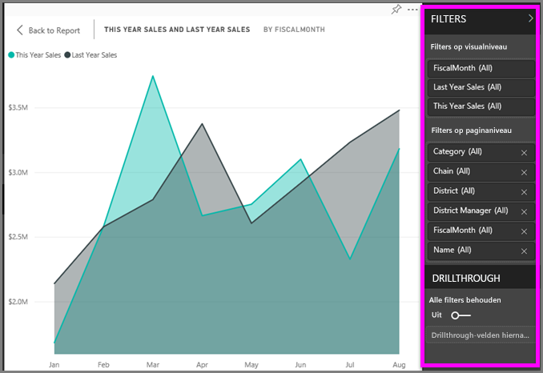
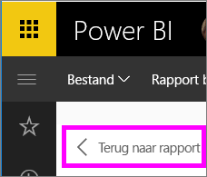

# Inhoud gedetailleerder weergeven: focusmodus en modus volledig scherm

<iframe width="560" height="315" src="https://www.youtube.com/embed/dtdLul6otYE" frameborder="0" allowfullscreen></iframe>

De focusmodus en de modus volledig scherm zijn twee verschillende manieren waarop u meer details kunt zien in visuals, in rapporten en op dashboards.  Het belangrijkste verschil is dat in de modus volledig scherm alle deelvensters om de inhoud heen worden verwijderd, terwijl u in de focusmodus nog steeds kunt werken met uw visuals. Laten we de overeenkomsten en verschillen nader bekijken.  

|Inhoud    | Focusmodus  |Modus volledig scherm  |
|---------|---------|----------------------|
|Dashboard     |   Niet mogelijk     | ja |
|Rapportpagina   | Niet mogelijk  | ja|
|Rapportvisualisatie | ja    | ja |
|Dashboardtegel | ja    | ja |
|Windows 10 Mobile | Niet mogelijk | Ja |

## Wat is de modus Volledig scherm?

Geef de inhoud van de Power BI-service (dashboards, rapportpagina's, tegels en visualisaties) weer zonder de afleiding van menu's en navigatiebalken.  U kunt uw tegel zonder andere storende factoren weergeven op het volledige scherm. Dit wordt soms TV-modus genoemd.   

Als u de modus volledig scherm wilt openen, selecteert u het pictogram **Volledig scherm** () op de menubalk van de Power BI-service boven aan uw dashboard, rapport, tegel of visual in de focusmodus.  De geselecteerde inhoud vult nu het hele scherm.
Als u Power BI mobiel gebruikt, [is de modus Volledig scherm beschikbaar voor Windows 10 Mobile-apps](./mobile/mobile-windows-10-app-presentation-mode.md). 

Enkele gebruikstoepassingen voor de modus Volledig scherm zijn:

* Uw dashboard, tegel, visual of rapport op een vergadering of conferentie presenteren.
* Het element op kantoor weergeven op een speciaal groot scherm of projector.
* Het element op een klein scherm weergeven.
* Controle in de vergrendelde modus: u kunt het scherm aanraken of de muis over tegels bewegen zonder het onderliggende rapport te openen.

## Wat is de focusmodus?
Met de ***focusmodus*** kunt u een visual of tegel uitvouwen (pop-out) om meer details te zien.  Misschien hebt u een dashboard of rapport dat te vol is en wilt u inzoomen op slechts één visual.  De focusmodus is de perfecte oplossing hiervoor.  

In de focusmodus kan een Power BI-*gebruiker* werken met filters die zijn toegepast op het moment dat de visual is gemaakt.  In de Power BI-service kunt u de focusmodus gebruiken op een dashboardtegel of in een rapportvisual.

## Werken in de modus volledig scherm
Als u een dashboard of rapportpagina wilt openen in de modus volledig scherm, selecteert u het pictogram Volledig scherm  in de bovenste navigatiebalk. Zodra de modus volledig scherm is geopend, wordt er een snelmenu weergegeven wanneer u de muisaanwijzer of cursor verplaatst. Omdat het volledige scherm beschikbaar is voor een breed scala aan inhoud, verschillen de opties in het snelmenu allemaal licht. Ze wijzen echter redelijk voor zich.  Wijs gewoon een pictogram aan om een definitie te zien.

Menu voor dashboards    
    

Menu voor rapportpagina's    
    

  *     
  Met de knop **Terug** gaat u naar de vorige pagina in uw browser. Als de vorige pagina een Power BI-pagina was, wordt deze weergegeven in de modus Volledig scherm.  De modus Volledig scherm blijft actief totdat u de modus afsluit.

  *     
  Met deze knop drukt u uw dashboard of rapportpagina af in de modus Volledig scherm.

  *     
    Met de knop **Aanpassen aan scherm** geeft u het dashboard zo groot mogelijk weer, zonder schuifbalken.  

    

  *        
    Soms hebt u geen behoefte aan schuifbalken, maar wilt u dat het dashboard wordt weergegeven over volledige breedte van de beschikbare ruimte. Selecteer de knop **Aanpassen aan breedte**.    

    

  *        
    Wanneer rapporten op het volledige scherm worden weergegeven, gebruikt u deze pijlen om door de pagina's in het rapport te bladeren.    
  * Als u de modus Volledig scherm wilt afsluiten, selecteert u het pictogram **Volledig scherm afsluiten**.

      

## Werken in de focusmodus
Er zijn twee manieren om de focusmodus te openen: eentje voor dashboardtegels en eentje voor rapportvisualisaties.

### Focusmodus op dashboards
1. Open een dashboard in de Power BI-service.

2. Beweeg de muisaanwijzer over de tegel of rapportvisualisatie, selecteer het beletselteken (...) en kies **Openen in de focusmodus**.

    .

2. De tegel wordt geopend en op het volledige rapportcanvas weergegeven.

   

3. Vouw het deelvenster Filters uit om alle filters weer te geven die zijn toegepast op deze visual.

   

4. U kunt nog meer verkennen door [de filters aan te passen](end-user-report-filter.md) en te zoeken naar interessante ontdekkingen in uw gegevens.  

5. U kunt de focusmodus sluiten en terugkeren naar het dashboard door  **Focusmodus sluiten** te selecteren (in de linkerbovenhoek van de visual).

        

## Focusmodus voor rapportvisualisaties
1. Open een rapport in de Power BI-service.  In dit voorbeeld gebruiken we het retailanalysevoorbeeld ter demonstratie.

1. Als het rapport is geopend, selecteert u het **tabblad Maandelijkse regionale verkoop**.

2. Wijs de regiografiek aan in de linkerbenedenhoek en selecteer het pictogram **Focusmodus** ().  

   
2. De visualisatie wordt geopend en op het volledige canvas weergegeven.

   
3. U kunt optioneel het deelvenster Filters uitvouwen om te werken met de filters die zijn toegepast op deze visual. Kijk nauwkeuriger naar de gegevens voor nieuwe inzichten en antwoorden op vragen. Als *gebruiker* kunt u geen nieuwe filters toevoegen, niet de velden wijzigen die worden gebruikt in de visualisaties, en geen nieuwe visualisaties maken.  Alle wijzigingen die u aanbrengt in de bestaande filters, worden echter opgeslagen wanneer u Power BI afsluit. Als u niet wilt dat uw wijzigingen worden onthouden in Power BI, selecteert u **Standaardinstelling herstellen**.   

   

5. U kunt de focusmodus sluiten en terugkeren naar het rapport door **Terug naar rapport** te selecteren (in de linkerbovenhoek van de visual).

      

## Aandachtspunten en probleemoplossing
* Als u de focusmodus gebruikt voor een visualisatie in een rapport, kunt u alle filters weergeven en gebruiken, zowel op het niveau van visuals, op paginaniveau, bij drillthrough als op rapportniveau.    
* Als u de focusmodus gebruikt voor een visualisatie in een dashboard, kunt u alleen de filters op het niveau van de visuele elementen weergeven en gebruiken.

## Volgende stappen
[Instellingen voor rapporten weergeven](end-user-report-view.md)