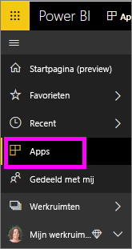
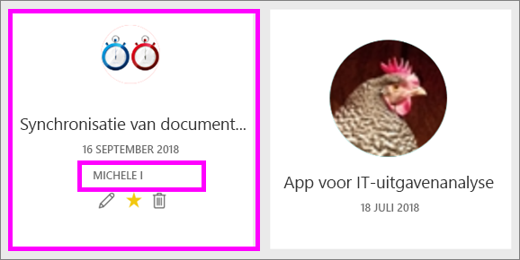
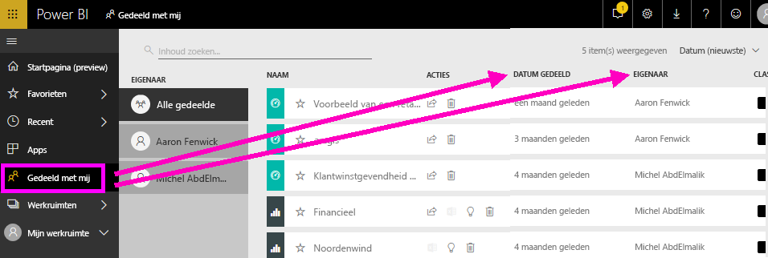
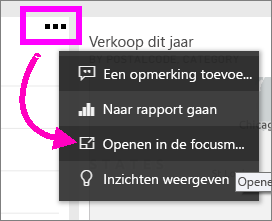
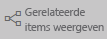
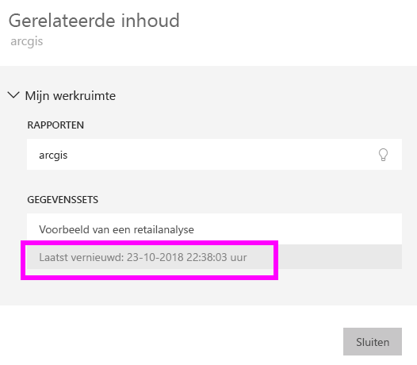

# Uw inhoud is up-to-date
Als *consument* werkt u met inhoud die is gemaakt door *ontwerpers* en met u is gedeeld. U vraagt zich misschien af of die inhoud is bijgewerkt, of misschien wilt u alleen weten wanneer die inhoud voor het laatst is vernieuwd. Het geeft u zelfvertrouwen als u weet dat u met de nieuwste inhoud werkt.  
 

Ervoor zorgen dat u de nieuwste gegevens gebruikt, is vaak essentieel om de juiste beslissingen te nemen. Wat kunt u doen om te controleren of u de nieuwste inhoud gebruikt? In veel gevallen hoeft u helemaal niets te doen. Apps die met u zijn gedeeld, worden automatisch vernieuwd en bijgewerkt volgens een planning die de app-ontwerper heeft ingesteld. Hetzelfde geldt voor dashboards en rapporten die met u worden gedeeld. De ontwerper zorgt er handmatig of met behulp van een schema voor geautomatiseerde vernieuwing voor dat de inhoud actueel is.  

Neem contact op met de ontwerper als u vragen hebt over de actualiteit van gegevens.

## De naam van de ontwerper vinden

### Apps

Het app-scherm toont zowel de naam van de ontwerper als de datum waarop die app is gemaakt.  

1. Selecteer **Apps** in het linkernavigatievenster.

    

    Voor elke app ziet u een titel en de datum waarop deze is gemaakt. 

2. Beweeg de muisaanwijzer over de app om ook de naam van de ontwerper weer te geven. 

    

### Gedeeld met mij
Op het scherm **Gedeeld met mij** ziet u de naam van de eigenaar van de inhoud, evenals de datum waarop de inhoud met u is gedeeld.

 

## De datum van laatste vernieuwing vinden
Als u dat wilt, kunt u voor de meeste inhoud de datum van de laatste vernieuwing vinden. 

### Update van dashboardtegels
Voor dashboardtegels bekijkt u de tegel in de focusmodus om het tijdstempel van de laatste vernieuwing te zien.

1. Selecteer op de dashboardtegel het beletselteken (...) en kies **Openen in de focusmodus**.

    

2. In de rechterbovenhoek wordt de datum van de laatste vernieuwing weergegeven. Als u deze niet ziet, vouwt u uw browser uit om deze te verbreden. 

    

### Vanuit dashboards en rapporten
Een andere manier om de datum van de laatste vernieuwing te vinden is via **Gerelateerde items weergeven**.  **Gerelateerde items weergeven** is beschikbaar in de bovenste menubalk van Power BI.

Op het deelvenster **Gerelateerde inhoud** wordt informatie over de laatste vernieuwing van de onderliggende gegevensset van het dashboard of rapport weergegeven.

## Wat er gebeurt als een app door de ontwerper wordt verwijderd

Als een ontwerper een app verwijdert, worden de dashboards en rapporten die aan de app zijn gekoppeld ook automatisch uit uw Power BI-werkruimte verwijderd. Ze zijn niet meer beschikbaar en de app wordt niet meer weergegeven in het navigatiedeelvenster.

## Abonneren om wijzigingen te zien
U kunt ook up-to-date blijven door u te abonneren op een rapport of dashboard. In plaats van dat u zich moet aanmelden en een rapport of dashboard moet openen, geeft u aan Power BI door dat u een momentopname wilt ontvangen volgens een schema dat u zelf instelt.  Zie [Abonneren op dashboards en rapporten](end-user-subscribe.md) voor meer informatie.

## Gegevensmeldingen instellen
Wilt u een melding als de gegevens een door u ingestelde limiet overschrijden? [Maak een gegevensmelding](end-user-alerts.md).  Met gegevensmeldingen blijft u eenvoudig up-to-date. Met gegevensmeldingen geeft u aan Power BI door dat u een e-mail wilt ontvangen als een waarde in een rapport een specifieke drempelwaarde overschrijdt.  Voorbeelden zijn als de voorraad onder de 25 eenheden komt of als er verkoopdoelstellingen worden overschreden.  

## Volgende stappen
[Een gegevensmelding maken](end-user-alerts.md)    
[Abonneren op dashboards en rapporten](end-user-subscribe.md)    
[Gerelateerde inhoud weergeven](end-user-related.md)    
