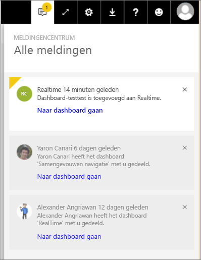

# Power BI-meldingen
Het meldingencentrum is een sequentiële feed met informatie over uw Power BI-ervaring. Open het meldingencentrum om berichten te bekijken over nieuwe dashboards die met u zijn gedeeld, wijzigingen in uw groepsruimte, informatie over Power BI-gebeurtenissen en -vergaderingen, waarschuwingen die u hebt ingesteld en meer. U kunt [meldingen instellen in de Power BI-service](../service-set-data-alerts.md), maar ook in de mobiele Power BI-apps.

Kijk hoe Amanda meldingen bekijkt die ze heeft ontvangen, haar meldingen beheert en op meldingen reageert. Volg vervolgens de instructies onder de video om het zelf te proberen.

<iframe width="560" height="315" src="https://www.youtube.com/embed/bZMSv5KAlcE" frameborder="0" allowfullscreen></iframe>

1. Wanneer u zich aanmeldt bij Power BI, worden alle nieuwe meldingen die naar u zijn verzonden terwijl u offline was, toegevoegd aan uw feed. Als u nieuwe meldingen hebt, wordt er een gele ballon met het aantal nieuwe items weergegeven in Power BI.
   
   
2. Selecteer in de menubalk van Power BI het meldingenpictogram.
   
   
3. De nieuwste meldingen worden bovenaan weergegeven en ongelezen berichten worden gemarkeerd. Meldingen worden gedurende 90 dagen bewaard, tenzij u ze eerder verwijdert of de limiet van 100 berichten bereikt.
   
   
4. Als u een melding wilt verwijderen selecteert u het X-pictogram.

### Volgende stappen
* [Gegevenswaarschuwingen in de Power BI-service](../service-set-data-alerts.md)
* [Een Microsoft Flow maken die wordt geactiveerd door een Power BI-gegevensmelding](../service-flow-integration.md)
* [Gegevensmeldingen instellen in de iPhone-app (Power BI voor iOS)](mobile/mobile-set-data-alerts-in-the-mobile-apps.md)
* [Gegevensmeldingen instellen in de mobiele Power BI-app instellen voor Windows 10](mobile/mobile-set-data-alerts-in-the-mobile-apps.md)
* Nog vragen? [Misschien dat de Power BI-community het antwoord weet](http://community.powerbi.com/)

