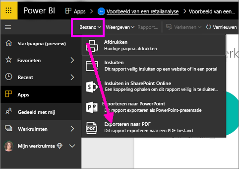
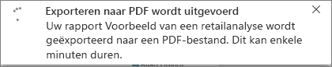
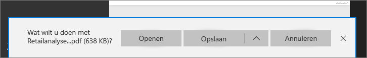

# Rapporten exporteren van Power BI naar PDF
Met Power BI kunt u uw rapport publiceren naar PDF-indeling en heel eenvoudig een document op basis van uw Power BI-rapport maken. Wanneer u **naar PDF exporteert**, wordt elke pagina in het Power BI-rapport een afzonderlijke pagina in het PDF-document.

## Uw Power BI-rapport naar PDF exporteren
Selecteer in de Power BI-service een rapport om weer te geven op het canvas. U kunt ook een rapport selecteren via de pagina Start, Apps of een andere sectie in het linkernavigatievenster.

1. Selecteer **Bestand** > **Exporteren naar PDF** in de menubalk.

    

    Er wordt een voortgangsbalk weergegeven in de rechterbovenhoek. Het exporteren kan enkele minuten duren; u kunt tijdens het exporteren van het rapport in Power BI blijven werken.

    

    Wanneer u klaar bent, wijzigt de meldingsbanner zodat u weet dat de Power BI-service het exportproces heeft voltooid.

2. Het bestand is beschikbaar wanneer de gedownloade bestanden worden weergegeven in uw browser. In de volgende afbeelding wordt dit weergegeven als een downloadbanner langs de onderkant van het browservenster.

    

Zo eenvoudig werkt dat. U kunt het bestand downloaden en openen met een PDF-viewer, zoals de viewer in Microsoft Edge.

## Beperkingen en overwegingen
Er zijn enkele overwegingen en beperkingen waarmee u rekening moet houden bij het werken met de functie **Exporteren naar PDF**.

- Interactiviteiten in de sessie, zoals markeren en filteren, inzoomen enzovoort, worden nog niet ondersteund bij het exporteren naar PDF. In de geëxporteerde PDF worden de oorspronkelijke visuals weergegeven zoals ze zijn opgeslagen in het rapport. Als u filters en slicers hebt toegepast en deze wilt behouden in de export, slaat u het rapport op en voert u vervolgens de export uit.

* **R-visualisaties** worden momenteel niet ondersteund. Deze visuals zijn in de PDF leeg en er wordt een foutbericht weergegeven.  

* **Aangepaste visuele elementen** die zijn **gecertificeerd** worden ondersteund. Voor meer informatie over gecertificeerde aangepaste visuele elementen, inclusief een certificatie verkrijgen voor een aangepast visueel element, zie [Een certificatie verkrijgen voor een aangepast visueel element](../power-bi-custom-visuals-certified.md). Aangepaste visuals die niet zijn gecertificeerd, worden niet ondersteund. Deze worden in de PDF met een foutbericht weergegeven.   

* Rapporten met meer dan 30 rapportpagina's kunnen momenteel niet worden geëxporteerd.

* Het proces van het exporteren van een rapport naar PDF kan enkele minuten duren. Factoren die de benodigde tijd kunnen beïnvloeden zijn onder meer de structuur van het rapport en de huidige belasting van de Power BI-service.

* Als het menu-item **Exporteren naar PDF** niet beschikbaar is in de Power BI-service, heeft uw tenantbeheerder de functie waarschijnlijk uitgeschakeld. Neem contact op met uw tenantbeheerder voor meer informatie.

* Achtergrondafbeeldingen worden bijgesneden binnen het begrenzingsgebied van de grafiek. Het wordt ten zeerste aanbevolen om achtergrondafbeeldingen te verwijderen voordat u naar PDF exporteert.

* Rapporten die eigendom zijn van een gebruiker buiten uw Power BI-tenantdomein (zoals een rapport dat eigendom is van iemand buiten uw organisatie en dat met u wordt gedeeld) kunnen niet naar PDF worden gepubliceerd.

* Als u een dashboard deelt met iemand buiten uw organisatie (en daarmee een gebruiker die geen deel uitmaakt van uw Power BI-tenant), dan kan die gebruiker de aan het gedeelde dashboard gekoppelde rapporten niet exporteren naar PDF. Als u bijvoorbeeld aaron@contoso.com bent, kunt u delen met cassie@cohowinery.com. Maar cassie@cohowinery.com kan de gekoppelde rapporten niet exporteren naar PDF.

* De Power BI-service gebruikt uw taalinstelling voor Power BI als taal voor het geëxporteerde PDF-bestand. Als u uw voorkeurstaal wilt zien of instellen, selecteert u het tandwielpictogram > **Instellingen** > **Algemeen** > **Taal**.

## Volgende stappen
[Een rapport afdrukken](end-user-print.md)