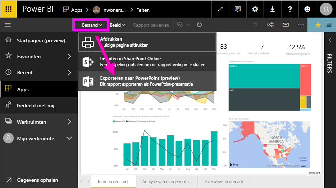
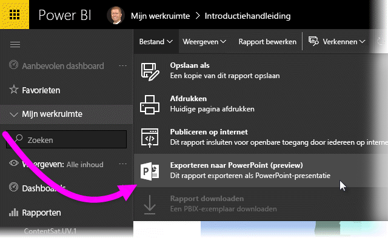
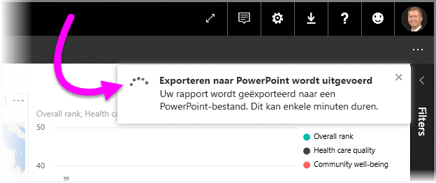
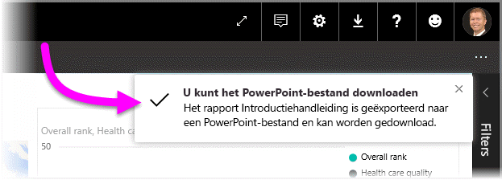
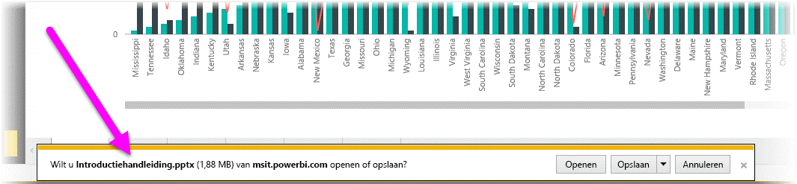
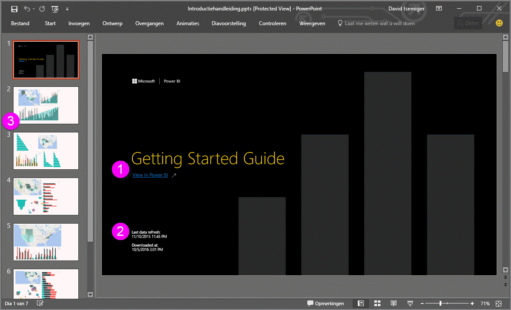
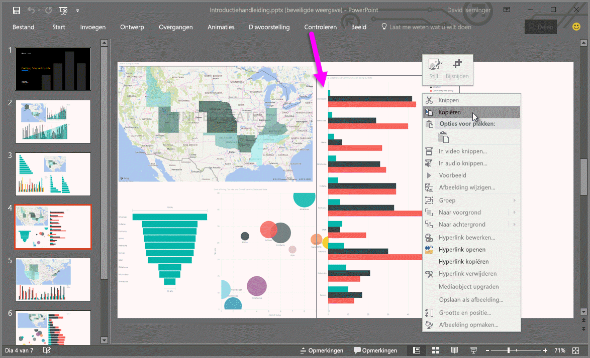

# Rapporten exporteren van Power BI naar PowerPoint
Met Power BI kunt u uw rapport publiceren naar **Microsoft PowerPoint** en heel eenvoudig een presentatie op basis van uw Power BI-rapport maken. Wanneer u wilt **exporteren naar PowerPoint** gebeurt het volgende:

* Elke pagina in het Power BI-rapport wordt een afzonderlijke dia in PowerPoint
* Elke pagina in het Power BI-rapport wordt geëxporteerd als een enkele afbeelding met een hoge resolutie in PowerPoint <!-- * The filters and slicers settings that you added to the report are preserved. -->
* In PowerPoint wordt een koppeling gemaakt die verwijst naar het Power BI-rapport 

Het ophalen van uw **Power BI-rapport** dat is geëxporteerd naar **PowerPoint** gaat snel. Volg de stappen in de volgende sectie.

## Uw Power BI-rapport naar PowerPoint exporteren
Selecteer in de Power BI-service een rapport om weer te geven op het canvas. U kunt ook een rapport selecteren via de pagina **Start**, **Apps** of een andere sectie in het linkernavigatievenster.

Wanneer het rapport dat u wilt exporteren naar PowerPoint wordt weergegeven op het canvas, selecteert u **Bestand > Exporteren naar PowerPoint** in de menubalk in de Power BI-service.

Hier ziet u een meldingsbanner in de rechterbovenhoek van het browservenster van de Power BI-service die aangeeft dat het rapport wordt geëxporteerd naar PowerPoint. Dit kan enkele minuten duren; u kunt tijdens het exporteren van het rapport in Power BI blijven werken.

Wanneer u klaar bent, wijzigt de meldingsbanner zodat u weet dat de Power BI-service het exportproces heeft voltooid.

Het bestand is beschikbaar wanneer de gedownloade bestanden worden weergegeven in uw browser. In de volgende afbeelding wordt dit weergegeven als een downloadbanner langs de onderkant van het browservenster.

Zo eenvoudig werkt dat. U kunt het bestand downloaden, openen met PowerPoint en vervolgens wijzigen of bewerken zoals u met elke andere PowerPoint-presentatie zou doen.

## Het geëxporteerde PowerPoint-bestand bekijken
Bij het openen van het PowerPoint-bestand dat door Power BI is geëxporteerd, ziet u enkele coole en nuttige elementen. Bekijk de volgende afbeelding en vervolgens de genummerde elementen hieronder die deze coole functies beschrijven.

1. De eerste pagina van de presentatie bevat de naam van uw rapport en een koppeling zodat u het rapport waarop de presentatie is gebaseerd, kunt **Weergeven in Power BI**.
2. U krijgt zo ook handige informatie over het rapport, zoals de *laatste gegevensvernieuwing* waarop het geëxporteerde rapport is gebaseerd en de *gedownload op* -tijd en -datum. Dit is het tijdstip en de datum waarop het Power BI-rapport naar een PowerPoint-bestand is geëxporteerd.
3. Elke rapportpagina is een afzonderlijke dia, zoals wordt weergegeven in het navigatiedeelvenster links. 
4. Uw gepubliceerde rapport wordt gerenderd in de taal die is geselecteerd in uw instellingen voor Power BI. Anders wordt de taal bepaald door de landinstelling van uw browser. Als u uw voorkeurstaal wilt zien of instellen, selecteert u het tandwielpictogram  **> Instellingen > Algemeen > Taal**. Raadpleeg [Ondersteunde talen en landen/regio's voor Power BI](../supported-languages-countries-regions.md) voor informatie over landinstellingen.
5. Op de titeldia van de PowerPoint-presentatie staat het tijdstip van de export in de juiste tijdzone.

Wanneer u naar een afzonderlijke dia gaat, zult u merken dat elke rapportpagina een onafhankelijke afbeelding is.

>[!NOTE]
> Het gebruik van één visual per rapportpagina is nieuw gedrag. Het vorige gedrag, waarbij voor elke visual een aparte afbeelding werd gebruikt, is niet meer geïmplementeerd. 
 

Wat u verder doet met uw PowerPoint-presentatie, of met de afbeeldingen met hoge resolutie, is geheel aan u!

## Beperkingen
Er zijn enkele overwegingen en beperkingen waar u rekening mee moet houden bij het werken met de functie **Exporteren naar PowerPoint**.

* In-sessie interactiviteit, zoals markeren en filteren, inzoomen, enzovoort, wordt nog niet ondersteund bij het exporteren naar PowerPoint. In de geëxporteerde PowerPoint worden de oorspronkelijke visuele elementen weergegeven zoals ze zijn opgeslagen in het rapport. Als u filters en slicers hebt toegepast en deze wilt behouden in de export, slaat u het rapport op en voert u vervolgens de export uit.
* **R-visualisaties** worden momenteel niet ondersteund. Dergelijke visuele elementen worden als een blanco afbeelding naar PowerPoint geëxporteerd met een foutmelding die aangeeft dat het visuele element niet wordt ondersteund.
* **Aangepaste visuele elementen** die zijn **gecertificeerd** worden ondersteund. Voor meer informatie over gecertificeerde aangepaste visuele elementen, inclusief een certificatie verkrijgen voor een aangepast visueel element, zie [Een certificatie verkrijgen voor een aangepast visueel element](../power-bi-custom-visuals-certified.md). Aangepaste visuele elementen die niet gecertificeerd zijn, worden niet ondersteund. Dergelijke visuele elementen worden als een blanco afbeelding naar PowerPoint geëxporteerd met een foutmelding die aangeeft dat het visuele element niet wordt ondersteund.
* Rapporten met meer dan 30 rapportpagina's kunnen momenteel niet worden geëxporteerd.
* Het proces van het exporteren van een rapport naar PowerPoint kan enkele minuten duren. Factoren die de benodigde tijd kunnen beïnvloeden zijn onder meer de structuur van het rapport en de huidige belasting van de Power BI-service.
* Als het menu-item **Exporteren naar PowerPoint** niet beschikbaar is in de Power BI-service, heeft uw tenantbeheerder de functie waarschijnlijk uitgeschakeld. Neem contact op met uw tenantbeheerder voor meer informatie.
* Achtergrondafbeeldingen worden bijgesneden binnen het begrenzingsgebied van de grafiek. Het wordt ten zeerste aanbevolen om achtergrondafbeeldingen te verwijderen voordat u naar PowerPoint exporteert.
* Pagina's in PowerPoint worden altijd aangemaakt in het standaard 9:16-formaat, ongeacht de oorspronkelijke paginaformaten of afmetingen in het Power BI-rapport.
* Rapporten die eigendom zijn van een gebruiker buiten uw Power BI-tenantdomein (zoals een rapport dat eigendom is van iemand buiten uw organisatie en dat met u wordt gedeeld) kunnen niet worden gepubliceerd naar PowerPoint.
* Als u een dashboard deelt met iemand buiten uw organisatie (en daarmee een gebruiker die niet in uw Power BI-tenant is) dan kan die gebruiker de aan het gedeelde dashboard gekoppelde rapporten niet exporteren naar PowerPoint. Als u bijvoorbeeld aaron@contoso.com bent, kunt u delen met david@cohowinery.com. Maar david@cohowinery.com kan de gekoppelde rapporten niet exporteren naar PowerPoint.
* Zoals eerder vermeld, wordt elke rapportpagina geëxporteerd als één afbeelding in het PowerPoint-bestand.
* De Power BI-service gebruikt uw taalinstelling voor Power BI als taal voor het exportbestand van PowerPoint. Als u uw voorkeurstaal wilt zien of instellen, selecteert u het tandwielpictogram  **> Instellingen > Algemeen > Taal**.
* Het **Gedownload op**-tijdstip op de titeldia van het geëxporteerde PowerPoint-bestand is ingesteld op de tijdzone van uw computer op het moment van de export.

## Volgende stappen
[Een rapport afdrukken](end-user-print.md)