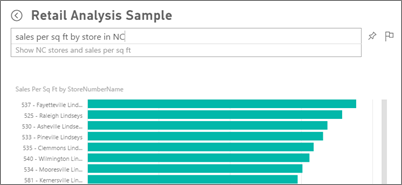
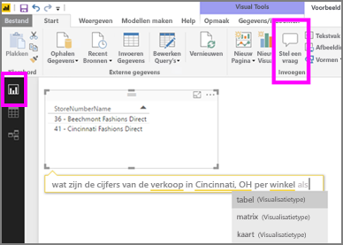

# Q&A in Power BI-service en Power BI Desktop
## Wat is Q&A?
Soms krijgt u het snelst een antwoord uit uw gegevens wanneer u een vraag stelt in natuurlijke taal. Bijvoorbeeld: "Wat was de totale omzet het afgelopen jaar?"  Gebruik Q&A om aan de hand van intuïtieve, natuurlijke taal uw gegevens te verkennen en antwoorden te krijgen in de vorm van diagrammen en grafieken. Q&A verschilt van een zoekmachine. Q&A retourneert alleen resultaten over de gegevens in Power BI.

Dit artikel is het uitgangspunt voor alles omtrent Q&A. Selecteer de onderstaande koppeling voor meer informatie over Q&A in Power BI-service (dashboards en rapporten), Power BI Desktop (rapporten), Power BI Embedded en Power BI-mobiel.  

> [!NOTE]
> **Power BI Q&A** ondersteunt alleen het beantwoorden van query's in natuurlijke taal gevraagd, die in het Engels zijn opgesteld. U kunt tevens een preview-functie proberen voor het stellen van vragen in het Spaans. Ga in **Power BI Desktop** naar **Bestand**, **Opties en instellingen**, **Opties** en zoek het tabblad **Preview-functies**. Schakel het selectievakje in voor **Ondersteuning voor Q&A in het Spaans**.  
>
>

Het stellen van de vraag is slechts het begin.  Leef u uit met uw gegevens en verfijn of verbreed uw vraag om betrouwbare nieuwe informatie aan het licht te brengen, in te zoomen op details of uit te zoomen voor een breder perspectief. U zult aangenaam verrast worden door de inzichten die u vergaart en de ontdekkingen die u doet.

De ervaring is volledig interactief... en snel. Dankzij de opslag in het geheugen, kunt u vrijwel onmiddellijk een respons verwachten.

##  Q&A voor *gebruikers*
Als een collega een dashboard met u deelt, vindt u het Q&A-vragenvak op het dashboard in de Power BI-service (app.powerbi.com) onder aan het dashboard in Power BI - Mobiel en boven de visualisatie in Power BI Embedded. Tenzij de eigenaar u machtigingen voor bewerken heeft gegeven, kunt u gegevens verkennen met behulp van Q&A, maar kunt u geen visualisaties opslaan die met Q&A zijn gemaakt.

## Q&A voor *auteurs*
Als u een *auteur* van Power BI-rapporten bent of over bewerkingsmachtigingen voor een gegevensset beschikt, vindt u het Q&A-vragenvak op het dashboard in Power BI-service en op elke rapportpagina in de Power BI-service en in Power BI Desktop. Een visualisatie die u met Q&A maakt, kan worden opgeslagen op een dashboard en in een rapport.

Naast hun gegevens verkennen met behulp van Q&A, kunnen auteurs en eigenaren van datasets de Q&A-ervaring voor gebruikers verbeteren door [hun gegevenssets te wijzigen](../service-prepare-data-for-q-and-a.md), [aanbevolen vragen toe te voegen](../service-q-and-a-create-featured-questions.md) en [Q&A in en uit te schakelen](end-user-q-and-a-direct-query.md) voor on-premises gegevenssets voor live verbinding. In [ingesloten scenario's](../developer/qanda.md) kunnen ontwikkelaars kiezen uit 2 modi: **interactief** en **alleen resultaat**.

## Hoe weet Q&A hoe vragen moeten worden beantwoord?
### Welke gegevenssets gebruikt Q&A?
Hoe weet Q&A hoe gegevensspecifieke vragen moeten worden beantwoord? Q&A baseert zich op de namen van de tabellen, kolommen en berekende velden in de onderliggende gegevensset. Het is dus belangrijk welke naam u (of de eigenaar van de gegevensset) aan dingen geeft.

Stel bijvoorbeeld dat u een Excel-tabel genaamd Sales hebt en dat deze tabel de kolommen Product, Month, Units Sold, Gross Sales en Profit bevat. U kunt dan over elk van deze entiteiten een vraag stellen.  U kunt vragen stellen als 'show *sales*', 'total *profit* by *month*', 'sort *products* by *units sold*' enzovoort.

Q&A kan vragen beantwoorden die zijn gebaseerd op hoe uw gegevensset is georganiseerd. Hoe werkt dit voor gegevens in Salesforce? Als u verbinding met uw salesforce.com-account maakt, genereert Power BI automatisch een dashboard.  Bekijk voordat u vragen gaat stellen met Q&A de gegevens die worden weergegeven in de dashboardvisualisaties, en ook de gegevens die worden weergegeven in de Q&A-vervolgkeuzelijst.

* Als de aslabels en -waarden van de visualisaties 'sales', 'account', 'month' en 'opportunities' bevatten, kunt u vragen stellen zoals: ‘Which *account* has the highest *opportunity*, or show *sales* by month as a bar chart.’
* Als de vervolgkeuzelijst 'salesperson', 'state' en 'year' bevat, kunt u vragen stellen zoals: which *salesperson* had the lowest *sales* in *Florida* in *2013*.

Als u de prestatiegegevens van de website in Google Analytics hebt, kunt u Q&A vragen over de tijd die aan een webpagina is besteed, het aantal unieke paginabezoeken en de percentages gebruikersbetrokkenheid. Of als u query's hebt voor demografische gegevens, kunt u vragen stellen over leeftijd en huishoudinkomens per locatie.

### Welke visualisatie gebruikt Q&A?
Q&A kiest de beste visualisatie op basis van de gegevens die worden weergegeven. Soms worden gegevens in de onderliggende gegevensset(s) gedefinieerd als een bepaald type of een bepaalde categorie waardoor het voor Q&A duidelijker wordt hoe de gegevens moeten worden weergegeven. Als gegevens bijvoorbeeld zijn gedefinieerd als een gegevenstype, ligt het voor de hand ze als een lijndiagram weer te geven. Gegevens die zijn gecategoriseerd als een plaats, zullen eerder als een kaart worden weergegeven.

U kunt ook zelf bij de vraag opgeven welke visualisatie moet worden gebruikt. Het is echter niet altijd mogelijk de gegevens in het door u gevraagde type visualisatie weer te geven.

Zie [Tips voor het stellen van vragen](end-user-q-and-a-tips.md) voor informatie over trefwoorden die door Q&A worden herkend.

## Voor meer informatie over Power BI Q&A
[Overzicht: Q&A gebruiken in Power BI-dashboards en rapporten](../power-bi-tutorial-q-and-a.md): stapsgewijze instructies voor het gebruik van Q&A en een overzicht van de algehele werking.

[Microsoft Power BI - mobiele apps](mobile/mobile-apps-ios-qna.md): voor iOS op iPads, iPhones en iPod Touch-apparaten.

[Microsoft Power BI Embedded](../developer/qanda.md) Q&A integreren in een app.

[Tips voor het stellen van vragen in Q&A](end-user-q-and-a-tips.md): informatie over de vragen die u Q&A kunt stellen voor de best mogelijke resultaten.

[Voeg aanbevolen vragen aan uw gegevenssets toe](../service-q-and-a-create-featured-questions.md) om ervoor te zorgen dat deze vragen in Q&A als suggestie aan uw collega's worden aangeboden.

[Q&A inschakelen voor uw on-premises gegevenssets](end-user-q-and-a-direct-query.md) Als u een gateway nodig hebt om verbinding te maken met de gegevensset, gebruikt u de instellingen van de Power BI om Q&A in en uit te schakelen.

[Zelfstudie: Q&A gebruiken met het voorbeeld van een retailanalyse in Power BI-service](../power-bi-visualization-introduction-to-q-and-a.md): gebruik Q&A in een realistische, branchegerichte zelfstudie.

[Ervoor zorgen dat uw gegevens goed werken met Q&A](../service-prepare-data-for-q-and-a.md): als u de persoon bent die de gegevenssets en gegevensmodellen maakt,  is dit onderwerp bedoelt voor u.

Hebt u nog vragen? [Misschien dat de Power BI-community het antwoord weet](http://community.powerbi.com/)
