<!-- once the sample aps are live, change this so consumers can follow along -->
# Snelstart: meer informatie over de mogelijkheden van Power BI voor ***gebruikers***
In deze snelstartgids wordt uitgelegd hoe u Power BI kunt gebruiken om op basis van gegevens tot zakelijke inzichten te komen. Dit artikel is niet bedoeld om uitgebreide informatie te bieden, maar is eerder een rondleiding langs de vele acties die beschikbaar zijn voor **gebruikers** van Power BI.

Als u zich niet hebt geregistreerd voor Power BI, kunt u zich hier [aanmelden voor een gratis proefversie](https://app.powerbi.com/signupredirect?pbi_source=web) voordat u begint.

## Vereisten
- Power BI-service (app.powerbi.com) <!-- app from AppSource -->

## Leesweergave
De leesweergave is beschikbaar in de Power BI-service voor *gebruikers* van rapporten. Wanneer een collega een rapport met u deelt, kunt u het rapport verkennen en gebruiken in de leesweergave. 

De andere rapportmodus in de Power BI-service is de [bewerkingsweergave ](../service-interact-with-a-report-in-editing-view.md). Deze modus is beschikbaar voor *ontwerpers* van rapporten.  

De leesweergave is een krachtige en veilige manier om uw dashboards en rapporten te verkennen. Terwijl u de invalshoeken voor de dashboards en rapporten die met u zijn gedeeld varieert, blijven de onderliggende gegevenssets intact en ongewijzigd. 

In de leesweergave kunt u bijvoorbeeld visuals op een pagina kruislings markeren en filteren.  U hoeft alleen maar een waarde in de ene visual te markeren of selecteren en u ziet meteen de gevolgen hiervan voor de andere visuals. Gebruik het filtervenster om op een rapportpagina filters toe te voegen of te wijzigen en wijzig de manier waarop waarden in een visualisatie zijn gesorteerd. Dit zijn slechts enkele van de mogelijkheden die *gebruikers* in Power BI hebben.  Lees verder voor meer informatie over deze en andere mogelijkheden.

 
### Een app weergeven
In Power BI zijn het de *apps* die gerelateerde dashboards en rapporten op één centrale locatie bundelen.

1. Selecteer in het linkernavigatievenster de optie **Apps**  > **Apps verkrijgen**. 
   
     
2. Zoek in AppSource onder **Mijn organisatie** om de resultaten te filteren en de gewenste app te vinden.
   
     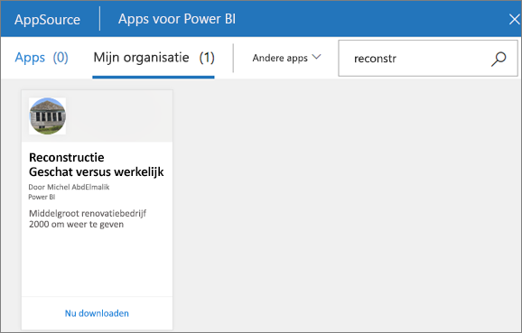
3. Selecteer **Nu downloaden** om deze aan uw container met apps toe te voegen. 

### Een dashboard weergeven
Als u deze app opent, wordt er een dashboard weergegeven. Een Power BI-***dashboard*** bestaat uit één pagina, ook wel een canvas genoemd, die gebruikmaakt van visualisaties om een verhaal te vertellen. Aangezien het maar één pagina betreft, bevat een goed ontworpen dashboard alleen de belangrijkste elementen van dat verhaal.

De visualisaties die u op het dashboard ziet, worden *tegels* genoemd en zijn vanuit rapporten *vastgemaakt* aan het dashboard.

### Abonneren op een dashboard (of een rapport)
U hoeft Power BI niet te openen als u een dashboard wilt controleren.  In plaats daarvan kunt u zich abonneren, zodat u volgens een door u ingesteld schema een momentopname van het desbetreffende dashboard van Power BI ontvangt. 

.

1. Selecteer in de bovenste menubalk **Abonneren** of selecteer het enveloppictogram .
   
   

3. Gebruik de gele schuifregelaar om het abonnement in of uit te schakelen.  Voeg optioneel gegevens voor het e-mailbericht in. 

    Merk op in de onderstaande schermafbeelding dat wanneer u zich op een rapport abonneert, u zich feitelijk abonneert op een rapport*pagina*.  Als u zich op meer dan één pagina in een rapport wilt abonneren, selecteert u **Nog een abonnement toevoegen** en selecteert u een andere pagina. 
      
   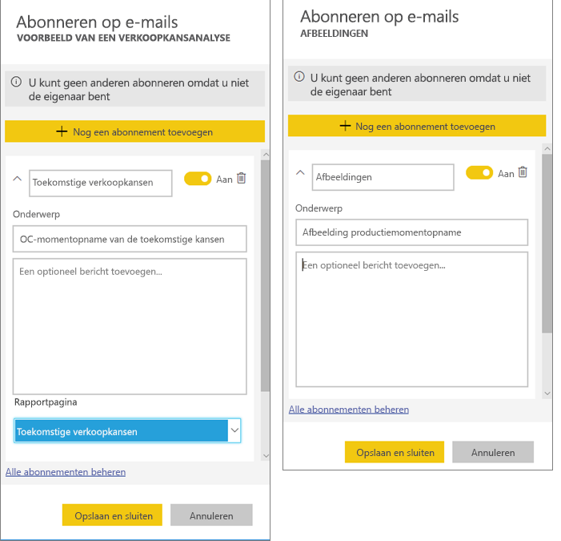
   
    Als u de rapportpagina vernieuwt, wordt de gegevensset niet vernieuwd. Alleen de eigenaar van een gegevensset kan de gegevensset vernieuwen. Als u de naam van de onderliggende gegevensset(s) wilt opzoeken, selecteert u boven in de menubalk de optie **Gerelateerde items weergeven**.

### Gerelateerde inhoud weergeven
In het deelvenster **Gerelateerde inhoud** ziet u hoe uw Power BI-service-inhoud -- dashboards, rapporten en gegevenssets -- onderling zijn verbonden. Het deelvenster toont niet alleen de gerelateerde inhoud, maar stelt u ook in staat om actie te ondernemen op de inhoud en eenvoudig te navigeren tussen de gerelateerde content.

Selecteer in de menubalk boven aan een dashboard of rapport de optie **Gerelateerde items weergeven**.

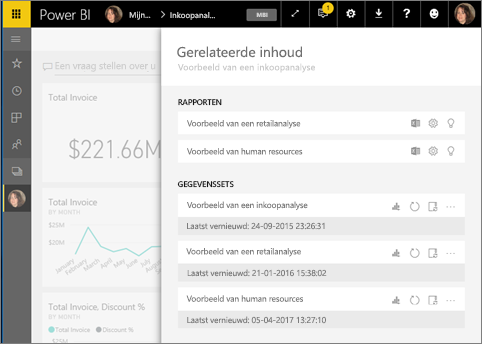

### Q&A gebruiken om in natuurlijke taal vragen te stellen
Soms krijgt u het snelst een antwoord uit uw gegevens wanneer u een vraag stelt in natuurlijke taal. Het Q&A-vragenvak bevindt zich boven aan uw dashboard. Bijvoorbeeld: 'Toon het aantal grote verkoopkansen per verkoopfase als een trechter'. 

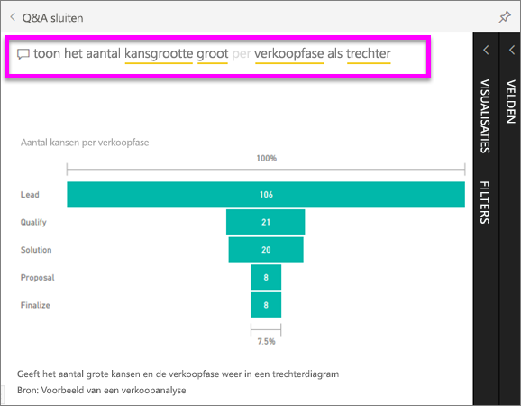

### Een dashboard toevoegen aan Favorieten
Wanneer u van inhoud een *favoriet* maakt, kunt u deze inhoud openen via de navigatiebalk aan de linkerkant. De linkernavigatiebalk wordt vrijwel in elk gebied van Power BI weergegeven. Favorieten zijn doorgaans de dashboards, rapportpagina's en apps die u het vaakst bezoekt.

1. Sluit Q&A om terug te keren naar een dashboard.    
2. Selecteer in de rechterbovenhoek van de Power BI-service **Favoriet** of het sterpictogram .
   
   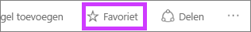

### Een rapport en rapportpagina's openen en weergeven
Een rapport bestaat uit een of meer pagina's met visuals. Rapporten worden gemaakt door Power BI-*rapportontwerpers* en [gedeeld met *gebruikers*, rechtstreeks](end-user-shared-with-me.md) of als onderdeel van een [app](end-user-apps.md). 

Rapporten kunnen worden geopend vanaf een dashboard. De meeste tegels voor dashboards zijn *vastgemaakt* vanuit rapporten. Als u een tegel selecteert, wordt het rapport geopend dat is gebruikt om de tegel te maken. 

1. Selecteer een tegel in het dashboard. In dit voorbeeld hebben we de kolomgrafiektegel 'Revenue' geselecteerd.

    

2.  Het bijbehorende rapport wordt geopend. Zoals u ziet, bevinden we ons momenteel op de pagina 'Revenue overview'. Dit is de rapportpagina die de kolomgrafiek bevat die we in het dashboard hebben geselecteerd.

    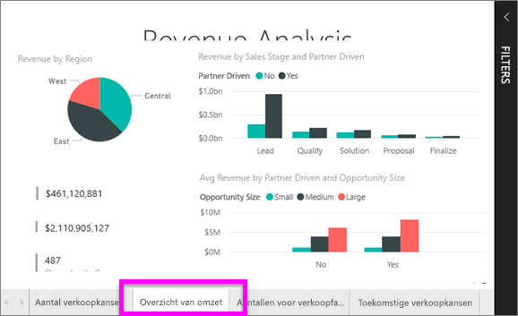

### De afmetingen van de weergave aanpassen
Rapporten kunnen op verschillende apparaten met verschillende schermgrootten en hoogte-breedteverhoudingen worden weergegeven.  De standaardweergave is mogelijk niet wat u op uw apparaat wilt zien.  

1. Als u de weergave wilt aanpassen, selecteert u in de menubalk bovenaan **Weergave**.

    

2.  Kies een van de weergaveopties. In dit voorbeeld is de optie **Aanpassen aan pagina** gekozen.

    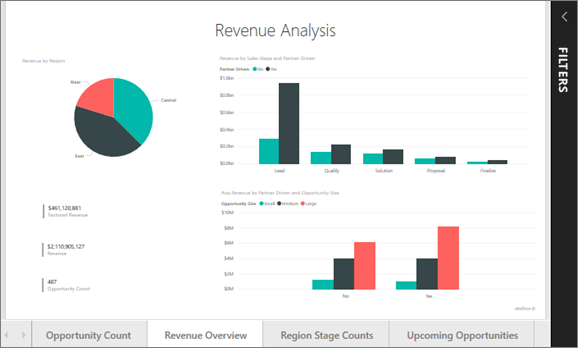    

### Deelvenster Rapportfilters gebruiken
Als de auteur van het rapport filters aan een pagina in een rapport heeft toegevoegd, kunt u deze gebruiken en uw wijzigingen opslaan in het rapport.

1. Selecteer in de rechterbovenhoek het pictogram **Filters**.
   
   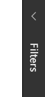  

2. Selecteer een visueel element om het te activeren. Hierop worden alle filters weergegeven die zijn toegepast op de visual (filters op niveau van visuele elementen), op de hele rapportpagina (filters op paginaniveau) en binnen het hele rapport (filters op rapportniveau).
   
   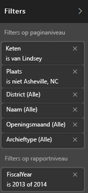

3. Beweeg de muisaanwijzer over een filter en vouw het filter uit door de pijl-omlaag te selecteren.
   
   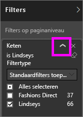

4. Breng wijzigingen aan de filters aan en controleer hoe de visuals worden beïnvloed.  
   
     
     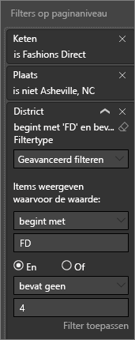

### Bekijken hoe alle visuals elementen op een pagina met elkaar zijn verbonden
Markeer en filter de verwante visualisaties op een pagina kruislings. De visualisaties op één rapportpagina zijn allemaal met elkaar 'verbonden'.  Dit betekent dat als u een of meer waarden in een visualisatie selecteert, andere visualisaties die gebruikmaken van dezelfde waarde op basis van uw selectie worden gewijzigd.

> 
### Details weergeven op een visualisatie
De muisaanwijzer over visuele elementen bewegen om meer informatie weer te geven

### Een visual sorteren
De visuals op een rapportpagina kunnen worden gesorteerd en opgeslagen met de door u aangebrachte wijzigingen. 

1. Plaats de muisaanwijzer op een visual om deze te activeren.    
2. Selecteer het beletselteken (...) om de opties voor sorteren weer te geven.

     

###  Het deelvenster **Selectie** openen
Navigeer eenvoudig tussen de visualisaties op de rapportpagina. 

1. Selecteer **Weergeven > Selectiedeelvenster** om het deelvenster Selectie te openen. Stel de optie **Selectiedeelvenster** in op Aan.

    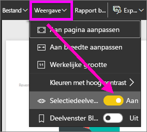

2. Het selectiedeelvenster wordt geopend op uw rapportcanvas. Selecteer een visual in de lijst om deze te activeren.

    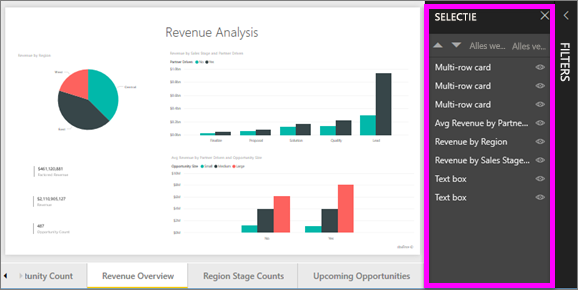

### Inzoomen op afzonderlijke visuals
Beweeg de muisaanwijzer over een visual en selecteer het pictogram **Focusmodus** . Wanneer u een visualisatie in de focusmodus bekijkt, wordt deze uitgebreid om het volledige rapportcanvas te vullen zoals hieronder wordt weergegeven.

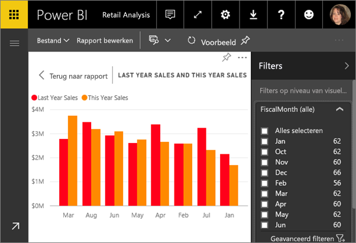

Als u dezelfde visualisatie zonder de afleiding van menubalken, het filtervenster en dergelijke wilt zien, selecteert u het pictogram **Volledig scherm** op de bovenste menubalk    .

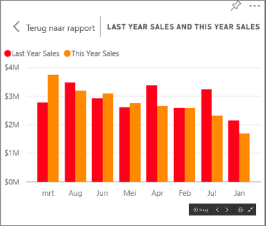

### De gegevens weergeven die worden gebruikt om een visualisatie te maken
Een visual in Power BI wordt opgebouwd met gegevens uit onderliggende gegevenssets. Als u een kijkje achter de schermen wilt nemen, kunt u de gegevens die zijn gebruikt voor het maken van het visuele element *weergegeven* in Power BI. Wanneer u **Gegevens weergeven** selecteert, geeft Power BI de gegevens onder (of naast) de visualisatie weer.

1. Open een rapport in Power BI-service en selecteer een visual.  
2. Als u de gegevens achter de visual wilt weergeven, selecteert u het beletselteken (...) en kiest u **Gegevens weergeven**.
   
   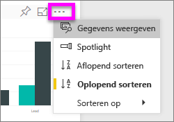

Dit is slechts een kort overzicht van enkele van de dingen die **gebruikers** met de Power BI-service kunnen doen.  

## Resources opschonen
- Als u verbinding met een app hebt gemaakt, selecteert u in de linkernavigatiebalk **Apps** om de inhoudslijst Apps te openen. Plaats de muisaanwijzer op de app die u wilt verwijderen en selecteer het prullenbakpictogram.

- Als u gegevens hebt geïmporteerd uit of verbinding hebt gemaakt met een voorbeeldrapport van Power BI, opent u via de linkernavigatiebalk **Mijn werkruimte**. Gebruik de tabbladen bovenaan om het dashboard, het rapport en de gegevensset te zoeken en selecteer vervolgens het prullenbakpictogram voor elk van deze items.

## Volgende stappen

