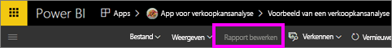
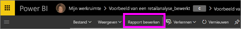
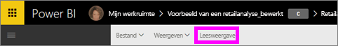

# Leesweergave en bewerkweergave in rapporten van de Power BI-service
In de Power BI-service (geen Power BI Desktop) zijn er twee modi voor het weergeven en werken met rapporten: de leesweergave en de bewerkweergave. De leesweergave is beschikbaar voor alle gebruikers en is speciaal ontworpen voor *gebruikers van gegevens*, terwijl de bewerkweergave alleen beschikbaar is voor *rapportauteurs* en -eigenaren.

## Leesweergave rapport

 De leesweergave is een manier om het rapport te verkennen en ermee te werken -- het is een leuke en veilige manier om met uw gegevens te spelen en er meer over te weten te komen. De leesweergave is ontworpen voor *gebruikers* van het rapport, personen die rapporten vanuit Apps openen of [met wie rapporten zijn gedeeld](../service-share-dashboards.md). In de leesweergave krijgt elke afzonderlijke gebruiker van een specifiek rapport hetzelfde rapport en identieke visualisaties te zien, waarop dezelfde filters zijn toegepast.  Gebruikers kunnen met de rapporten werken, de bestaande filters wijzigen (en deze wijzigingen worden met het rapport opgeslagen), maar kunnen geen nieuwe filters toevoegen.

>**Opmerking**: in bepaalde omstandigheden kunnen rapportconsumenten verschillende gegevens zien vanwege beveiligings- en gegevensmachtigingen op rijniveau.

## Bewerkweergave rapport

De bewerkweergave is alleen beschikbaar voor personen die het rapport hebben gemaakt of die [mede-eigenaar van een rapport zijn als lid of beheerder van een app-werkruimte](end-user-create-apps.md).

De bewerkweergave is ontworpen voor het *auteurs* van rapporten. Hier importeren auteurs gegevens en maken ze er verbinding mee, verkennen ze de gegevens en maken ze rapporten en dashboards. In de bewerkweergave kunnen *auteurs* nog dieper in hun gegevens graven door velden toe te voegen en te verwijderen, het type visualisatie te veranderen, nieuwe visualisaties te maken en visualisaties en pagina's uit het rapport toe te voegen en te verwijderen. Ze kunnen de gemaakte rapporten vervolgens delen met collega's.

## Leesweergave versus bewerkweergave
In deze grafiek worden niet alle mogelijkheden van een rapport van Power BI-service vermeld! Hierin staan alleen die rapporttaken die niet beschikbaar zijn in **zowel** leesweergave als bewerkweergave.

|Taak  | Leesweergave  | Bewerkweergave |
|-------------------------|-------|-------|
|**Rapporten in zijn geheel**  |
| [Een rapport maken of bewerken](../service-report-create-new.md) | Nee  | Ja |
| [Een rapport delen](../service-share-reports.md)| Ja | Ja, en kan ook machtigingen beheren, zoals het geven van *eigenaarsmachtigingen* aan anderen. |
| [Persistent (permanent) filters op visueel niveau, drillthrough-niveau, paginaniveau en rapportniveau maken vanuit het deelvenster Filters](../power-bi-report-add-filter.md) | Nee  | Ja |
| [Deelvenster Rapportfilters gebruiken](end-user-report-filter.md) | Ja, de bestaande filters kunnen worden gebruikt en wijzigingen kunnen met het rapport worden opgeslagen. Er kunnen echter geen nieuwe filters worden toegevoegd. | Ja |
| [Het rapportdeelvenster Analyse gebruiken](../service-analytics-pane.md) | Nee | Ja |
| [Opties **Rapportweergave** ](../power-bi-report-display-settings.md) | Ja, met enkele uitzonderingen. | Ja, alle, met inbegrip van rasterlijnen, uitlijnen en vergrendelen. |
| [Een vernieuwingsplan maken](../refresh-data.md) | Nee  | Ja |
| [Abonneren op een rapportpagina](end-user-subscribe.md) | Ja | Nee |
| [Vragen en antwoorden - vragen stellen in rapporten](end-user-q-and-a.md) | Nee  | Ja |
| [Metrische gegevens over het gebruik weergeven](../service-usage-metrics.md) | Ja, op het rapportcanvas. | Ja, in de lijst met rapporten (inhoudsweergave) |
| [Gerelateerde items weergeven](end-user-related.md) | Ja, op het rapportcanvas. | Ja, in de lijst met rapporten (inhoudsweergave) |
| [Een rapport opslaan](../service-report-save.md) | Ja, maar alleen met behulp van **Opslaan als**. | Ja |
| [Een rapport verwijderen](end-user-delete.md) | Nee  | Ja |
|**Rapportpagina’s** |
| [Een rapportpagina toevoegen of de naam ervan wijzigen](../power-bi-report-add-page.md)  | Nee  | Ja  |
| [Een rapportpagina dupliceren](../power-bi-report-copy-paste-page.md) | Nee  | Ja |
| [Rapportpagina verwijderen](end-user-delete.md) | nee | ja |
|**Werken met rapportvisualisaties**|
| [Visualisaties toevoegen aan een rapport](../visuals/power-bi-report-add-visualizations-i.md) | Nee  | Ja |
| [Tekstvakken en vormen aan een rapport toevoegen](../power-bi-reports-add-text-and-shapes.md) | Nee  | Ja |
| [Het rapportvenster Opmaak gebruiken](../service-the-report-editor-take-a-tour.md) | Nee | Ja |
| [Visuele interacties instellen](end-user-interactions.md) | Nee  | Ja |
| [Gegevens weergeven die worden gebruikt om de visualisatie te maken](end-user-show-data.md) | Nee  | Ja |
| [Analyseren configureren](end-user-drill.md) | Nee  | Ja |
| [De gebruikte visualisatie wijzigen](../visuals/power-bi-report-change-visualization-type.md) | Nee | Ja|
| [Een visualisatie, tekstvak of vorm verwijderen](end-user-delete.md)| Nee | Ja |

## Navigeren tussen de bewerkweergave en de leesweergave
Onthoud dat alleen de auteur en eigenaar(eigenaren) van rapporten een rapport in de bewerkweergave kunnen openen.

1. Een rapport wordt standaard geopend in de leesweergave. U kunt zien dat u zich in de leesweergave bevindt als u de optie **Rapport bewerken** ziet staan. Als **Rapport bewerken** grijs wordt weergegeven, bent u niet gemachtigd om het rapport te openen in de bewerkweergave.

   

2. Als **Rapport bewerken** niet grijs wordt weergegeven, selecteert u deze optie om het rapport in de bewerkweergave te openen.

   

   Het rapport is nu in de bewerkweergave en maakt gebruik van dezelfde [weergave-instellingen](../power-bi-report-display-settings.md) als die u voor het laatst hebt gebruikt in de leesweergave.

2. Als u terug wilt naar de leesweergave, selecteert u **Leesweergave** in de bovenste navigatiebalk.

    

### Volgende stappen
Er zijn vele manieren om met een rapport in de leesweergave te werken en om uw gegevens zodanig op te delen dat u inzichten en antwoord op uw vragen krijgt.  In het volgende onderwerp, [Interactie met een rapport in de leesweergave](../service-interact-with-a-report-in-editing-view.md), wordt dit uitvoerig beschreven.    
Terug naar [Rapporten in Power BI](end-user-reports.md)    
Hebt u nog vragen? [Misschien dat de Power BI-community het antwoord weet](http://community.powerbi.com/)
