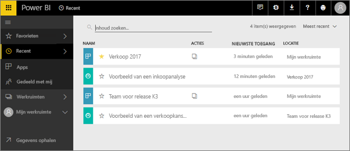
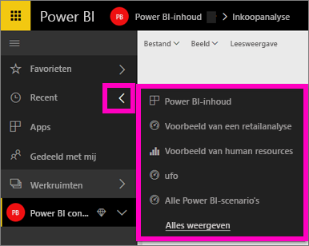
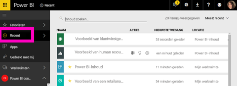

# **Recente** inhoud in Power BI-service
Recente inhoud bevat de laatste items die u hebt bezocht in de Power BI-service, tot een maximum van 20 items.  Deze omvatten: dashboards, rapporten, apps en de werkmappen voor al uw werkruimten.

Bekijk hoe Amanda laat zien hoe de lijsten met **Recente** inhoud van de Power BI-service worden ingevuld, volg daarna de stap-voor-stap instructies onder de video om het zelf uit te proberen.

<iframe width="560" height="315" src="https://www.youtube.com/embed/G26dr2PsEpk" frameborder="0" allowfullscreen></iframe>

## Recente inhoud weergeven
Selecteer de pijl rechts van **Recent** in de linkernavigatiebalk voor een overzicht van de vijf meest recent bezochte items.  Hier kunt u recent geopende inhoud selecteren om te openen. Alleen de vijf meest recente items worden weergegeven.

Als u meer dan vijf onlangs bezochte items hebt, selecteert u **Alles weergeven** om het scherm Recent te openen (zie hieronder). U kunt ook **Recent** of het pictogram Recent  gebruiken in het linkernavigatievenster.

Van hieruit werkt u met de inhoud zoals u zou doen op de afzonderlijke schermen van de tabbladen [**Dashboards**](end-user-dashboards.md), [**Rapporten**](end-user-reports.md) en **Werkmappen** en in het <!--[**Apps**](end-user-apps.md)-->-scherm van de app.

## Volgende stappen
<!--[Power BI service Apps](end-user-apps.md)-->

Nog vragen? [Misschien dat de Power BI-community het antwoord weet](http://community.powerbi.com/)

