# Rondleiding door het deelvenster Filters van het rapport
In dit artikel wordt het rapportvenster Filters in Power BI-service besproken.

Er zijn veel verschillende manieren om gegevens te filteren in Power BI. Wij raden u aan om te beginnen met het lezen van [Filters en markeren](../power-bi-reports-filters-and-highlighting.md).

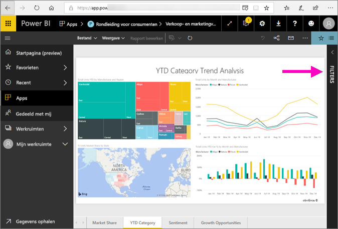

## Het deelvenster Filters van het rapport gebruiken
Als een collega een rapport met u deelt, bekijk dan het deelvenster **Filters**. Het wordt soms samengevouwen aan de rechterzijde van het rapport. Selecteer het om het uit te breiden.   

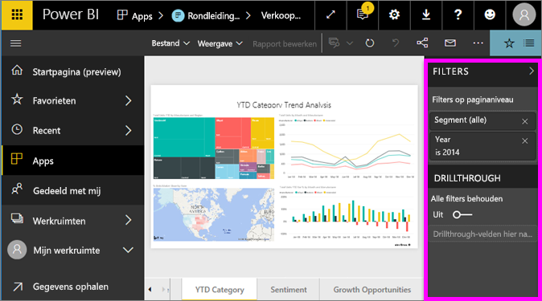

Het deelvenster Filters bevat filters die aan het rapport zijn toegevoegd door de *rapportontwerper*. *Gebruikers* als uzelf kunnen de filters gebruiken en uw wijzigingen opslaan, maar geen nieuwe filters aan het rapport toevoegen. In de bovenstaande schermopname heeft de ontwerper bijvoorbeeld twee filters op paginaniveau toegevoegd: Segment en Jaar. U kunt deze filters gebruiken en wijzigen, maar u kunt geen derde filter op paginaniveau toevoegen.

In de Power BI-service worden wijzigingen die u aanbrengt in het deelvenster Filters bewaard en deze wijzigingen worden doorgevoerd in de mobiele versie van het rapport. Als u de standaardinstellingen die de ontwerper heeft geconfigureerd voor het deelvenster Filters wilt herstellen, selecteert u **Standaardinstellingen herstellen** in de bovenste menubalk.     

## Het deelvenster Filters openen
Wanneer een rapport is geopend, wordt het deelvenster Filters aan de rechterkant van het rapportcanvas weergegeven. Als u het deelvenster niet ziet, selecteert u de pijl in de rechterbovenhoek om het uit te vouwen.  

In dit voorbeeld hebben we een visualisatie met 6 filters geselecteerd. De rapportagepagina heeft ook filters, onder de kop **Filters op paginaniveau**. Er is één [Drillthrough-filter](../power-bi-report-add-filter.md) en het hele rapport heeft ook een filter:  **FiscalYear** is 2013 of 2014.

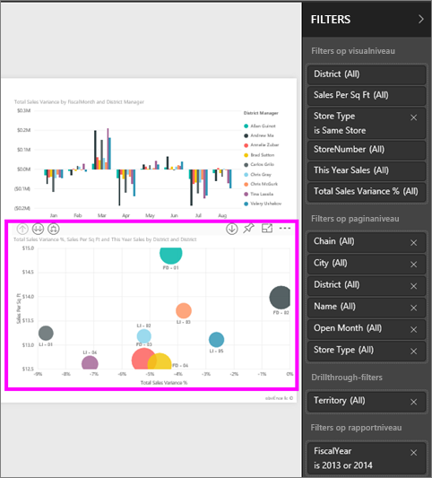

Naast sommige filters staat het woord **Alle**, wat betekent dat alle waarden in het filter worden opgenomen.  Zo zien we aan **Chain (All)** (Keten (Alle)) in de bovenstaand schermopname dat deze rapportpagina gegevens bevat over alle winkelketens.  Aan de andere kant blijkt uit het filter op rapportniveau **FiscalYear is 2013 or 2014** (Boekjaar is 2013 of 2014) dat het rapport alleen gegevens voor de boekjaren 2013 en 2014 bevat.

Iedereen die dit rapport bekijkt, kan met deze filters werken.

- Zoek met de pagina-, visual-, rapport- en drillthrough-filters om de gewenste waarde te zoeken en te selecteren. 

    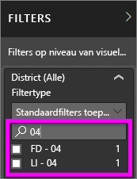

- Bekijk de details van het filter door de pijl naast het filter aan te wijzen en te selecteren.
  
   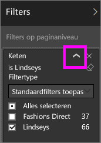
* Wijzig het filter, bijvoorbeeld door **Lindseys** te wijzigen in **Fashions Direct**.
  
     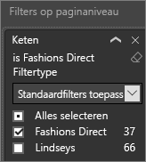

* Herstel de oorspronkelijke staat van de filters door **Standaardinstellingen herstellen** in de bovenste menubalk te selecteren.    
    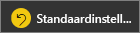
    
* Verwijder het filter door de **x** naast de filternaam te selecteren.
  
    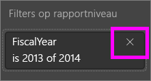

  Het verwijderen van een filter verwijdert het uit de lijst, maar verwijdert de gegevens niet uit het rapport.  Als u bijvoorbeeld het filter **FiscalYear is 2013 or 2014** (Boekjaar is 2013 of 2014) verwijdert, blijven de boekjaargegevens in het rapport staan. De gegevens worden niet meer gefilterd, zodat nu niet alleen de gegevens voor 2013 en 2014, maar voor alle belastingjaren die voorkomen in de gegevens worden weergegeven.  Als u het filter eenmaal hebt verwijderd kunt u het echter niet meer wijzigen, omdat het uit de lijst is verwijderd. Een betere optie is het filter te wissen door het  te selecteren.
  
  

## Een filter wissen
 Selecteer in de geavanceerde modus of standaardfiltermodus het gumpictogram   om het filter te wissen. 

## Typen filters: tekstveldfilters
### Lijstmodus
Als u een selectievakje aanvinkt, selecteert of deselecteert u de waarde. Het selectievakje **Alle** kan worden gebruikt om alle selectievakjes in of uit te schakelen. De selectievakjes geven alle beschikbare waarden voor dat veld weer.  Terwijl u het filter aanpast, wordt de herformulering aangepast aan uw keuzes. 

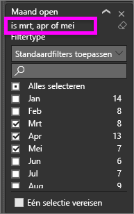

U ziet nu dat de tekst is aangepast in 'is Mar, Apr or May'.

### Geavanceerde modus
Selecteer **Geavanceerd filteren** om over te schakelen naar de geavanceerde modus. Gebruik de vervolgkeuzelijsten en tekstvakken om aan te geven welke velden u wilt opnemen. Door te kiezen tussen **En** en **Of**, kunt u complexe filterexpressies maken. Selecteer de knop **Filter toepassen** wanneer u de gewenste waarden hebt ingesteld.  

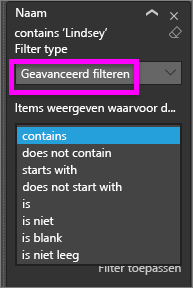

## Typen filters: numerieke veldfilters
### Lijstmodus
Als er een eindig aantal waarden is, wordt er een lijst weergegeven als u de veldnaam selecteert.  Zie **Tekstveldfilters** &gt; **Lijstmodus** hierboven voor hulp bij het gebruik van selectievakjes.   

### Geavanceerde modus
Als het aantal waarden oneindig is of als de waarden een bereik aangeven, wordt de geavanceerde filtermodus geopend als u de veldnaam selecteert. Gebruik de vervolgkeuzelijst en tekstvakken om een bereik met waarden aan te geven dat u wilt zien. 

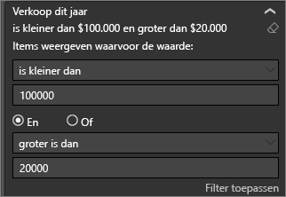

Door te kiezen tussen **En** en **Of**, kunt u complexe filterexpressies maken. Selecteer de knop **Filter toepassen** wanneer u de gewenste waarden hebt ingesteld.

## Typen filters: datum en tijd
### Lijstmodus
Als er een eindig aantal waarden is, wordt er een lijst weergegeven als u de veldnaam selecteert.  Zie **Tekstveldfilters** &gt; **Lijstmodus** hierboven voor hulp bij het gebruik van selectievakjes.   

### Geavanceerde modus
Als de veldwaarden datums of tijden vertegenwoordigen, kunt u een begin-/eindtijd opgeven wanneer u datum-/tijdfilters gebruikt.  

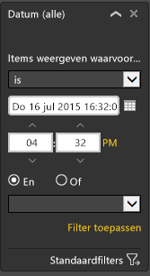

## Volgende stappen
[Leer hoe en waarom visuals elkaar in een rapport kruislings filteren en markeren](end-user-interactions.md)