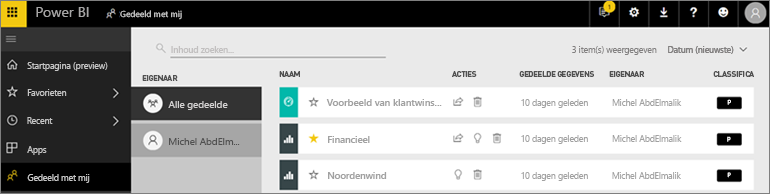
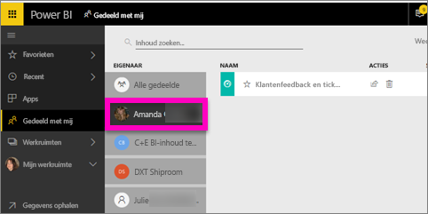

# De dashboards en rapporten weergeven die met mij zijn gedeeld
## Gedeeld met mij

Wanneer een collega inhoud met u deelt via de knop **Delen**, wordt deze inhoud weergegeven in de container **Gedeeld met mij**. Het dashboard of rapport is alleen beschikbaar vanuit **Gedeeld met mij** en niet vanuit **Apps**.

Kijk hoe Amanda de inhoudslijst **Gedeeld met mij** uitlegt en demonstreert hoe u naar de lijst navigeert en deze filtert. Volg vervolgens de stapsgewijze instructies onder de video om het zelf te proberen. Als u met u gedeelde dashboards wilt weergeven, moet u beschikken over een Power BI Pro-licentie. Lees [Wat is Power BI Premium?](../service-premium.md) voor meer informatie.

<iframe width="560" height="315" src="https://www.youtube.com/embed/G26dr2PsEpk" frameborder="0" allowfullscreen></iframe>

U krijgt opties om met het dashboard en de rapporten te communiceren, afhankelijk van de machtigingen die de ontwerper u heeft gegeven. Hierbij zijn de mogelijkheden inbegrepen om kopieën van het dashboard te maken, het rapport [in leesweergave](end-user-reading-view.md) te openen en opnieuw te delen met andere collega's.

## Acties die beschikbaar zijn via de container **Gedeeld met mij**
* Selecteer het sterpictogram om [een dashboard of rapport toe te voegen aan de favorieten](end-user-favorite.md).
* Een dashboard of rapport verwijderen  
* Sommige dashboards en rapporten kunnen opnieuw worden gedeeld  
* Bovendien kunt u, als uw lijsten erg lang worden, [via het zoekveld en door te sorteren vinden wat u nodig hebt](end-user-search-sort.md).
  
  > [!NOTE]
  > Voor informatie over EGRC-classificaties selecteert u de classificatie-knop of [gaat u naar Classificatie van dashboardgegevens](../service-data-classification.md).
  > 
  > 
* Selecteer de naam van een dashboard om deze te openen en te verkennen. Als u de gedeelde dashboard hebt geopend, kunt u via Q & A vragen stellen over de onderliggende gegevens of een tegel selecteren die u wilt openen om in de leesweergave te kunnen communiceren met het rapport.

## Gedeelde dashboards filteren op eigenaar
De inhoud in het scherm **Gedeeld met mij** kan verder worden gefilterd op de eigenaar van de inhoud. Als ik bijvoorbeeld **Amanda** selecteer, zie ik alleen het dashboard dat Amanda met mij heeft gedeeld.

