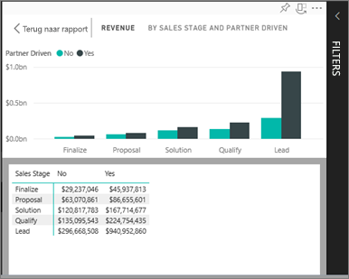
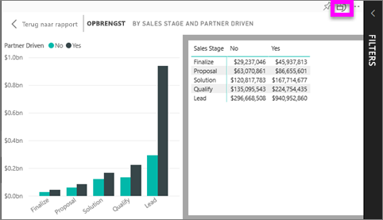

# De gegevens weergeven die zijn gebruikt voor het maken van de visualisatie
## Gegevens weergeven
Een visual in Power BI wordt opgebouwd met gegevens uit onderliggende gegevenssets. Als u een kijkje achter de schermen wilt nemen, kunt u de gegevens die zijn gebruikt voor het maken van het visuele element *weergegeven* in Power BI. Wanneer u **Gegevens weergeven** selecteert, geeft Power BI de gegevens onder (of naast) de visualisatie weer.

## *Gegevens weergeven* in de Power BI-service gebruiken
1. Open een rapport in Power BI-service en selecteer een visual.  
2. Als u de gegevens achter de visual wilt weergeven, selecteert u het beletselteken (...) en kiest u **Gegevens weergeven**.
   
   
3. Standaard worden de gegevens weergegeven onder het visuele element.
   
   

4. Als u de afdrukstand wilt wijzigen, selecteert u verticale indeling  in de rechterbovenhoek van de visualisatie.
   
   

### Volgende stappen
[Visualisaties in Power BI-rapporten](../visuals/power-bi-report-visualizations.md)    
[Power BI-rapporten](end-user-reports.md)    
