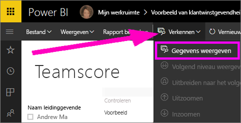
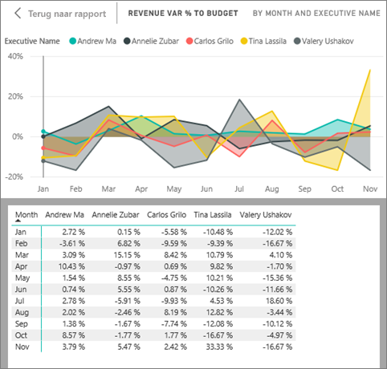
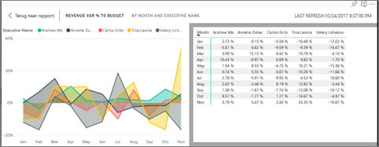

# De gegevens weergeven die zijn gebruikt voor het maken van de visualisatie
## Gegevens weergeven
Een visualisatie in Power BI is opgebouwd met gegevens uit uw gegevenssets. Als u een kijkje achter de schermen wilt nemen, kunt u de gegevens die zijn gebruikt voor het maken van het visuele element *weergegeven* in Power BI. Wanneer u **Gegevens weergeven** selecteert, geeft Power BI de gegevens onder (of naast) de visualisatie weer.

U kunt de gegevens die zijn gebruikt voor het maken van de visualisatie ook exporteren als .xlsx- of .csv-bestand en weergeven in Excel. Zie [Gegevens exporteren uit Power BI-visualisaties](end-user-export-data.md) voor meer informatie.

> [!NOTE]
> *Gegevens weergeven* en *Gegevens exporteren* zijn beide beschikbaar in de Power BI-service en Power BI Desktop. Power BI Desktop biedt echter een extra detaillaag; [*Records weergeven* geeft de daadwerkelijke rijen uit de gegevensset weer](../desktop-see-data-see-records.md).
> 
> 

## *Gegevens weergeven* in de Power BI-service gebruiken
1. Open in de Power BI-service een rapport in de [Leesweergave of Bewerkweergave](end-user-reading-view.md) en selecteer een visueel element.  Open de Rapportweergave in Power BI Desktop.
2. Als u de gegevens achter het visuele element wilt weergeven, selecteert u **Verkennen** > **Gegevens weergeven**.
   
   
3. Standaard worden de gegevens weergegeven onder het visuele element.
   
   
4. Als de afdrukstand wilt wijzigen, selecteert u verticale indeling  in de rechterbovenhoek van de visualisatie.
   
   
5. Als u de gegevens wilt exporteren naar een .csv-bestand, selecteert u het beletselteken en kiest u **Gegevens exporteren**.
   
    
   
    Zie [Gegevens exporteren uit Power BI-visualisaties](end-user-export-data.md) voor meer informatie over het exporteren van de gegevens naar Excel.
6. Als u de gegevens wilt verbergen, schakelt u **Verkennen** > **Gegevens weergeven** uit.

### Volgende stappen
[Gegevens uit Power BI-visualisaties exporteren](end-user-export-data.md)    
[Visualisaties in Power BI-rapporten](../visuals/power-bi-report-visualizations.md)    
[Power BI-rapporten](end-user-reports.md)    
[Power BI - basisbeginselen](end-user-basic-concepts.md)    
Hebt u nog vragen? [Misschien dat de Power BI-community het antwoord weet](http://community.powerbi.com/)

