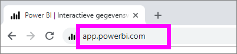
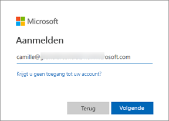
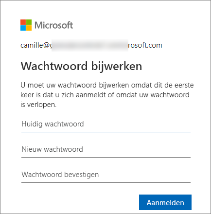
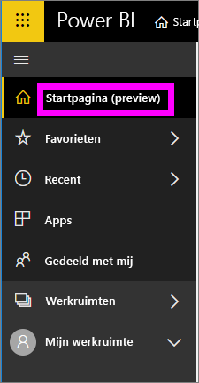
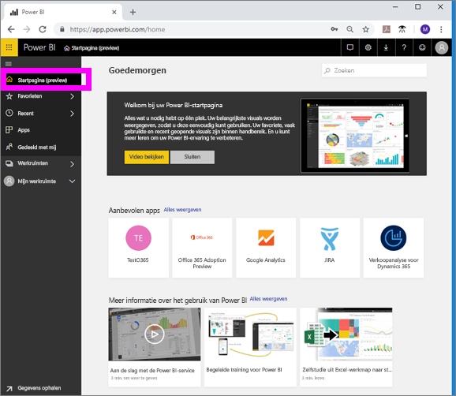
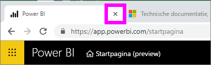

# Aanmelden bij de Power BI-service

## Power BI-accounts
Voordat u zich bij Power BI kunt aanmelden, hebt u een account nodig. U kunt op twee manieren een Power BI-account krijgen. De eerste is wanneer uw bedrijf Power BI-licenties voor zijn medewerkers koopt. En de tweede is wanneer personen zich registreren voor gratis proefversies of persoonlijke licenties. In dit artikel wordt het eerste scenario behandeld.

## Voor de eerste keer aanmelden

### Stap 1: open een browser
Power BI-service wordt in een browser uitgevoerd.  Dus stap 1 is dat u uw favoriete browser opent en **app.powerbi.com** typt.

### Stap 2: Typ uw e-mailadres
De eerste keer dat u zich aanmeldt, wordt u gevraagd om uw e-mailadres.  Dit is het werk- of school-e-mailadres dat is gebruikt om u te registreren voor Power BI.  

Zoek in uw Postvak IN naar een e-mailbericht van de Power BI-beheerder. De meeste beheerders sturen een welkomstbericht dat het tijdelijke wachtwoord bevat. Gebruik dit e-mailaccount voor uw aanmelding. 

 
### Stap 3: Maak een nieuw wachtwoord
Als uw Power BI-beheerder een tijdelijk wachtwoord heeft verzonden, voert u deze in het veld **Huidig wachtwoord** in. Als u dit wachtwoord niet in een e-mailbericht hebt ontvangen, moet u contact opnemen met de Power BI-beheerder.

Uw referenties worden in Power BI opgeslagen; u hoeft niet uw gebruikersnaam (e-mailadres) in te voeren bij de volgende keer dat u zich aanmeldt. 

### Stap 4: Controleer uw startpagina
Bij uw allereerste bezoek wordt de **Power BI-startpagina** geopend. Als uw **startpagina** niet wordt geopend, selecteert u deze in het navigatiedeelvenster links. 

Op de startpagina ziet u alle inhoud die u gemachtigd bent om te gebruiken. In het begin staat er misschien niet veel inhoud op uw startpagina, maar wees gerust: dit verandert wanneer u Power BI begint te gebruiken met uw collega's. 

Als u niet wilt dat Power BI op uw startpagina wordt geopend, kunt u [een **aanbevolen** dashboard of rapport](end-user-featured.md) instellen dat in plaats daarvan wordt geopend. 

## Veilig omgaan met inhoud
Als ***consument*** delen anderen inhoud met u en gaat u werken met die inhoud om de gegevens te verkennen en zakelijke beslissingen te nemen.  Wees gerust als u filtert, segmenteert, u abonneert, exporteert en de grootte wijzigt: uw werk is niet van invloed op de onderliggende gegevensset of de oorspronkelijke gedeelde inhoud (dashboards en rapporten). Power BI is een veilige ruimte voor u om te verkennen en te experimenteren. Dat betekent niet dat u uw wijzigingen niet kunt opslaan: dat kunt u wel. Maar deze wijzigingen zijn alleen van invloed op **uw** weergave van de inhoud. En om terug te keren naar de oorspronkelijke standaardweergave is eenvoudig: u hoeft slecht te klikken op een knop.

## Afmelden bij de Power BI-service
Wanneer u Power BI afsluit of u afmeldt bij Power BI, worden uw wijzigingen opgeslagen, zodat u verder kunt gaan waar u bent gestopt.

Sluit het browsertabblad waarop u werkt om Power BI af te sluiten. 

 

Als u een computer deelt, wordt u aangeraden om u af te melden telkens wanneer u Power BI afsluit.  Als u wilt afmelden, selecteert u uw profielafbeelding in de rechterbovenhoek en kiest u **Afmelden**. U kunt eventueel ook het browsertabblad sluiten wanneer u klaar bent.

 

## Probleemoplossing en aandachtspunten
- Als u zich hebt aangemeld voor Power BI als afzonderlijke gebruiker, meldt u zich aan met het e-mailadres dat u hebt gebruikt om u te registreren.

- Als u Power BI met meer dan één account gebruikt, wordt u gevraagd een account uit een lijst te selecteren en een wachtwoord in te voeren bij het aanmelden. 

## Volgende stappen
[Een Power BI-app weergeven](end-user-app-view.md)
