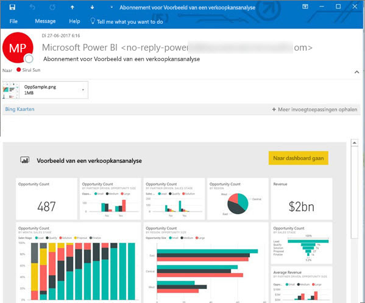

# Abonneren op een rapport of dashboard in de Power BI-service 
Het is nog nooit zo eenvoudig geweest om op de hoogte blijven van uw belangrijkste dashboards en rapporten. Abonneer u op de rapportpagina's en dashboards die voor u het belangrijkst zijn, zodat u een e-mail van Power BI in uw postvak ontvangt met een momentopname. U geeft voor Power BI op hoe vaak u de e-mails wilt ontvangen: van één keer per dag tot één keer per week. 

De e-mail en momentopname gebruiken de taal die is ingesteld in de instellingen van Power BI (zie [Ondersteunde talen en landen/regio's voor Power BI](../supported-languages-countries-regions.md)). Als er geen taal is ingesteld, gebruikt Power BI de taal van de lokale instellingen in uw huidige browser. Als u uw voorkeurstaal wilt bekijken of instellen, selecteert u het tandwielpictogram  > **Instellingen > Algemeen > Taal**. 

Wanneer u de e-mail ontvangt, bevat deze een koppeling naar het rapport of dashboard. Wanneer deze koppeling wordt geselecteerd op een mobiel apparaat waarop Power BI-apps zijn geïnstalleerd, wordt de app in plaats van het rapport of het dashboard op de website van Power BI (standaardacties) geopend.

## Vereisten
- Een abonnement **maken** is een functie van Power BI Pro. 
- Aangezien de e-mailberichten waarop u zich kunt abonneren, alleen worden verzonden wanneer een onderliggende gegevensset wordt bijgewerkt of wordt vernieuwd, werken dergelijke abonnementen niet voor gegevenssets die niet worden bijgewerkt of vernieuwd.

## Abonneren op een dashboard of een rapportpagina
Het proces voor het abonneren op een dashboard of rapport is grotendeels vergelijkbaar. U kunt u met dezelfde knop abonneren op dashboards en rapporten van de Power BI-service.
 
.

1. Open het dashboard of het rapport.
2. Selecteer in de bovenste menubalk **Abonneren** of selecteer het enveloppictogram .
   
   

3. Gebruik de gele schuifregelaar om het abonnement in of uit te schakelen.  Als u schuifregelaar instelt op Uit, wordt het abonnement niet verwijderd. Selecteer het prullenbakpictogram om het abonnement te verwijderen.

4. Voeg optioneel gegevens voor het e-mailbericht in. 

    Merk op in de onderstaande schermafbeelding dat wanneer u zich op een rapport abonneert, u zich feitelijk abonneert op een rapport*pagina*.  Als u zich op meer dan één pagina in een rapport wilt abonneren, selecteert u **Nog een abonnement toevoegen** en selecteert u een andere pagina. 
      
   

5. Selecteer **Opslaan en sluiten** om het abonnement op te slaan. Steeds wanneer een van de onderliggende gegevenssets wordt gewijzigd, ontvangt u een e-mailbericht met een momentopname van het dashboard of de rapportpagina. Als het dashboard of rapport vaker dan één keer per dag wordt vernieuwd, ontvangt u alleen na de eerste vernieuwing een e-mail.  
   
   
   
Als u de rapportpagina vernieuwt, wordt de gegevensset niet vernieuwd. Alleen de eigenaar van een gegevensset kan de gegevensset vernieuwen. Als u de naam van de onderliggende gegevensset(s) wilt opzoeken, selecteert u boven in de menubalk de optie **Gerelateerde items weergeven**.
   

## Hoe het e-mailschema wordt bepaald
In de volgende tabel wordt beschreven hoe vaak u een e-mailbericht ontvangt. Alles is afhankelijk van de verbindingsmethode van de gegevensset waarop het dashboard of rapport is gebaseerd (DirectQuery, Live Connect, geïmporteerd in Power BI of een Excel-bestand in OneDrive of SharePoint Online) en op de abonnementopties (dagelijks, wekelijks of geen).

|  | **DirectQuery** | **Live Connect** | **Geplande vernieuwing (import)** | **Excel-bestand in OneDrive/SharePoint Online** |
| --- | --- | --- | --- | --- |
| **Hoe vaak wordt het rapport/dashboard vernieuwd?** |Elke 15 minuten |Power BI controleert om de 15 minuten en als de gegevensset is gewijzigd, wordt het rapport vernieuwd. |De gebruiker selecteert geen, dagelijks of wekelijks. Dagelijks mag maximaal 8 keer per dag zijn. Wekelijks is daadwerkelijk een wekelijks schema dat de gebruiker maakt, waarbij er een vernieuwingsfrequentie van minimaal één keer per week en maximaal één keer per dag kan worden ingesteld. |Elk uur |
| **Hoeveel controle heeft de gebruiker over het e-mailschema voor het abonnement?** |Opties zijn: dagelijks of wekelijks |Geen opties: de gebruiker ontvangt een e-mailbericht als het rapport wordt vernieuwd, maar niet vaker dan één keer per dag. |Als het rapport dagelijks wordt vernieuwd, zijn de opties dagelijks en wekelijks.  Als het rapport wekelijks wordt vernieuwd, is alleen de optie wekelijks beschikbaar. |Geen opties: de gebruiker een ontvangt een e-mailbericht wanneer de gegevensset wordt bijgewerkt, maar niet vaker dan één keer per dag. |

## Uw abonnementen beheren
Alleen u kunt uw abonnementen beheren. Selecteer **Abonneren** opnieuw en kies **Alle abonnementen beheren** (zie schermafbeeldingen onder stap 4 hierboven). 

Een abonnement wordt beëindigd als de Pro-licentie is verlopen, het dashboard of rapport door de eigenaar wordt verwijderd of het gebruikersaccount wordt verwijderd dat is gebruikt om het abonnement te maken.

## Aandachtspunten en probleemoplossing
* Als voor e-mailabonnementen in een dashboard beveiliging op rijniveau (RLS) is toegepast op een of meer tegels, worden deze tegels niet weergegeven.  Als de gegevensset RLS gebruikt voor e-mailabonnementen voor rapporten, kunt u geen abonnement maken.
* Abonnementen op rapportpagina’s zijn gekoppeld aan de naam van de rapportpagina. Als u zich abonneert op een rapportpagina en de naam ervan wordt gewijzigd, moet u uw abonnement opnieuw maken
* Bepaalde instellingen in uw organisatie zijn mogelijk geconfigureerd in Azure Active Directory. Dit kan de mogelijkheid om e-mailabonnementen in Power BI te gebruiken beperken.  Dit omvat, maar is niet beperkt tot, het gebruik van Multi-Factor Authentication of beperkingen voor IP-bereik bij het openen van resources.
* Voor e-mailabonnementen op gegevenssets met een liveverbinding ontvangt u alleen e-mailberichten wanneer de gegevens worden gewijzigd. Als de gegevensset wordt vernieuwd en er geen gegevenswijzigingen zijn, ontvangt u geen mail van Power BI.
* E-mailabonnementen bieden geen ondersteuning voor de [aangepaste visuals](../power-bi-custom-visuals.md).  De enige uitzondering hierop vormen de aangepaste visuals die zijn [gecertificeerd](../power-bi-custom-visuals-certified.md).  
* E-mailabonnementen bieden op dit moment geen ondersteuning voor de aangepaste R-visuals.  
* Als beveiliging op rijniveau (RLS) is toegepast op een of meer dashboardtegels, worden deze tegels niet weergegeven.
* E-mailabonnementen worden verzonden met de standaard filter- en slicerstatus voor het rapport. De wijzigingen die u aanbrengt in de standaardwaarden nadat u zich abonneert, worden niet weergegeven in het e-mailbericht.    
* Voor dashboardabonnementen geldt dat bepaalde soorten tegels nog niet worden ondersteund.  Hierbij gaat het om: streamingtegels, videotegels, tegels voor aangepaste webinhoud.     
* Mogelijk kunt u zich vanwege de maximale e-mailgrootte niet abonneren op dashboards of rapporten met extreem grote afbeeldingen.    
* Wanneer dashboards of rapporten langer dan twee maanden niet worden bezocht, wordt de vernieuwing van de bijbehorende gegevenssets automatisch door Power BI onderbroken.  Als u echter een abonnement aan een dashboard of rapport toevoegt, wordt het dashboard of rapport niet onderbroken, ook net als het niet wordt bezocht.    

## Volgende stappen
* Nog vragen? [Misschien dat de Power Bi-community het antwoord weet](http://community.powerbi.com/).    
* [Lees het blogbericht](https://powerbi.microsoft.com/blog/introducing-dashboard-email-subscriptions-a-360-degree-view-of-your-business-in-your-inbox-every-day/)

