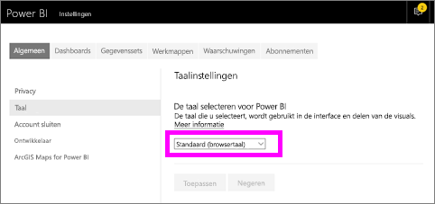
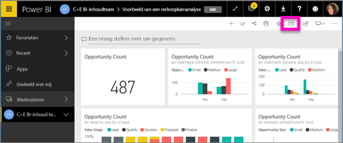
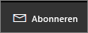
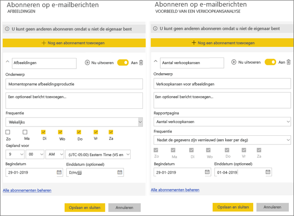
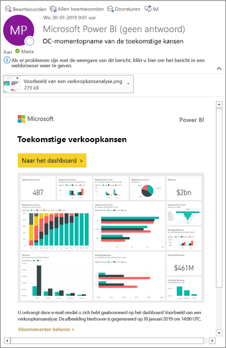
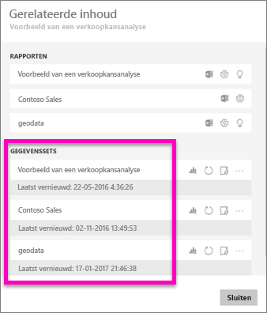
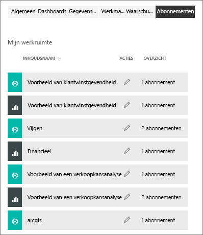

# Abonneren op een rapport of dashboard in de Power BI-service 
Het is nog nooit zo eenvoudig geweest om op de hoogte blijven van uw belangrijkste dashboards en rapporten. Abonneer u op de rapportpagina's en dashboards die voor u het belangrijkst zijn, zodat u een e-mail van Power BI in uw postvak ontvangt met een momentopname. U vertelt Power BI hoe vaak u de e-mailberichten wilt ontvangen: dagelijks, wekelijks, of wanneer de gegevens worden vernieuwd. U kunt ook een specifiek tijdstip instellen waarop Power BI de e-mailberichten verzendt of deze nu laten uitvoeren.  

De e-mail en momentopname gebruiken de taal die is ingesteld in de instellingen van Power BI (zie [Ondersteunde talen en landen/regio's voor Power BI](../supported-languages-countries-regions.md)). Als er geen taal is ingesteld, gebruikt Power BI de taal van de lokale instellingen in uw huidige browser. Als u uw voorkeurstaal wilt bekijken of instellen, selecteert u het tandwielpictogram  > **Instellingen > Algemeen > Taal**. 

Wanneer u de e-mail ontvangt, bevat deze een koppeling om naar het rapport of dashboard te gaan. Wanneer deze koppeling wordt geselecteerd op een mobiel apparaat waarop Power BI-apps zijn geïnstalleerd, wordt de app in plaats van het rapport of het dashboard op de website van Power BI (standaardacties) geopend.

## Vereisten
Een abonnement **maken** is een functie van Power BI Pro.   

## Abonneren op een dashboard of een rapportpagina
Het proces voor het abonneren op een dashboard of rapport is vergelijkbaar. U kunt u met dezelfde knop abonneren op dashboards en rapporten van de Power BI-service.
 
.

1. Open het dashboard of het rapport.
2. Selecteer in de bovenste menubalk **Abonneren** of selecteer het enveloppictogram .
   
   

   
    
    Het scherm aan de linkerkant wordt weergegeven wanneer u zich op het dashboard bevindt en u **Abonneren** selecteert. Het scherm aan de rechterkant wordt weergegeven wanneer u zich op de rapportpagina bevindt en u **Abonneren** selecteert. Als u zich op meer dan één pagina in een rapport wilt abonneren, selecteert u **Nog een abonnement toevoegen** en selecteert u een andere pagina. 

4. Gebruik de gele schuifregelaar om het abonnement in of uit te schakelen.  Als u de schuifregelaar instelt op Uit, wordt het abonnement niet verwijderd. Selecteer het prullenbakpictogram om het abonnement te verwijderen.

4. Voeg optioneel gegevens voor het e-mailbericht in. 

5. Selecteer een **frequentie** voor uw abonnement.  U kunt voor Dagelijks, Wekelijks, of Nadat gegevens zijn vernieuwd (dagelijks) kiezen.  Als u het e-mailbericht van het abonnement alleen op bepaalde dagen wilt ontvangen, selecteert u **wekelijks** en kiest u de dagen waarop u het wilt ontvangen.  Als u bijvoorbeeld het e-mailbericht van het abonnement alleen op werkdagen wilt, ontvangen, selecteert u **Wekelijks** als frequentie en schakelt u de selectievakjes voor Za en Zo uit.   

6. Plan de tijd waarop het e-mailbericht wordt verzonden door Dagelijks of Wekelijks als frequentie te selecteren en een **geplande** **tijd** voor het abonnement in te voeren.   

7. Plan de begin- en einddatum door datums in de datumvelden in te voeren. De begintijd voor uw abonnement is standaard de datum waarop die u deze hebt gemaakt en de einddatum is één jaar later. Wanneer een abonnement een einddatum heeft bereikt, wordt het stopgezet tenzij u het opnieuw inschakelt.  U ontvangt vóór de geplande einddatum melding/meldingen met de vraag of u het abonnement wilt verlengen.     

8. Selecteer **Nu uitvoeren** om uw abonnement te beoordelen en testen.  Hiermee wordt het e-mailbericht meteen naar u verzonden. 

8. Selecteer **Opslaan en sluiten** om het abonnement op te slaan als alles er goed uitziet. U ontvangt een e-mailbericht en een momentopname van het dashboard of rapport op de planning die u instelt. Voor alle abonnementen waarbij de frequentie is ingesteld op **Nadat gegevens zijn vernieuwd**, wordt alleen een e-mailbericht verzonden na de eerste geplande vernieuwing op die dag.
   
   
   
    Als u de rapportpagina vernieuwt, wordt de gegevensset niet vernieuwd. Alleen de eigenaar van een gegevensset kan de gegevensset vernieuwen. Als u de naam van de onderliggende gegevensset(s) wilt opzoeken, selecteert u boven in de menubalk de optie **Gerelateerde items weergeven**.
   
    

## Uw abonnementen beheren
Alleen u kunt uw abonnementen beheren. Selecteer **Abonneren** opnieuw en kies **Alle abonnementen beheren** in de linkerbenedenhoek (zie schermafbeeldingen hierboven). 

Een abonnement wordt beëindigd als de Pro-licentie is verlopen, het dashboard of rapport door de eigenaar wordt verwijderd of het gebruikersaccount wordt verwijderd dat is gebruikt om het abonnement te maken.

## Aandachtspunten en probleemoplossing
* Als voor e-mailabonnementen in een dashboard beveiliging op rijniveau (RLS) is toegepast op een of meer tegels, worden deze tegels niet weergegeven.  Als de gegevensset RLS gebruikt voor e-mailabonnementen voor rapporten, kunt u geen abonnement maken.
* Abonnementen op rapportpagina’s zijn gekoppeld aan de naam van de rapportpagina. Als u zich abonneert op een rapportpagina en de naam ervan wordt gewijzigd, moet u uw abonnement opnieuw maken
* Als u de abonnementsfunctie niet kunt gebruiken, moet u contact opnemen met uw systeembeheerder. Uw organisatie kan deze functie voor verificatie of een andere reden hebben uitgeschakeld.  
* E-mailabonnementen bieden geen ondersteuning voor de [aangepaste visuals](../power-bi-custom-visuals.md).  De uitzondering hierop vormen de aangepaste visuals die zijn [gecertificeerd](../power-bi-custom-visuals-certified.md).  
* E-mailabonnementen bieden op dit moment geen ondersteuning voor de aangepaste R-visuals.  
* Voor dashboardabonnementen geldt dat bepaalde soorten tegels nog niet worden ondersteund.  Hierbij gaat het om: streamingtegels, videotegels, tegels voor aangepaste webinhoud.     
* Mogelijk kunt u zich vanwege de maximale e-mailgrootte niet abonneren op dashboards of rapporten met extreem grote afbeeldingen.    
* Wanneer dashboards of rapporten langer dan twee maanden niet worden bezocht, wordt de vernieuwing van de bijbehorende gegevenssets automatisch door Power BI onderbroken.  Als u echter een abonnement aan een dashboard of rapport toevoegt, wordt het dashboard of rapport niet onderbroken, ook net als het niet wordt bezocht.    

## Volgende stappen

[Inhoud zoeken en sorteren](end-user-search-sort.md)