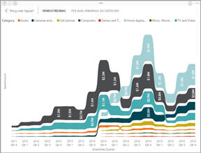

# Typen visualisaties in Power BI
U vindt visualisaties in rapporten, dashboards, apps, en Q&A. Sommige van deze visualisatietypen zijn verpakt met Power BI en sommige zijn *aangepaste visualisaties*. Aangepaste visualisaties worden gemaakt buiten Power BI en op een manier die het voor *rapportontwerpers* mogelijk maakt om deze aan Power BI-rapporten, dashboards en apps toe te voegen. 

Dit artikel vormt een overzicht van de visualisaties die zijn verpakt met Power BI.  Dit zijn de visualisaties die u het vaakst tegenkomt. 

> [!NOTE]
> Zoek voor meer informatie over aangepaste visualisaties in de sectie **Visuele Power BI-elementen** van [Microsoft AppSource](https://appsource.microsoft.com/marketplace/apps?product=power-bi-visuals). Van elk visuele element vindt u een beschrijving, auteursgegevens, en schermafdrukken of een video. 

## Lijst met visualisaties die beschikbaar zijn in Power BI
Al deze visualisaties kunnen worden gevonden in Power BI-apps, -dashboards, -rapporten en zijn [opgegeven in Q&A](#qna). Zie [Interactie met visualisaties in rapporten, dashboards en apps](end-user-visualizations.md) voor meer informatie over de interactie met visualisaties

### Vlakdiagrammen: eenvoudig (lagen) en gestapeld

Het eenvoudige vlakdiagram is gebaseerd op het lijndiagram waarbij het gebied tussen de as en de lijn wordt gevuld. Vlakdiagrammen benadrukken de mate van wijzigingen in de loop van de tijd en kunnen worden gebruikt om de aandacht te vestigen op de totale waarde voor een trend. Gegevens die bijvoorbeeld de winst in de loop van de tijd voorstellen, kunnen worden afgezet in een vlakdiagram om de totale winst te benadrukken.

### Staaf- en kolomdiagrammen

 

Staafdiagrammen zijn de standaard als u een specifieke waarde over verschillende categorieën wilt weergeven.

### Kaarten: één getal

Kaarten met één getal geven één feit weer, één gegevenspunt. Soms is één getal het belangrijkste dat u wilt bijhouden op uw Power BI-dashboard of -rapport, zoals de totale omzet, het marktaandeel jaar na jaar of het totale aantal verkoopkansen.  

### Kaarten: met meerdere rijen

Kaarten met meerdere rijen geven een of meer gegevenspunten weer, één per rij.

### Combinatiegrafieken

Een combinatiegrafiek combineert een kolomdiagram en een lijndiagram. Als u deze twee diagrammen combineert, kunt u de gegevens sneller vergelijken. Combinatiegrafieken kunnen over één of twee Y-assen beschikken, dus zorg ervoor dat u hier goed op let. 

In de volgende gevallen komen combinatiegrafieken goed van pas:
- Als u hebt een lijndiagram en een kolomdiagram met dezelfde X-as hebt.
- Als u meerdere metingen met verschillende waardebereiken wilt vergelijken.
- Als u het verband tussen twee metingen wilt illustreren in één visualisatie.
- Als u wilt controleren of één meting voldoet aan het doel dat is gedefinieerd door een andere meting.
- Als u ruimte op het canvas wilt besparen.

### Ringdiagrammen

Ringdiagrammen lijken op cirkeldiagrammen.  Ze geven het verband weer tussen delen en het geheel. Het enige verschil is dat het midden leeg is, waardoor er ruimte is voor een label of pictogram.

### Trechterdiagrammen

Trechters helpen bij het visualiseren van een proces dat bestaat uit fasen en waarbij items achter elkaar van de ene naar de volgende fase stromen.  Een voorbeeld hiervan is een verkoopproces dat begint met potentiële klanten en eindigt met de afhandeling van de aankoop.

Bijvoorbeeld verkoopactiviteiten waarbij de klanten in bepaalde fasen worden bijgehouden: Lead > Gekwalificeerde Lead > Potentiële klant > Contract > Sluiten. De vorm van de trechter brengt de status van het proces dat u bijhoudt in één oogopslag over.
Elke fase van de trechter vertegenwoordigt een percentage van het totaal. In de meeste gevallen heeft een trechterdiagram dus de vorm een trechter. De eerste fase is het grootst en elke latere fase is kleiner dan de vorige. Een trechter in de vorm van een peer is ook nuttig. Hiermee kunt u een probleem in het proces identificeren. Maar normaal gesproken is de eerste fase (de startfase) het grootst.

In de volgende gevallen komen trechterdiagrammen goed van pas:
- wanneer de gegevens sequentieel zijn en ten minste 4 fasen doorlopen.
- wanneer het aantal 'items' in de eerste fase naar verwachting groter is dan het aantal in de laatste fase.
- om potentieel (inkomsten/verkoop/deals/enz) te berekenen fasen.
- om conversie- en retentiepercentages te berekenen en bij te houden.
- om knelpunten in een lineair proces te identificeren.
- om de werkstroom van een winkelwagen bij te houden.
- om de voortgang en het succes van reclame-/marketingcampagnes met doorklikken bij te houden.

### Meterdiagrammen

Een radiale-meterdiagram heeft een cirkelvormige boog en toont één waarde die de voortgang naar een doel/KPI meet. Het doel of de doelwaarde wordt weergegeven door de lijn (naald). De voortgang naar het doel wordt weergegeven door de arcering. En de waarde die de voortgang vertegenwoordigt, wordt vetgedrukt weergegeven in de boog. Alle mogelijke waarden zijn gelijkmatig verdeeld langs de boog, van minimum (meest linkse waarde) tot maximum (meest rechtse waarde).

In het bovenstaande voorbeeld zijn we een autohandelaar die de gemiddelde verkoop van het verkoopteam per maand bijhoudt. Ons doel is 140 en dat wordt weergegeven door de zwarte naald. De minimale mogelijke gemiddelde verkoop is ingesteld op 0 en we hebben het maximum ingesteld op 200. De blauwe arcering geeft aan dat we deze maand momenteel ongeveer 120 verkopen gemiddeld hebben. Gelukkig hebben we nog een week de tijd om ons doel te bereiken.

Radiale meters zijn een uitstekende keuze om:
- de voortgang naar een doel weer te geven
- een percentielmeting weer te geven, zoals een KPI
- de status van één meting weer te geven
- informatie weer te geven die snel kan worden gelezen en begrepen

<!-- ### Key influencers chart

A key influencer chart displays the major contributors to a selected result or value.  -->

### KPI's

Een Key Performance Indicator (KPI) is een visuele aanwijzing waarmee de voortgang naar een meetbaar doel wordt aangegeven. 

KPI's zijn een prima keuze:
- voor het meten van voortgang (waarmee loop ik voor of achter?)
- voor het meten van de afstand tot een doel (hoe ver loop ik voor of achter?)

### Lijndiagrammen

Lijndiagrammen benadrukken de algehele vorm van een volledige reeks waarden, meestal in de loop van de tijd.

### Kaarten: basiskaarten

Gebruik een basiskaart om categorische en kwantitatieve gegevens te koppelen aan ruimtelijke locaties.

### Kaarten: ArcGIS-kaarten

De combinatie van ArcGIS-kaarten en Power BI tilt kaarten naar een volledig nieuw niveau, verder dan de presentatie van punten op een kaart. Met de beschikbare opties voor basiskaarten, locatietypen, thema's, symboolstijlen en referentielagen worden prachtige informatieve kaartvisualisaties gemaakt. De combinatie van bindende gegevenslagen (zoals censusgegevens) op een kaart met ruimtelijke analyse geeft een beter inzicht in uw visualisatiegegevens.

### Kaarten: Choropletenkaarten

In een choropletenkaart worden arcering, tinten of patronen gebruikt om aan te geven hoe een waarde in verhouding verschilt voor een geografisch gebied of regio. U kunt zo snel deze relatieve verschillen laten zien met behulp van arcering die varieert van licht (minder frequent/lager) tot donker (meer-frequent/hoger).

### Kaarten: Shape-kaarten

Met shape-kaarten kunt u op een kaart regio's met elkaar vergelijken met behulp van een kleur. In tegenstelling tot de visualisatie van de M\kaart kunnen shape-kaarten geen nauwkeurige geografische locaties van gegevenspunten weergeven op een kaart. Het belangrijkste doel ervan is om relatieve vergelijkingen van regio's aan te geven op een kaart door verschillende kleuren te gebruiken.

### Matrix

De matrixvisualisatie is een type tabelvisualisatie (Zie 'Tabel' hieronder) die ondersteuning biedt voor een indeling met interval. Rapportontwerpers nemen vaak matrices op in rapporten en dashboards waarmee gebruikers een of meer element (rijen, kolommen, cellen) in de matrix kunnen selecteren voor het kruislings markeren van andere visuele elementen op een rapportpagina.  

### Cirkeldiagrammen

Cirkeldiagrammen geven het verband weer tussen delen en het geheel. 

### Lintgrafiek

Lintgrafieken geven aan welke gegevenscategorie de hoogste rang (hoogste waarde) heeft. In lintgrafieken kunnen wijzigingen in de rang goed worden weergegeven, waarbij voor elke periode de hoogste rang (waarde) altijd bovenaan wordt weergegeven.

### Spreidings-, bellen- en eendimensionale puntdiagrammen

Een spreidingsdiagram heeft altijd twee waardeassen, waarbij een reeks numerieke gegevens op een horizontale as en een andere reeks numerieke waarden op de verticale as wordt weergegeven. In het diagram worden punten weergegeven op het snijpunt van een numerieke x- en y-waarde, waarbij deze waarden in één gegevenspunt worden gecombineerd. Deze gegevenspunten kunnen, afhankelijk van de gegevens, gelijkmatig of ongelijkmatig over de horizontale as zijn verdeeld.

Bij een bellendiagram worden de gegevenspunten vervangen door bellen. De grootte van de bellen geeft de gegevens een extra dimensie.

Een eendimensionaal puntdiagram lijkt erg op een bellendiagram en een spreidingsdiagram, behalve dat er numerieke of categorische gegevens langs de X-as geplaatst kunnen worden.

### High-densityspreiding

High-densitygegevens worden per definitie verzameld om redelijk snel visualisaties te maken die responsief zijn voor op interactiviteit. High-densitysampling maakt gebruik van een algoritme dat overlappende punten elimineert en zorgt ervoor dat alle punten in de gegevensset worden weergegeven in de visualisatie. Er wordt niet alleen een representatieve steekproef van de gegevens geplot.  

Dit zorgt voor de best mogelijke combinatie van reactievermogen, weergave en behoud van belangrijke punten in de algehele gegevensset te bieden.

### Slicers

Een slicer is een zelfstandig diagram dat kan worden gebruikt voor het filteren van de andere visualisaties op de pagina. Slicers zijn verkrijgbaar in veel verschillende indelingen (categorie, bereik, datum, enzovoort) en kunnen zo worden geformatteerd dat selectie van slechts één, veel of alle van de beschikbare waarden mogelijk is. 

In de volgende gevallen komen slicers goed van pas:
- als u veelgebruikte of belangrijke filters op het rapportcanvas wilt weergeven voor een eenvoudigere toegang;
- als u de huidige gefilterde status gemakkelijker wilt bekijken zonder dat u een vervolgkeuzelijst hoeft te openen;
- als u wilt filteren op kolommen die niet nodig zijn en verborgen zitten in de gegevenstabellen;
- als u meer gerichte rapporten wilt maken door slicers naast belangrijke visuele elementen te zetten.

### Zelfstandige afbeeldingen

Een zelfstandige afbeelding is een afbeelding die is toegevoegd aan een rapport of dashboard. 

### Tabellen

Een tabel is een raster met gerelateerde gegevens in een logische reeks rijen en kolommen. Het kan ook koppen en een rij voor totalen bevatten. Tabellen werken goed met kwantitatieve vergelijkingen waarbij u veel waarden voor één categorie bekijkt. Deze tabel geeft bijvoorbeeld vijf verschillende eenheden voor Categorie weer.

Tabellen zijn een prima keuze:
- om gedetailleerde gegevens en exacte waarden (in plaats van visuele weergaven) te bekijken en vergelijken;
- om gegevens weer te gegeven in tabelvorm;
- om numerieke gegevens per categorie weer te geven.

### Treemaps

Treemaps zijn diagrammen van gekleurde rechthoeken waarbij de grootte de waarde aangeeft.  Ze kunnen hiërarchisch zijn waarbij kleinere rechthoeken zijn genest binnen de grootste rechthoeken. De ruimte in elke rechthoek wordt toegewezen op basis van de waarde die wordt gemeten. En de rechthoeken zijn gerangschikt op grootte van linksboven (grootste) naar rechtsonder (kleinste).

In de volgende gevallen komen treemaps goed van pas:
- wanneer u grote hoeveelheden hiërarchische gegevens moet weergeven;
- wanneer een staafdiagram het grote aantal waarden niet effectief kan verwerken;
- wanneer u de verhoudingen tussen de verschillende en het geheel wilt weergeven;
- wanneer u het patroon van de distributie van de meting tussen de verschillende niveaus van categorieën in de hiërarchie wilt weergeven;
- wanneer u kenmerken wilt weergeven met grootte- en kleurcoderingen;
- wanneer u patronen, uitbijters, de belangrijkste bijdragers en uitzonderingen wilt identificeren.

### Watervalgrafieken

Een watervalgrafiek toont een voorlopig totaal terwijl waarden worden toegevoegd of afgetrokken. Dit is handig om te begrijpen hoe een beginwaarde (bijvoorbeeld netto inkomsten) wordt beïnvloed door een reeks positieve en negatieve wijzigingen.

De kolommen worden met een kleur gecodeerd, zodat u snel toenames en afnames kunt zien. De kolommen met de eerste en de uiteindelijke waarde beginnen vaak op de horizontale as, terwijl de tussenliggende waarden zwevende kolommen zijn. Vanwege dit 'uiterlijk' worden watervalgrafieken ook wel bruggrafieken genoemd.

In de volgende gevallen komen watervalgrafieken goed van pas:
- wanneer er wijzigingen voor de meting zijn binnen een tijdreeks of verschillende categorieën
- om de belangrijkste wijzigingen te controleren die bijdragen aan de totaalwaarde
- om de jaarlijkse winst van uw bedrijf uit te zetten door verschillende bronnen van omzet weer te geven en uiteindelijk bij de totale winst (of verlies) uit te komen.
- om het aantal personeelsleden aan het begin en het einde van een jaar in beeld te brengen
- om te visualiseren hoeveel geld u elke maand verdient en uitgeeft, en het huidige saldo voor uw rekening

## Aangeven welke visualisatie Q&A moet gebruiken
Wanneer u query's in natuurlijke taal typt met Power BI Q&A, kunt u het type visualisatie in uw query opgeven.  Bijvoorbeeld:

'***verkoop per staat als treemap***'

## Volgende stappen
[Interactie met visualisaties in rapporten, dashboards en apps](end-user-visualizations.md)    
[The right visual reference van sqlbi.com](http://www.sqlbi.com/wp-content/uploads/videotrainings/dashboarddesign/visuals-reference-may2017-A3.pdf)