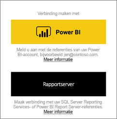
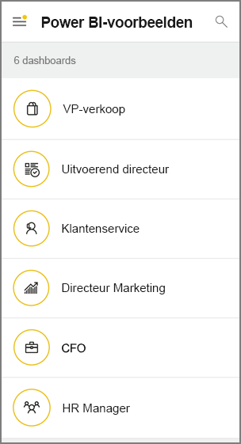
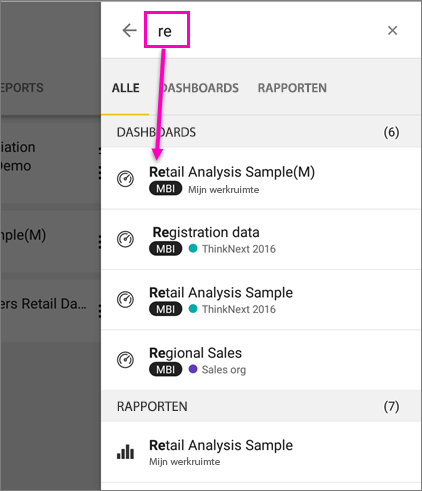
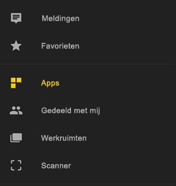
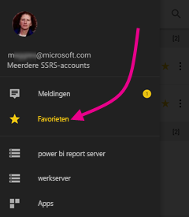
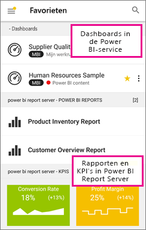

# Aan de slag met de mobiele Power BI-app op Android-apparaten
De Android-app voor Microsoft Power BI biedt de mobiele BI-ervaring voor Power BI, Power BI Report Server en Reporting Services. Bekijk en gebruik vanaf elke locatie uw bedrijfsdashboards on-premises en in de cloud met mobiele live-toegang met aanraakfunctionaliteit. Verken de gegevens in dashboards en deel deze met uw collega's per e-mail of sms-bericht. 

U maakt Power BI-rapporten in Power BI Desktop en publiceert deze:

* [Publiceer de rapporten naar de Power BI-service](../../power-bi-overview.md) en maak dashboards.
* [Publiceer de rapporten on-premises naar Power BI Report Server](../../report-server/quickstart-create-powerbi-report.md).

Vervolgens gebruikt u de dashboards en rapporten on-premises of in de cloud in de Power BI-app voor Android-apparaten.

Ontdek [wat er nieuw is in de mobiele Power BI-apps](../../mobile-whats-new-in-the-mobile-apps.md).

## Vereisten

### De app downloaden

[Download de app Power BI voor Android](http://go.microsoft.com/fwlink/?LinkID=544867) vanuit de Google Play Store.
  
Power BI kan worden uitgevoerd op verschillende Android-apparaten waarop het besturingssysteem Android 5.0 of hoger is geïnstalleerd. U controleert dit op uw apparaat door naar **Instellingen** > **Over het apparaat** > **Android-versie** te gaan. 

**Starten wanneer de app wordt geopend**    
U kunt zelfs zonder u te registreren of aan te melden na het openen van de app door de aanmeldingspagina's bladeren, voor een snel overzicht van wat u met de Power BI-app op uw Android-apparaat kunt doen. Tik op **Overslaan** om de voorbeelden te bekijken en te verkennen en om met de app te oefenen. U kunt op elk gewenst moment [teruggaan naar de voorbeelden](mobile-android-app-get-started.md#try-the-power-bi-and-reporting-services-samples) vanaf de startpagina van dashboards.

Ontdek [wat er nieuw is in de mobiele Power BI-apps](../../mobile-whats-new-in-the-mobile-apps.md).

## Registreren voor de Power BI-service op het web
Als u zich nog niet hebt geregistreerd, gaat u naar de [Power BI service (http://powerbi.com/)](http://powerbi.com/) om u te registreren voor een eigen account, waarmee u dashboards en rapporten kunt maken en opslaan en uw gegevens kunt samenbrengen. Meld u vervolgens op uw Android-apparaat aan bij Power BI om uw eigen dashboards vanaf elke locatie weer te geven.

1. Tik in de Power BI-service op [Registreren](http://go.microsoft.com/fwlink/?LinkID=513879) om een Power BI-account te maken.
2. Begin met het [maken van uw eigen dashboards en rapporten](../../service-get-started.md).

## Aan de slag met de Power BI-app op uw apparaat
1. Open de Power BI voor Android-app vanuit het startscherm op uw Android-apparaat.
   
   
2. Tik op **Power BI** als u uw Power BI-dashboards en -rapporten wilt weergeven.  
   
   Als u een bericht krijgt dat u niet bij Power BI kunt worden aangemeld, raadpleegt u [Kan niet verifiëren omdat uw zakelijke SSL-certificaat niet wordt vertrouwd](mobile-android-app-error-corporate-ssl-account-is-untrusted.md) voor meer informatie over hoe u het probleem kunt oplossen.

   Tik op **Report Server** om uw Power BI Report Server- en Reporting Services-rapporten en -KPI's weer te geven.
   
   

## De Power BI- en Reporting Services-voorbeelden uitproberen
U hoeft zich niet aan te melden om met de Power BI- en Reporting Services-voorbeelden te oefenen. Nadat u de app hebt gedownload, kunt u de voorbeelden bekijken of aan de slag gaan. U kunt op elk gewenst moment teruggaan naar de voorbeelden vanaf de startpagina met dashboards.

### Power BI-voorbeelden
U kunt de Power BI-voorbeelddashboards bekijken en gebruiken, maar er zijn enkele dingen die u hiermee niet kunt doen. Het is niet mogelijk de rapporten achter de dashboards te openen, de voorbeelden met anderen te delen of ze aan uw favorieten toe te voegen.

1. Tik op de knop voor globale navigatie  in de linkerbovenhoek.
2. Tik op **Instellingen** > **Ontdek onze voorbeelden**, kies een rol en verken het voorbeelddashboard voor die rol.  
   
   

### Voorbeelden van mobiele Reporting Services-rapporten
1. Tik op de knop voor globale navigatie  in de linkerbovenhoek.
2. Tik op **Reporting Services-voorbeelden** en open de map Retail Reports of Sales Reports om KPI's en mobiele rapporten te verkennen.
   
   

## Een dashboard of rapport zoeken
* Tik op het vergrootglas in de rechterbovenhoek en typ de term die u zoekt.
  
    
  
    Standaard worden alle dashboards en rapporten doorzocht, maar u kunt aangeven dat er slechts één hoeft te worden doorzocht.

## Uw inhoud in de mobiele Power BI-apps zoeken
Uw dashboards en rapporten worden opgeslagen op verschillende locaties in de mobiele Power BI-apps. Waar ze worden opgeslagen, is afhankelijk van waar ze afkomstig zijn. Klik [hier](../../mobile-apps-quickstart-view-dashboard-report.md) voor informatie over het zoeken van uw inhoud in de mobiele apps. Bovendien kunt u altijd zoeken naar alles wat u in de mobiele Power BI-apps hebt. 

## Uw favoriete dashboards, KPI's en rapporten weergeven
U ziet op de pagina Favorieten in de mobiele apps al uw favoriete Power BI-dashboards, samen met Power BI Report Server- en Reporting Services-KPI's en -rapporten. Wanneer u een dashboard aan uw *favorieten* toevoegt in de mobiele Power BI-app, kunt u het openen op al uw apparaten, met inbegrip van de Power BI-service in uw browser. 

* Tik op **Favorieten**.
  
   
  
   Al uw Power BI-favorieten en favorieten van de Power BI Report Server- en Reporting Services-webportal bevinden zich op deze pagina.
  
   

Lees meer over [favorieten in de mobiele Power BI-apps](mobile-apps-favorites.md).

## Ondersteuning voor ondernemingen voor de mobiele Power BI-apps
Organisaties kunnen Microsoft Intune gebruiken voor het beheer van apparaten en toepassingen, waaronder de mobiele Power BI-apps voor Android en iOS.

Microsoft Intune kan bijvoorbeeld worden gebruikt om een pincode voor toegang te vereisen, om te beheren hoe gegevens door de toepassing worden verwerkt of zelfs om toepassingsgegevens te versleutelen wanneer de app niet wordt gebruikt.

> [!NOTE]
> Als u de mobiele Power BI-app op uw Android-apparaat gebruikt en uw organisatie Microsoft Intune MAM heeft geconfigureerd, is het vernieuwen van gegevens op de achtergrond uitgeschakeld. De volgende keer dat u de app gebruikt, worden de gegevens vanuit de Power BI-service op het web vernieuwd.
> 
> 

Lees meer over [het configureren van mobiele Power BI-apps voor Android met Microsoft Intune](../../service-admin-mobile-intune.md). 

## Volgende stappen
Hier volgen enkele dingen die u in de Android-apparaat-app voor Power BI kunt doen met dashboards en rapporten in Power BI en rapporten en KPI's in de Power BI Report Server- of Reporting Services-webportal.

### Power BI-dashboards en -rapporten
* [Uw apps](../end-user-apps.md) weergeven.
* Uw [dashboards](../../mobile-apps-view-dashboard.md) weergeven.
* De [tegels op uw dashboards](../../mobile-tiles-in-the-mobile-apps.md) verkennen.
* [Power BI-rapporten](../../mobile-reports-in-the-mobile-apps.md) openen.
* [Uw apps](../end-user-apps.md) weergeven.
* [Aantekeningen maken en tegels delen](mobile-annotate-and-share-a-tile-from-the-mobile-apps.md).
* [Dashboards](../../mobile-share-dashboard-from-the-mobile-apps.md) delen.
* [Een Power BI-QR-code scannen](../../mobile-apps-qr-code.md) met uw Android-telefoon om een verwante dashboardtegel of verwant rapport te openen. 
* [Meldingen over updates voor uw Power BI-account](../../mobile-apps-notification-center.md) weergeven, zoals dashboards die collega's met u delen.

### Rapporten en KPI's op de Power BI Report Server- en Reporting Services-webportal
* [Rapporten en KPI's op de webportal weergeven](mobile-app-ssrs-kpis-mobile-on-premises-reports.md) in de mobiele Power BI-app voor Android-apparaten.
* [KPI's op de webportal](https://docs.microsoft.com/sql/reporting-services/working-with-kpis-in-reporting-services) maken.
* [Rapporten in Power BI Desktop maken en deze publiceren op de Power BI Report Server](../../report-server/quickstart-create-powerbi-report.md)-webportal

### Zie ook
* [De Android-app downloaden](http://go.microsoft.com/fwlink/?LinkID=544867) vanuit de Android-app-store.
* [Wat is Power BI?](../../power-bi-overview.md)
* Vragen? [Misschien dat de Power BI-community het antwoord weet](http://community.powerbi.com/)

