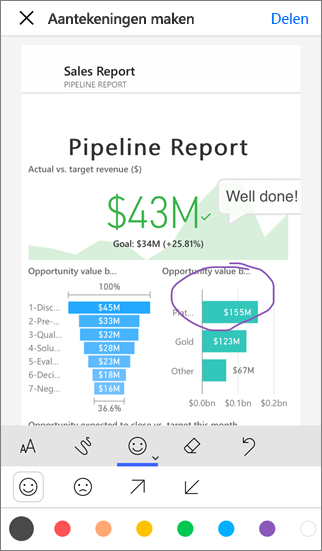
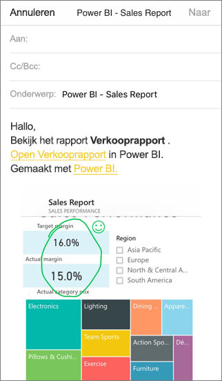

# Een tegel, rapport of visual van aantekeningen voorzien en delen via mobiele Power BI-apps
Van toepassing op:

|  |  |  |  |
|:--- |:--- |:--- |:--- |
| iPhones |iPads |Android-telefoons |Android-tablets |

U kunt momentopnamen van tegels, rapporten of visuals van aantekeningen voorzien en delen met de mobiele Power BI-app voor iOS en Android-apparaten. Uw geadresseerden zien de momentopname precies zoals deze was toen u het e-mailbericht hebt verzonden, plus een koppeling. U kunt momentopnamen van tegels naar iedereen verzenden, niet alleen naar collega's in hetzelfde e-maildomein. U kunt aantekeningen toevoegen (regels, tekst of stempels) voordat u de momentopname deelt.

*Een rapport met aantekeningen*

Het e-mailbericht met de momentopname van de tegel, het rapport of de visual bevat ook een koppeling naar het werkelijke object in de Power BI-service ([https://powerbi.com](https://powerbi.com)). De geadresseerden kunnen op de koppeling klikken en rechtstreeks naar de tegel, het rapport of de visual gaan, als u en zij beschikken over Power BI Pro-licenties, of als de inhoud deel uitmaakt van de [Premium-capaciteit](../../service-premium.md) en u het item al met hen hebt gedeeld. 

U kunt [een tegel ook delen vanuit de mobiele Power BI-app voor Windows 10-apparaten](mobile-windows-10-phone-app-get-started.md), maar u kunt geen aantekeningen toevoegen.

## Een tegel openen om aantekeningen toe te voegen
1. Tik op een tegel om deze te openen in de focusmodus.
2. Tik op het pictogram Aantekeningen  in de rechterbovenhoek van de tegel.
3. Nu kunt u [de tegel van aantekeningen voorzien en deze delen](mobile-annotate-and-share-a-tile-from-the-mobile-apps.md#annotate-and-share-the-tile-report-or-visual).

## Een rapport openen om aantekeningen toe te voegen
1. Open een rapport. 
2. Tik op het pictogram Aantekeningen  in de rechterbovenhoek van het rapport.
3. Nu kunt u [het rapport van aantekeningen voorzien en het delen](mobile-annotate-and-share-a-tile-from-the-mobile-apps.md#annotate-and-share-the-tile-report-or-visual).

## Een visual openen om aantekeningen toe te voegen
1. Tik op een visual in een rapport. Tik vervolgens op het pictogram Uitvouwen om deze te openen in de focusmodus. 
   
    
2. Tik op het pictogram Aantekeningen  in de rechterbovenhoek van de visual.
3. Nu kunt u [de visual van aantekeningen voorzien en deze delen](mobile-annotate-and-share-a-tile-from-the-mobile-apps.md#annotate-and-share-the-tile-report-or-visual).

## De tegel, het rapport of de visual van aantekeningen voorzien en deze delen
1. Hier ziet u hoe u aantekeningen maakt:  
   
   
   
   *De aantekeningenbalk op iPhones en iPads*
   
   
   
   *De aantekeningenbalk op Android-apparaten*
   
   * Als u lijnen met verschillende kleuren en dikten wilt tekenen, tikt u op het pictogram met de kronkellijn, kiest u een breedte en kleur, en begint u met tekenen.  
   * Als u opmerkingen wilt typen, tikt u op de **AA**, kiest u de tekstgrootte en -kleur, en begint u te typen.  
   * Als u stempels (zoals emoticons) op de tegel wilt plakken, tikt u op het lachebekje, kiest u een kleur en tikt u op de plek waar u deze wilt invoegen.   
2. Nadat u aantekeningen hebt gemaakt, tikt u in de rechterbovenhoek op **Delen**.
3. Open uw e-mailapp, typ de namen van de geadresseerden en wijzig het bericht, indien gewenst.  
   
   
   
   Het e-mailbericht bevat een afbeelding, en een koppeling naar de specifieke tegel, of visual, of naar het specifieke rapport. 
4. Tik op **Verzenden**.

## Volgende stappen
* [Een dashboard delen via de mobiele Power BI-apps](mobile-share-dashboard-from-the-mobile-apps.md)
* Vragen? [Misschien dat de Power BI-community het antwoord weet](http://community.powerbi.com/)

