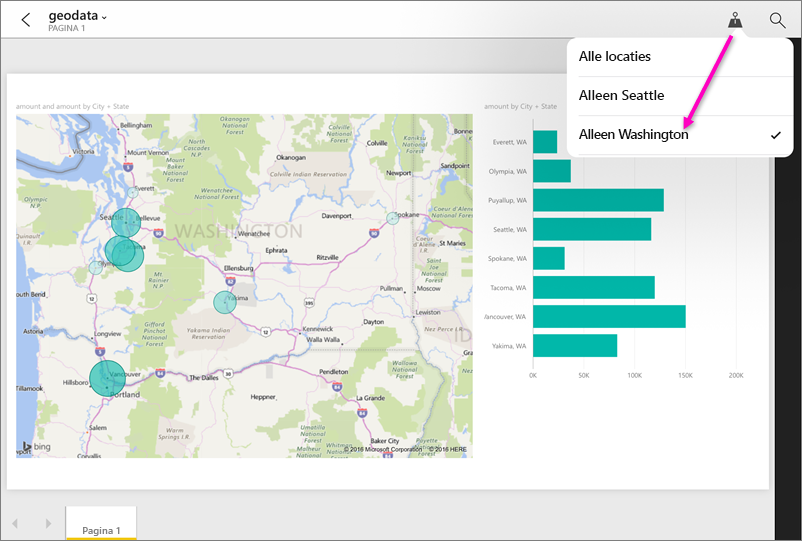

# Een rapport filteren op geografische locatie in de mobiele Power BI-apps
Van toepassing op:

|  |  |  |  |  |
|:--- |:--- |:--- |:--- |:--- |
| iPhones |iPads |Android-telefoons |Android-tablets |Windows 10-telefoons |

Ziet u, wanneer u een Power BI-rapport weergeeft op een mobiel apparaat, in de rechterbovenhoek een pictogram van een kleine punaise? Als dit het geval is, kunt u dit rapport filteren op basis van uw geografische locatie.

> [!NOTE]
> U kunt alleen filteren op locatie als de geografische namen in het rapport in het Engels zijn, bijvoorbeeld ‘New York City’ of ‘Germany’. Windows 10-tablets en -pc's bieden geen ondersteuning voor geografische filtering, maar Windows 10-telefoons wel.
> 
> 

## Een rapport filteren op uw geografische locatie
1. Open een rapport in de mobiele Power BI-app op uw mobiele apparaat.
2. Als het rapport geografische gegevens bevat, ziet u een bericht waarin u wordt gevraagd om Power BI toegang te verlenen tot uw locatie. Klik op **Toestaan**, en tik vervolgens opnieuw op **Toestaan**.
3. Tik op de punaise . U kunt filteren op stad, provincie of land/regio, afhankelijk van de gegevens in het rapport. Het filter biedt alleen opties die overeenkomen met uw huidige locatie.
   
    

## Waarom zie ik geen locatiecodes in een rapport?
Alle drie deze voorwaarden moeten waar zijn om locatiecodes te kunnen zien. 

* De persoon die het rapport in Power BI Desktop heeft gemaakt, [heeft geografische gegevens gecategoriseerd](../../desktop-mobile-geofiltering.md) voor minstens één kolom, zoals stad, provincie of land/regio.
* U bevindt zich op een van de locaties met gegevens in deze kolom.
* U gebruikt een van deze mobiele apparaten:
  * iOS (iPad, iPhone, iPod).
  * Android-telefoon of -tablet.
  * Windows 10-telefoon (andere Windows 10-apparaten zoals pc's en tablets bieden geen ondersteuning voor geografische filtering).

Lees meer over [het instellen van geografische filtering](../../desktop-mobile-geofiltering.md) in Power BI Desktop.

### Volgende stappen
* [Verbinding maken met Power BI-gegevens uit de praktijk](mobile-apps-data-in-real-world-context.md) met de mobiele apps
* [Gegevenscategorisatie in Power BI Desktop](../../desktop-data-categorization.md) 
* Vragen? [Misschien dat de Power BI-community het antwoord weet](http://community.powerbi.com/)

