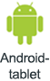
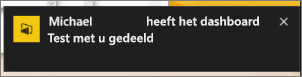
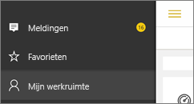
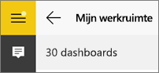
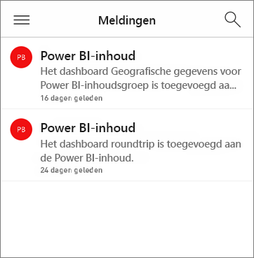
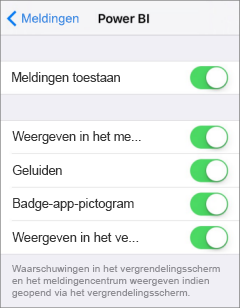
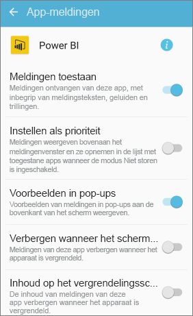

# Meldingen ontvangen in de Power BI - Mobiel-apps
Van toepassing op:

|  |  |  |  |  |
|:--- |:--- |:--- |:--- |:--- |
| iPhones |iPads |Android-telefoons |Android-tablets |Windows 10-apparaten |

Via Meldingen ontvangt u informatie met betrekking tot uw Power BI-ervaring rechtstreeks in de Power BI-service of op uw mobiele apparaat. Wanneer u Meldingen opent, ziet u een sequentiële feed met berichten over [waarschuwingen die u hebt ingesteld](mobile-set-data-alerts-in-the-mobile-apps.md), nieuwe dashboards die met u zijn gedeeld, wijzigingen in uw groepsruimte, informatie over Power BI-gebeurtenissen en -vergaderingen en meer.

> [!NOTE]
> Wanneer u zich op een iOS-apparaat voor de eerste keer aanmeldt bij de [bijgewerkte versie van de Power BI-apps](https://powerbi.microsoft.com/mobile/), wordt een bericht weergegeven waarin u wordt gevraagd of u wilt dat Power BI meldingen verzendt. U kunt ook in **Instellingen** configureren hoe Power BI u informeert voor uw apparaat. 
> 
> 

## Meldingen op uw mobiele apparaat weergeven
1. Wanneer u meldingen op uw mobiele apparaat ontvangt, wordt er standaard een geluid afgespeeld en wordt een meldingenbanner weergegeven in Power BI.
   
   
   
   Of op een iPad:
   
   
   
   U kunt [wijzigen hoe Power BI u op de hoogte brengt](mobile-apps-notification-center.md#change-or-turn-off-notifications-on-your-mobile-device).
2. Als u meldingen hebt ontvangen en u zich op uw mobiele apparaat aanmeldt bij Power BI, wordt een gele stip op de algemene navigatieknop  (Android) of op het pictogram **Meldingen** weergegeven. 
   
   
3. Selecteer het pictogram Meldingen  (Windows 10).
   
    De nieuwste meldingen worden bovenaan weergegeven en ongelezen berichten worden gemarkeerd. Meldingen worden gedurende 90 dagen bewaard, tenzij u ze verwijdert of de limiet van 100 berichten bereikt.
   
   
4. Als u een melding wilt verwijderen, tikt u op de melding en houdt u deze vast. Vervolgens selecteert u **Verwijderen**.

## Meldingen op uw mobiele apparaat wijzigen of uitschakelen
U kunt wijzigen hoe Power BI u op de hoogte brengt.

1. Op een iOS-apparaat gaat u naar **Instellingen** > **Meldingen**. 
   
    Op een Android-telefoon gaat u naar **Instellingen voor meldingen**.
   
    Op een Windows-apparaat gaat u in **Instellingen** naar **Systeem** > **Meldingen en acties**.
2. Selecteer **Power BI** in de lijst met apps. 
3. Hier kunt u meldingen volledig uitschakelen of kiezen welke meldingen u wilt ontvangen.
   
    **Op een iPhone**
   
    
   
    **Op een Android-telefoon**
   
    

    **Op een Windows 10-apparaat**

    

## Volgende stappen
* [Gegevenswaarschuwingen in de Power BI-service](../../service-set-data-alerts.md)
* [Gegevensmeldingen instellen in de iPhone-app (Power BI voor iOS)](mobile-set-data-alerts-in-the-mobile-apps.md)
* [Gegevensmeldingen instellen in de mobiele Power BI-app voor Windows 10](mobile-set-data-alerts-in-the-mobile-apps.md)
* [De nieuwste versie van de Power BI-apps](https://powerbi.microsoft.com/mobile/) voor mobiele apparaten downloaden

