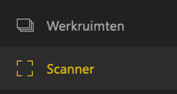
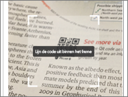
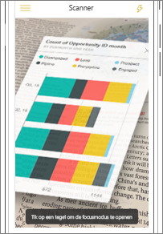
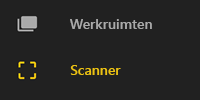
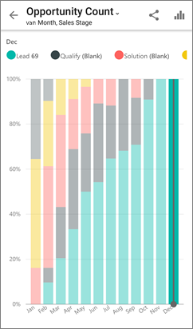

# Een Power BI QR-code scannen met uw mobiele apparaat
Van toepassing op:

|  |  |  |
|:--- |:--- |:--- |:--- |
| iPhones |Android-telefoons |Android-tablets |

QR-codes in Power BI kunnen alles in de praktijk rechtstreeks verbinden met gerelateerde BI-gegevens. Er is geen navigatie of zoekopdracht nodig.

Stel dat een collega [een QR-code heeft gemaakt in de Power BI-service](../../service-create-qr-code-for-tile.md) voor een rapport of een tegel in een dashboard, het dashboard of rapport met u heeft gedeeld en de QR-code heeft geplaatst op een belangrijke locatie, zoals in een e-mailbericht of op een specifiek item. 

U kunt de QR-code voor directe toegang tot de relevante tegel of het rapport scannen met uw telefoon. Hiervoor gebruikt u de scanner in de Power BI-app of een andere scanner die is geïnstalleerd op uw telefoon. 

Als uw collega het dashboard of rapport niet met u heeft gedeeld, kunt u rechtstreeks toegang aanvragen vanuit de mobiele app. 

> [!NOTE]
> U kunt ook [een QR-code voor een rapport scannen met de app Power BI for Mixed Reality](mobile-mixed-reality-app.md#scan-a-report-qr-code-in-holographic-view).

## Een Power BI QR-code op uw iPhone scannen met de scanner van Power BI
1. Open in de mobiele Power BI-app het algemene navigatiemenu  in de linkerbovenhoek. 
2. Schuif omlaag naar **Scanner** en selecteer deze. 
   
    
3. Als uw camera niet is ingeschakeld, moet u de Power BI-app toestemming geven voor het gebruik van de camera. Dit is een eenmalige goedkeuring. 
4. Richt de scanner op de Power BI QR-code. 
   
    
5. De tegel of het rapport lijkt over de achtergrond te zweven in Augmented Reality.
   
    
6. Tik op het rapport of de tegel om deze te openen in de focusmodus of ga terug naar de scanner.

### Een QR-code scannen met een externe scanner op uw iPhone
1. U kunt elke scanner die op uw telefoon is geïnstalleerd gebruiken om de relevante Power BI QR-code te scannen voor directe toegang tot de tegel of het rapport. 
2. Als u de Power BI-app niet hebt geïnstalleerd, wordt u omgeleid naar de [Apple App Store om deze te downloaden](http://go.microsoft.com/fwlink/?LinkId=522062) op uw iPhone.

## Een Power BI QR-code op uw Android-apparaat scannen met de scanner van Power BI
1. Open in de mobiele Power BI-app de algemene navigatieknop  in de linkerbovenhoek. 
2. Schuif omlaag naar **QR-scanner** en selecteer deze.
   
    
3. Als uw camera niet is ingeschakeld, moet u de Power BI-app toestemming geven voor het gebruik van de camera. Dit is een eenmalige goedkeuring. 
4. Richt de scanner op de Power BI QR-code. 
   
    
5. De tegel of het rapport wordt automatisch geopend in Power BI.
   
    

### Een QR-code scannen met een externe scanner op uw Android-apparaat
1. U kunt elke scanner die op uw Android-apparaat is geïnstalleerd gebruiken om de relevante Power BI QR-code te scannen voor directe toegang tot de tegel of het rapport. 
2. Als u de Power BI-app niet hebt geïnstalleerd, wordt u omgeleid naar [Google Play om deze te downloaden](http://go.microsoft.com/fwlink/?LinkID=544867). 

## Volgende stappen
* [Verbinding maken met Power BI-gegevens uit de praktijk](mobile-apps-data-in-real-world-context.md) met de mobiele apps
* [Een QR-code voor een tegel maken in de Power BI-service](../../service-create-qr-code-for-tile.md)
* [Een QR-code voor een rapport maken in de Power BI-service](../../service-create-qr-code-for-report.md)
* U kunt ook [een QR-code scannen met de app Power BI for Mixed Reality](mobile-mixed-reality-app.md)
* Vragen? [Misschien dat de Power BI-community het antwoord weet](http://community.powerbi.com/)

