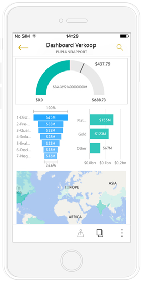
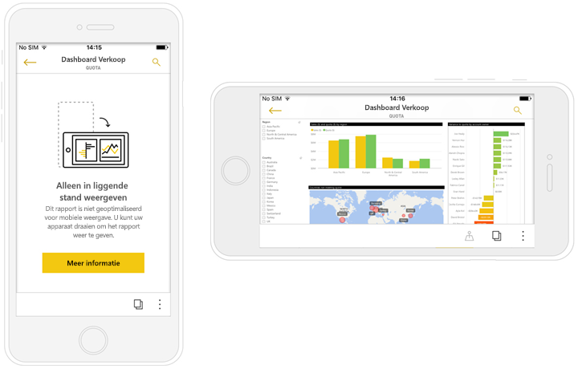
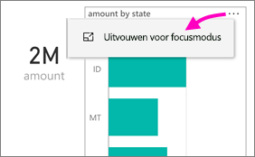
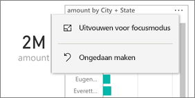
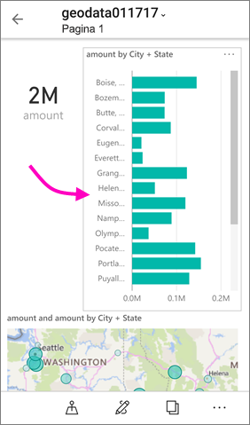

# Voor uw telefoon geoptimaliseerde Power BI-rapporten weergeven

Van toepassing op:

|  |  |
|:--- |:--- |
| iPhones |Android-telefoons |

Wanneer u een Power BI-rapport in Power BI Desktop of de Power BI-service maakt, kunt u ook [een versie van het rapport maken die is geoptimaliseerd voor weergave](../../desktop-create-phone-report.md) in de Power BI-app op een telefoon.

Wanneer u een Power BI-rapport op een telefoon opent, detecteert Power BI vervolgens of het rapport is geoptimaliseerd voor telefoons. Vervolgens wordt het geoptimaliseerde rapport automatisch in staande weergave geopend.

Als er geen voor de telefoon geoptimaliseerd rapport bestaat, wordt het rapport geopend in de niet-geoptimaliseerde liggende weergave. Een voor de telefoon geoptimaliseerd rapport wordt ook in de niet-geoptimaliseerde weergave met de indeling van het oorspronkelijke rapport weergegeven als u uw telefoon kantelt. Als slechts enkele pagina’s zijn geoptimaliseerd, ziet u een bericht in de portretweergave met de mededeling dat het rapport in de liggende modus beschikbaar is.

Alle andere functies van Power BI-rapporten werken nog steeds in voor de telefoon geoptimaliseerde rapporten. Meer informatie over wat u kunt doen in:

* [Rapporten op iPhones](mobile-reports-in-the-mobile-apps.md). 
* [Rapporten op Android-telefoons](mobile-reports-in-the-mobile-apps.md).

## De rapportpagina filteren op een telefoon
Als u een voor de telefoon geoptimaliseerd rapport hebt waarvoor filters zijn gedefinieerd, kunt u deze filters gebruiken wanneer u het rapport op een telefoon bekijkt. Het rapport wordt op uw telefoon geopend en is gefilterd op de waarden zoals die zijn gefilterd in het webrapport. Er wordt ook een bericht weergegeven waarin staat dat er filters actief zijn op de pagina. U kunt de filters op uw telefoon wijzigen.

1. Tik op het filterpictogram  onder aan de pagina. 
2. Gebruik basis- of geavanceerde filters om de resultaten waarin u geïnteresseerd bent te bekijken.
   
    

## Visuele elementen kruislings markeren
Kruislings visuals markeren in telefoonrapporten werkt hetzelfde als in de Power BI-service en in rapporten op telefoons in de liggende weergave: Wanneer u gegevens in een visual selecteert, worden de gerelateerde gegevens in de andere visuals op die pagina's uitgelicht.

Meer informatie over [filteren en markeren in Power BI](../../power-bi-reports-filters-and-highlighting.md).

## Visuele elementen selecteren
Wanneer u een visueel element selecteert in een rapport op de telefoon, wordt dit visuele element gemarkeerd en wordt erop gefocust. Canvasgebaren werken niet meer.

Als het visuele element is geselecteerd, kunt u verschillende dingen doen, zoals schuiven binnen het visuele element. Om de selectie van een visueel element ongedaan te maken, tikt u op een willekeurige plek buiten het visuele element.

## Visuele elementen openen in de focusmodus
Rapporten op de telefoon hebben een focusmodus, zodat u een grotere weergave van een enkel visueel element kunt bekijken en deze en het rapport kunt verkennen.

* Tik in een rapport op de telefoon op het beletselteken (**...** ) in de rechterbovenhoek van een visueel element > **Uitvouwen voor focusmodus**.
  
    

Wat u doet in de focusmodus wordt doorgevoerd in het rapportcanvas en omgekeerd, voor een naadloze ervaring. Als u bijvoorbeeld een waarde in een visueel element markeert en vervolgens teruggaat naar het hele rapport, worden het rapport in zijn geheel gefilterd op de waarde die u in het visuele element hebt gemarkeerd.

Sommige handelingen zijn alleen mogelijk in de focusmodus vanwege beperkingen door het scherm:

* **Inzoomen** op de weergegeven gegevens in een visueel element. Lees hieronder meer over het [in- en uitzoomen](mobile-apps-view-phone-report.md#drill-down-in-a-visual) in een rapport op de telefoon.
* De waarden in het visuele element **sorteren**.
* **Herstellen**: Hiermee wist u stappen die u hebt gemaakt op een visueel element en keert u terug naar de definitie die is ingesteld bij het maken van het rapport.
  
    Als u alle stappen op een visueel element ongedaan wilt maken, tikt u op het beletselteken (**...** ) > **Herstellen**.
  
    
  
    Herstellen is beschikbaar op het niveau van het rapport om alle stappen op alle visuele elementen ongedaan te maken, of op het niveau van het visuele element om alle stappen op het specifieke geselecteerde visuele element te wissen.   

## Inzoomen op een visueel element
Als hiërarchieniveaus zijn gedefinieerd in een visueel element, u kunt inzoomen op de gedetailleerde informatie die wordt weergegeven in een visueel element. Vervolgens kunt u weer uitzoomen. U kunt [inzoomen op een visueel element toevoegen](../end-user-drill.md) in de Power BI-service of in Power BI Desktop. Inzoomen werkt alleen in voor de telefoon geoptimaliseerde Power BI-rapporten wanneer u ze op een telefoon bekijkt. 

1. Tik in een rapport op de telefoon op het beletselteken (**...** ) in de rechterbovenhoek > **Uitvouwen voor focusmodus**.
   
    
   
    In dit voorbeeld geven de balken de waarden voor de staten weer.
2. Tik op het verkenpictogram  in de linkerbenedenhoek.
   
    
3. Tik op **Volgende niveau weergeven** of **Uitbreiden naar het volgende niveau**.
   
    
   
    Nu geven de balken de waarden voor steden weer.
   
    
4. Als u op de pijl in de linkerbovenhoek tikt, gaat u terug naar het rapport op de telefoon en blijven de waarden naar het lagere niveau uitgevouwen.
   
    
5. Om terug te gaan naar het oorspronkelijke niveau, tikt u weer op het beletselteken (**...** ) > **Herstellen**.
   
    

## Volgende stappen
* [Rapporten maken die zijn geoptimaliseerd voor de mobiele Power BI-apps](../../desktop-create-phone-report.md)
* [Een telefoonweergave van een dashboard maken in Power BI](../../service-create-dashboard-mobile-phone-view.md)
* [Responsieve visuele elementen maken die zijn geoptimaliseerd voor elke grootte](../../visuals/desktop-create-responsive-visuals.md)
* Hebt u nog vragen? [Misschien dat de Power BI-community het antwoord weet](http://community.powerbi.com/)

