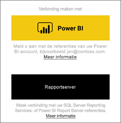
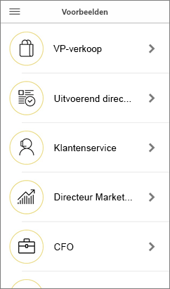
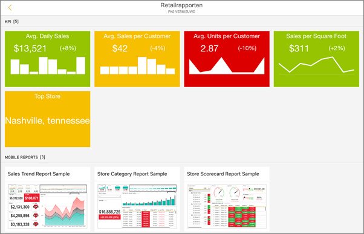
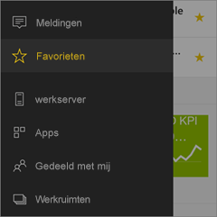
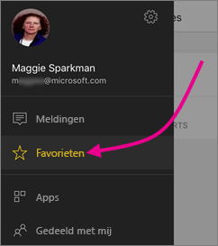
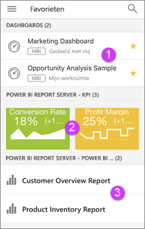

# Aan de slag met de mobiele Power BI-app op iOS-apparaten
De Microsoft Power BI-app voor iOS op de iPhone, iPad of iPod touch biedt de mobiele BI-ervaring voor Power BI, Power BI Report Server en Reporting Services. Bekijk uw bedrijfsdashboards on-premises en in de cloud, en gebruik ze vanaf elke locatie met mobiele live-toegang met aanraakfunctionaliteit. Verken de gegevens in dashboards en deel deze met uw collega's per e-mail of sms-bericht. En blijf via uw [Apple Watch](mobile-apple-watch.md) op de hoogte van uw meest recente gegevens.  

U maakt Power BI-rapporten in Power BI Desktop en publiceert deze:

* [Publiceer de rapporten naar de Power BI-service](../../service-get-started.md) en maak dashboards.
* [Publiceer de rapporten on-premises naar Power BI Report Server](../../report-server/quickstart-create-powerbi-report.md).

Vervolgens gebruikt u de dashboards en rapporten on-premises of in de cloud in de mobiele Power BI-app voor iOS.

Ontdek [wat er nieuw is in de mobiele Power BI-apps](mobile-whats-new-in-the-mobile-apps.md).

## De app downloaden
[De iOS-app downloaden](http://go.microsoft.com/fwlink/?LinkId=522062 "Download de iOS-app") via de Apple App Store naar uw iPhone, iPad of iPod touch.

U kunt de Power BI-app voor iOS uitvoeren op de iPhone 5 en hoger met iOS 10 of hoger. U kunt de app ook uitvoeren op een iPad of iPod touch met iOS 10 of hoger. 

## Aanmelden voor de Power BI-service
Als u nog niet bent aangemeld, gaat u naar [powerbi.com](https://powerbi.microsoft.com/get-started/) en selecteert u onder **Power BI - Samenwerken en delen via de cloud** de optie **Gratis proberen**.

## Aan de slag met de Power BI-app
1. Open de Power BI-app op uw iOS-apparaat.
2. Tik op **Power BI** om uw Power BI-dashboards weer te geven.  
   Als u uw mobiele rapporten en KPI's van Reporting Services wilt weergeven, tikt u op **SQL Server Reporting Services**.
   
   
   
   Wanneer u zich in de app bevindt, tikt u op de knop voor globale navigatie  in de linkerbovenhoek om te schakelen tussen de twee. 

## De Power BI- en Reporting Services-voorbeelden uitproberen
U hoeft zich niet aan te melden om met de Power BI- en Reporting Services-voorbeelden te oefenen. Nadat u de app hebt gedownload, kunt u de voorbeelden bekijken of aan de slag gaan. U kunt op elk gewenst moment via de knop voor de globale navigatie terugkeren naar de voorbeelden.

### Power BI-voorbeelden
U kunt de Power BI-voorbeelddashboards bekijken en gebruiken, maar er zijn enkele dingen die u hiermee niet kunt doen. Het is niet mogelijk de rapporten achter de dashboards te openen, de voorbeelden met anderen te delen of ze aan uw favorieten toe te voegen.

1. Tik op de knop voor globale navigatie  in de linkerbovenhoek.
2. Tik in de rechterbovenhoek op het  en tik vervolgens op **Power BI-voorbeelden**.
3. Kies een rol en verken het voorbeelddashboard voor die rol.  
   
   
   
   > [!NOTE]
   > Niet alle functies zijn beschikbaar in de voorbeelden. U kunt bijvoorbeeld niet de voorbeeldrapporten weergeven die de basis vormen voor de dashboards. 
   > 
   > 

### Voorbeelden van mobiele Reporting Services-rapporten
1. Tik op de knop voor globale navigatie  in de linkerbovenhoek.
2. Tik in de rechterbovenhoek op het  en tik vervolgens op **Reporting Services-voorbeelden**.
3. Open de map Detailhandelrapporten of Verkooprapporten om de bijbehorende KPI's en mobiele rapporten te verkennen.
   
   

## Uw inhoud in de mobiele Power BI-apps zoeken
Uw dashboards en rapporten worden opgeslagen op verschillende locaties in de mobiele Power BI-apps. Waar ze worden opgeslagen, is afhankelijk van waar ze afkomstig zijn. Klik [hier](mobile-apps-quickstart-view-dashboard-report.md) voor informatie over het zoeken van uw inhoud in de mobiele apps. Bovendien kunt u altijd zoeken naar alles wat u in de mobiele Power BI-apps hebt. 

Klik [hier](mobile-apps-quickstart-view-dashboard-report.md) voor meer informatie over het zoeken van uw inhoud in de mobiele apps.

## Uw favoriete dashboards, KPI's en rapporten weergeven
U ziet op de pagina Favorieten in de mobiele apps al uw favoriete Power BI-dashboards, samen met Power BI Report Server- en Reporting Services-KPI's en -rapporten. Wanneer u een dashboard aan uw *favorieten* toevoegt in de mobiele Power BI-app, kunt u het openen op al uw apparaten, met inbegrip van de Power BI-service in uw browser. 

* Tik op **Favorieten**.
  
   
  
   Op deze pagina worden al uw favorieten weergegeven:
  
   
  
  1. Dashboards in de Power BI-service
  2. KPI's in Power BI Report Server
  3. Power BI-rapporten in Power BI Report Server

Lees meer over [favorieten in de mobiele Power BI-apps](mobile-apps-favorites.md).

## Ondersteuning voor ondernemingen voor de mobiele Power BI-apps
Organisaties kunnen Microsoft Intune gebruiken voor het beheer van apparaten en toepassingen, waaronder de mobiele Power BI-apps voor Android en iOS.

Microsoft Intune kan bijvoorbeeld worden gebruikt om een pincode voor toegang te vereisen, om te beheren hoe gegevens door de toepassing worden verwerkt of zelfs om toepassingsgegevens te versleutelen wanneer de app niet wordt gebruikt.

> [!NOTE]
> Als u de mobiele Power BI-app op uw iOS-apparaat gebruikt en uw organisatie Microsoft Intune MAM heeft geconfigureerd, is het vernieuwen van gegevens op de achtergrond uitgeschakeld. De volgende keer dat u de app gebruikt, worden de gegevens vanuit de Power BI-service op het web vernieuwd.
> 

Lees meer over [het configureren van mobiele Power BI-apps met Microsoft Intune](../../service-admin-mobile-intune.md). 

## Volgende stappen

* [Wat is Power BI?](../../power-bi-overview.md)
* Vragen? [Misschien dat de Power BI-community het antwoord weet](http://community.powerbi.com/)

