# Gegevensmeldingen instellen in de mobiele Power BI-apps
Van toepassing op:

|  |  |  |  |  |
|:--- |:--- |:--- |:--- |:--- |
| iPhones |iPads |Android-telefoons |Android-tablets |Windows 10-apparaten |

U kunt meldingen voor dashboards instellen in de mobiele Power BI-apps en in de Power BI-service. Door middel van meldingen wordt u gewaarschuwd als wijzigingen aan de gegevens in een tegel de limieten overschrijden die u hebt ingesteld. Meldingen worden gebruikt voor tegels met een enkel getal, zoals kaarten en meters, maar niet voor het streamen van gegevens. U kunt gegevensmeldingen instellen voor uw mobiele apparaat en deze zien in de Power BI-service, en vice versa. Alleen u ziet de gegevensmeldingen die u hebt ingesteld, zelfs als u een dashboard of een momentopname van een tegel deelt.

U kunt waarschuwingen instellen voor tegels als u over de Power BI Pro-licentie beschikt of als het gedeelde dashboard zich in een Premium-capaciteit bevindt. 

> [!WARNING]
> Gegevensgestuurde meldingen bieden informatie over uw gegevens. Als uw apparaat wordt gestolen, wordt aangeraden de Power BI-service te gebruiken om alle gegevensgestuurde meldingsregels uit te schakelen. 
> 
> Meer informatie over het [beheren van gegevensmeldingen in de Power BI-service](../../service-set-data-alerts.md).
> 
> 

## Gegevensmeldingen op een iPhone of iPad
### Een melding instellen op een iPhone of iPad
1. Tik op een getal- of metertegel in een dashboard om deze te openen in de focusmodus.  
   
   
2. Tik op het belpictogram  om een melding toe te voegen.  
3. Tik op **Meldingsregel toevoegen**.
   
   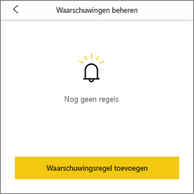
4. Kies ervoor om meldingen boven of onder een bepaalde waarde te ontvangen en stel vervolgens de waarde in.
   
   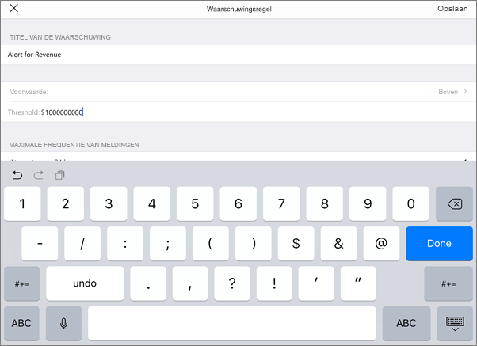
5. Bepaal of per uur of per dag meldingen wilt ontvangen, en of u ook een e-mailbericht wilt ontvangen wanneer u de melding krijgt.
   
   > [!NOTE]
   > U ontvangt niet elk uur of elke dag meldingen, tenzij de gegevens daadwerkelijk zijn vernieuwd in die tijd.
   > 
   > 
6. U kunt de titel van de melding ook wijzigen.
7. Tik op **Opslaan**.
8. Eén tegel kan meldingen hebben voor waarden zowel boven als beneden bepaalde drempelwaarden. Tik in **Meldingen beheren** op **Meldingsregel toevoegen**.
   
   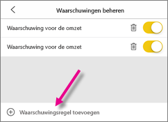

### Meldingen beheren op uw iPhone of iPad
U kunt afzonderlijke meldingen beheren op uw mobiele apparaat of [alle meldingen beheren in de Power BI-service](../../service-set-data-alerts.md).

1. Tik in een dashboard op een getal- of metertegel met een melding.  
   
   
2. Tik op het belpictogram .  
3. Tik op de naam van de melding om deze te bewerken, tik op de schuifregelaar om e-mailmeldingen uit te schakelen of tik op de prullenbak om de melding te verwijderen.
   
    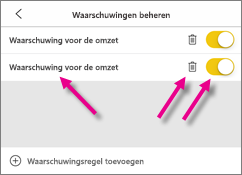

## Gegevensmeldingen op een Android-apparaat
### Een melding instellen op een Android-apparaat
1. Tik in een Power BI-dashboard op een getal- of metertegel om deze te openen.  
2. Tik op het belpictogram  om een melding toe te voegen.  
   
   
3. Tik op het plusteken (+).
   
   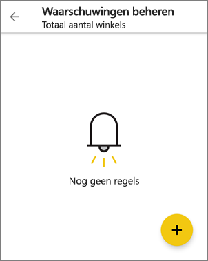
4. Kies ervoor om meldingen boven of onder een bepaalde waarde te ontvangen en voer vervolgens de waarde in.
   
   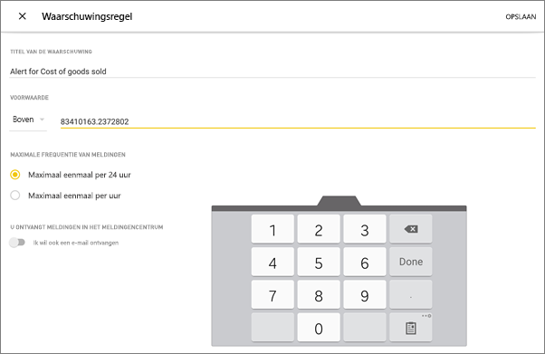
5. Tik op **Gereed**.
6. Bepaal of per uur of per dag meldingen wilt ontvangen, en of u ook een e-mailbericht wilt ontvangen wanneer u de melding krijgt.
   
   > [!NOTE]
   > U ontvangt niet elk uur of elke dag meldingen, tenzij de gegevens daadwerkelijk zijn vernieuwd in die tijd.
   > 
   > 
7. U kunt de titel van de melding ook wijzigen.
8. Tik op **Opslaan**.

### Meldingen beheren op een Android-apparaat
U kunt afzonderlijke meldingen beheren in de mobiele Power BI-app of [alle meldingen beheren in de Power BI-service](../../service-set-data-alerts.md).

1. Tik in een dashboard op een kaart- of metertegel met een melding.  
2. Tik op het effen belpictogram .  
3. Tik op de melding om een waarde te wijzigen of om de melding uit te schakelen.
   
    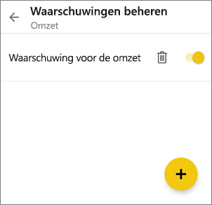
4. Tik op het plusteken (+) om een nieuwe melding toe te voegen aan de dezelfde tegel.
5. Als u de melding helemaal wilt verwijderen, tikt u op het prullenbakpictogram .

## Gegevensmeldingen op een Windows-apparaat
### Gegevensmeldingen instellen op een Windows-apparaat
1. Tik op een getal- of metertegel in een dashboard om deze te openen.  
2. Tik op het belpictogram  om een melding toe te voegen.  
   
   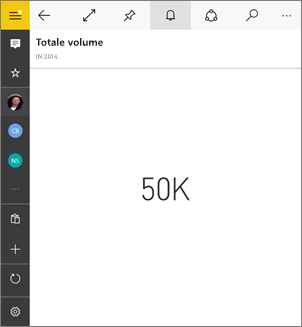
3. Tik op het plusteken (+).
   
   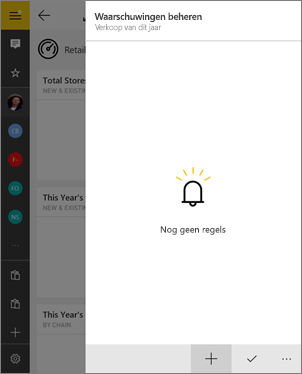
4. Kies ervoor om meldingen boven of onder een bepaalde waarde te ontvangen en voer vervolgens de waarde in.
   
   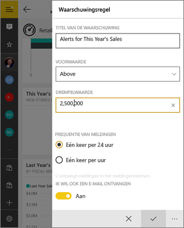
5. Bepaal of per uur of per dag meldingen wilt ontvangen, en of u ook een e-mailbericht wilt ontvangen wanneer u de melding krijgt.
   
   > [!NOTE]
   > U ontvangt niet elk uur of elke dag meldingen, tenzij de gegevens daadwerkelijk zijn vernieuwd in die tijd.
   > 
   > 
6. U kunt de titel van de melding ook wijzigen.
7. Tik op het vinkje.
8. Eén tegel kan meldingen hebben voor waarden zowel boven als beneden bepaalde drempelwaarden. Tik in **Meldingen beheren** op het plusteken (+).
   
   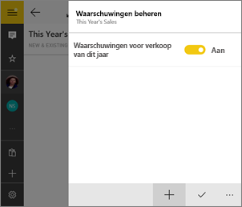

### Meldingen beheren op een Windows-apparaat
U kunt afzonderlijke meldingen beheren in de mobiele Power BI-app of [alle meldingen beheren in de Power BI-service](../../service-set-data-alerts.md).

1. Tik in een dashboard op een kaart- of metertegel met een melding.  
2. Tik op het belpictogram .  
   
   
3. Tik op de melding om een waarde te wijzigen of om de melding uit te schakelen.
   
    
4. Als u de melding helemaal wilt verwijderen, klikt u met de rechtermuisknop of tikt u op de melding en houdt deze vast. Klik of tik vervolgens op **Verwijderen**.

## Meldingen ontvangen
U ontvangt meldingen in het [Meldingencentrum](mobile-apps-notification-center.md) van Power BI op uw mobiele apparaat of in de Power BI-service. Hier ontvangt u ook meldingen over nieuwe dashboards die iemand met u heeft gedeeld.

Gegevensbronnen worden vaak zo ingesteld dat ze dagelijks worden vernieuwd. Soms worden ze vaker vernieuwd. Als de gegevens in het dashboard worden vernieuwd en deze bijgehouden gegevens een van de ingestelde drempelwaarden bereiken, vinden er een aantal dingen plaats.

1. Power BI controleert of het langer dan 24 uur geleden is (afhankelijk van de door u geselecteerde optie) sinds de laatste melding is verzonden.
   
   U ontvangt elk uur of elke 24 uur een melding zolang de gegevens de drempelwaarde overschrijden.
2. Als de melding zo is ingesteld dat u een e-mail ontvangt, vindt u iets soortgelijks als hieronder in uw Postvak IN.
   
   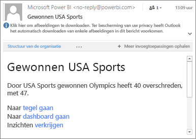
3. Er wordt een bericht aan het **Meldingencentrum** toegevoegd en een nieuw meldingenpictogram aan de desbetreffende tegel .
4. Tik op de algemene navigatieknop  om [ uw **Meldingencentrum**](mobile-apps-notification-center.md) en details van de melding te zien.
   
     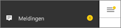 

> [!NOTE]
> Meldingen werken alleen voor gegevens die zijn vernieuwd. Als gegevens worden vernieuwd, controleert Power BI of er een melding voor die gegevens is ingesteld. Als de gegevens een drempelwaarde voor de melding hebben bereikt, wordt er een melding geactiveerd.
> 
> 

## Tips en problemen oplossen
* Meldingen worden momenteel niet ondersteund voor Bing-tegels of kaarttegels met datum-/tijdmetingen.
* Meldingen werken alleen met numerieke gegevens.
* Meldingen werken alleen voor gegevens die zijn vernieuwd. Ze werken niet met statische gegevens.
* Meldingen werken niet met tegels die streaminggegevens bevatten.

## Volgende stappen
* [Meldingen beheren in de Power BI-service](../../service-set-data-alerts.md)
* [Meldingencentrum van Power BI voor mobiel](mobile-apps-notification-center.md)
* Vragen? [Misschien dat de Power BI-community het antwoord weet](http://community.powerbi.com/)

