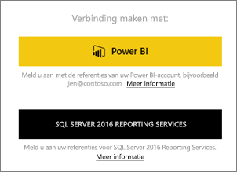
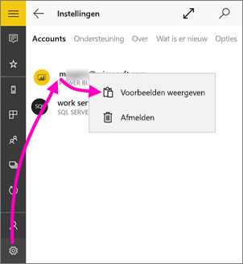
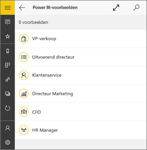
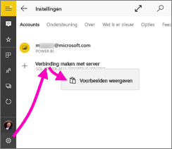
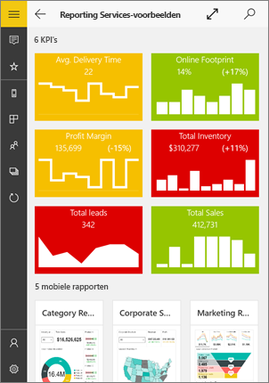
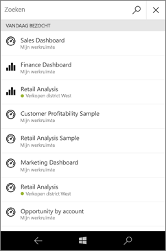
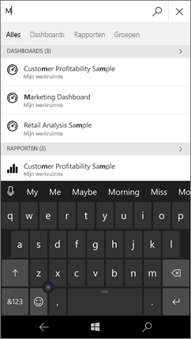
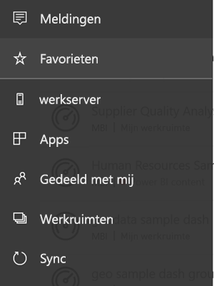
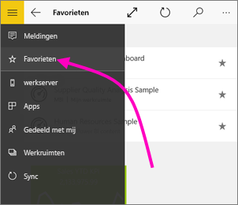
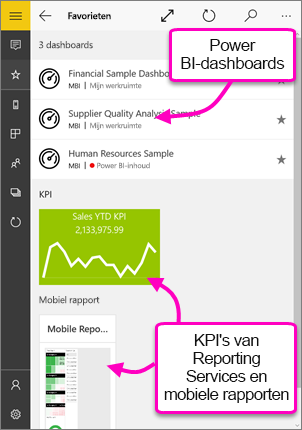

# Aan de slag met de mobiele Power BI-app voor Windows 10
Met de mobiele Power BI-app voor Windows 10 hebt u Power BI op uw telefoon of tablet met bijgewerkte, mobiele toegang tot uw bedrijfsgegevens. U kunt uw bedrijfsdashboards vanaf elke locatie en rechtstreeks op uw [Windows-startscherm](mobile-pin-dashboard-start-screen-windows-10-phone-app.md) bekijken en ze gebruiken.

U [maakt dashboards en rapporten in de Power BI-service](../../service-get-started.md) met uw gegevens. 

U gebruikt deze dashboards en rapporten vervolgens, verkent de gegevens en deelt ze via de mobiele Power BI-app voor Windows 10.

## Om te beginnen
* [**Download de mobiele Power BI-app voor Windows 10**](http://go.microsoft.com/fwlink/?LinkID=526478) vanuit de Windows Store.
  
  Uw apparaat moet Windows 10 gebruiken. De app kan worden uitgevoerd op apparaten met ten minste 3 GB RAM en 8 GB interne opslag.
   
* Ontdek [wat er nieuw is in de mobiele Power BI-apps](mobile-whats-new-in-the-mobile-apps.md).

## Registreren voor de Power BI-service op het web
Als u zich nog niet hebt geregistreerd, gaat u naar de [Power BI-service](http://powerbi.com/) om u te registreren voor een eigen account, waarmee u dashboards en rapporten kunt maken en opslaan en uw gegevens kunt samenbrengen. Meld u vervolgens op uw Windows 10-apparaat aan bij Power BI om uw eigen dashboards vanaf elke locatie weer te geven.

1. Tik in de Power BI-service op [Registreren](http://go.microsoft.com/fwlink/?LinkID=513879) om een Power BI-account te maken.
2. Begin met het [maken van uw eigen dashboards en rapporten](../../service-get-started.md).

## Aan de slag met Power BI-app
1. Open de Power BI-app op het beginscherm van uw Windows 10-apparaat.
   
   
2. Tik op **Power BI** als u uw Power BI-dashboards en -rapporten wilt weergeven. Meld u aan met dezelfde referenties als voor uw Power BI-account op internet. 
   
   Als u uw mobiele rapporten en KPI's van Reporting Services wilt weergeven, tikt u op **SQL Server 2016 Reporting Services**. Meld u aan met uw referenties voor SQL Server Reporting Services.
   
   
3. Tik op **Verkennen** om uw eigen dashboards weer te geven.

## De Power BI- en Reporting Services-voorbeelden uitproberen
U hoeft zich niet aan te melden om met de Power BI- en Reporting Services-voorbeelden te oefenen. Nadat u de app hebt gedownload, kunt u de voorbeelden bekijken of aan de slag gaan. U kunt op elk gewenst moment teruggaan naar de voorbeelden vanaf de startpagina met dashboards.

### Power BI-voorbeelden
U kunt de Power BI-voorbeelddashboards bekijken en gebruiken, maar er zijn enkele dingen die u hiermee niet kunt doen. Het is niet mogelijk de rapporten achter de dashboards te openen, de voorbeelden met anderen te delen of ze aan uw favorieten toe te voegen.

1. Tik op de knop voor globale navigatie  in de linkerbovenhoek.
2. Tik op het pictogram **Instellingen** , tik op uw naam en tik op **Voorbeelden weergeven**.
   
   
3. Kies een rol en verken het voorbeelddashboard voor die rol.  
   
   

### Voorbeelden van mobiele Reporting Services-rapporten
1. Tik op de knop voor globale navigatie  in de linkerbovenhoek.
2. Tik op het pictogram **Instellingen** , klik met de rechtermuisknop op **Verbinding maken met server** (of tik erop en houd vast) en tik op **Voorbeelden weergeven**.
   
   
3. Open de map Retail Reports of Sales Reports om die KPI's en mobiele rapporten te verkennen.
   
   

## Zoeken naar dashboards, rapporten en -apps
U kunt uw dashboards, rapporten en apps snel vinden door te typen in het zoekvak, dat altijd boven aan de app wordt weergegeven.

1. Tik op het zoekpictogram in de rechterbovenhoek.
   
   
   
   In Power BI worden uw meest recente dashboards, rapporten en apps weergegeven.
   
   
2. Als u begint te typen, worden alle relevante resultaten weergegeven in Power BI.
   
   

## Uw inhoud in de mobiele Power BI-apps zoeken
Uw dashboards en rapporten worden opgeslagen op verschillende locaties in de mobiele Power BI-apps. Waar ze worden opgeslagen, is afhankelijk van waar ze afkomstig zijn. Klik [hier](mobile-apps-quickstart-view-dashboard-report.md) voor informatie over het zoeken van uw inhoud in de mobiele apps. Bovendien kunt u altijd zoeken naar alles wat u in de mobiele Power BI-apps hebt. 

## Uw favoriete dashboards, KPI's en rapporten weergeven
U ziet op de pagina Favorieten in de mobiele apps al uw favoriete Power BI-dashboards, samen met Power BI Reporting Services-KPI's en mobiele rapporten. Wanneer u een dashboard aan uw *favorieten* toevoegt in de mobiele Power BI-app, kunt u het openen op al uw apparaten, met inbegrip van de Power BI-service in uw browser. 

* Tik op **Favorieten**.
  
   
  
   Al uw Power BI-favorieten en favorieten van de webportal van Reporting Services bevinden zich op deze pagina.
  
   

Lees meer over [favorieten in de mobiele Power BI-apps](mobile-apps-favorites.md).

## Volgende stappen
Hier volgen enkele andere dingen die u in de Power BI-app voor Windows 10-apparaten kunt doen met dashboards en rapporten in Power BI, en mobiele rapporten van Reporting Services en de KPI’s in de Reporting Services-webportal

### Power BI-dashboards en -rapporten
* [Uw apps](../end-user-apps.md) weergeven.
* Uw [dashboards](mobile-apps-view-dashboard.md) weergeven.
* [Power BI-tegels en -dashboards vastmaken](mobile-pin-dashboard-start-screen-windows-10-phone-app.md) op het startscherm van uw apparaat als live-tegels.
* [Tegels delen](mobile-windows-10-phone-app-get-started.md).
* [Dashboards](mobile-share-dashboard-from-the-mobile-apps.md) delen.

### Mobiele rapporten en KPI's van Reporting Services
* [De mobiele rapporten en KPI's van Reporting Services weergeven](mobile-app-windows-10-ssrs-kpis-mobile-reports.md) in de mobiele Power BI-app voor Windows 10-apparaten.
* [KPI's maken op de Reporting Services-webportal](https://msdn.microsoft.com/library/mt683632.aspx).
* [Uw eigen mobiele rapporten maken met de SQL Server Mobile Report Publisher](https://msdn.microsoft.com/library/mt652547.aspx), en deze publiceren naar de Reporting Services-webportal.

## Volgende stappen
* [De Power BI-app downloaden](http://go.microsoft.com/fwlink/?LinkID=526478) vanuit de Windows Store  
* [Wat is Power BI?](../../power-bi-overview.md)
* Vragen? [Misschien dat de Power BI-community het antwoord weet](http://community.powerbi.com/)

