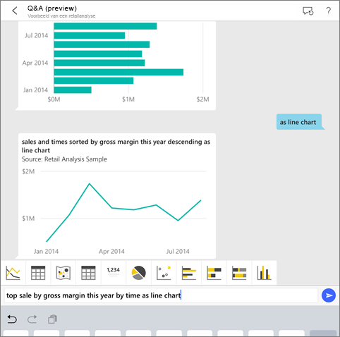
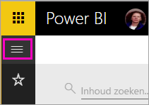
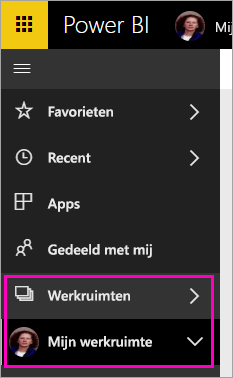
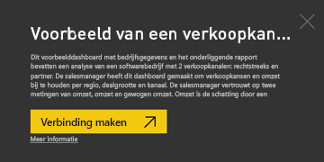
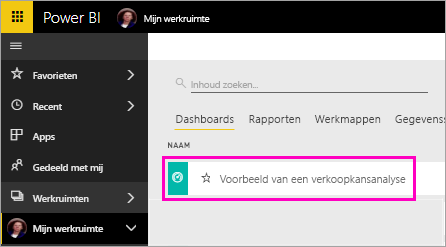
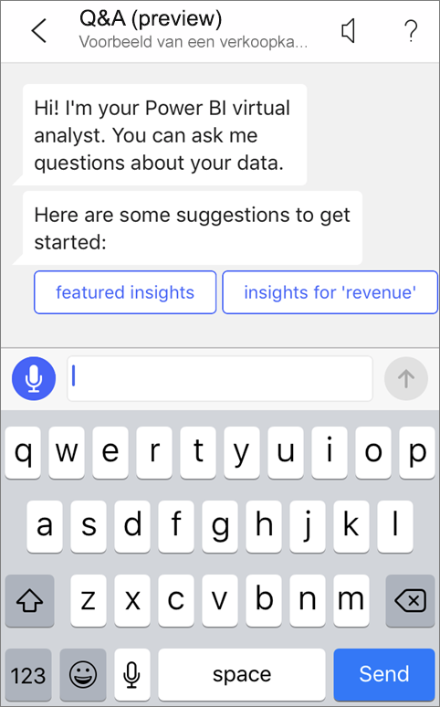
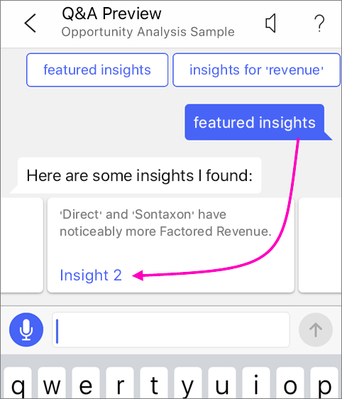
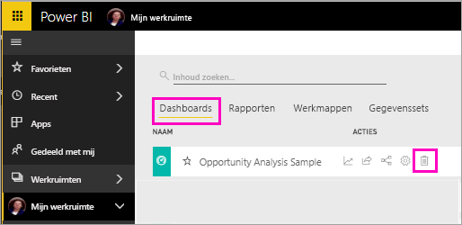

# Zelfstudie: vragen stellen over uw gegevens met de virtuele Q&A-analist in de Power BI iOS-apps

De eenvoudigste manier om inzicht te krijgen in uw gegevens is door vragen te stellen in uw eigen woorden. In deze zelfstudie stelt u vragen en bekijkt u inzichten over de voorbeeldgegevens met de virtuele Q&A-analist in de mobiele Microsoft Power BI-app op uw iPad, iPhone en iPod Touch. 

Van toepassing op:

|  |  |
|:--- |:--- |
| iPhones |iPads |

De virtuele Q&A-analist biedt een BI-ervaring met een communicatie-interface waarin gebruik wordt gemaakt van onderliggende Q&A-gegevens in de Power BI-service [(https://powerbi.com)](https://powerbi.com). De virtuele analist stelt gegevensinzichten voor en u kunt uw eigen vragen typen of uitspreken.

In deze zelfstudie leert u het volgende:

> [!div class="checklist"]
> * De mobiele Power BI-app voor iOS installeren
> * Een Power BI-voorbeelddashboard en -rapport downloaden
> * De inzichten bekijken die de mobiele app voorstelt

Als u zich niet hebt geregistreerd voor Power BI, kunt u zich hier [aanmelden voor een gratis proefversie](https://app.powerbi.com/signupredirect?pbi_source=web) voordat u begint.

## Vereisten

### De Power BI-app voor iOS installeren
[Download de iOS-app](http://go.microsoft.com/fwlink/?LinkId=522062 "De iPhone-app downloaden") via de Apple App Store naar uw iPad, iPhone of iPod Touch.

De volgende versies bieden ondersteuning voor de Power BI-app voor iOS:
- iPad met iOS 10 of hoger.
- iPhone 5 en hoger, met iOS 10 of hoger. 
- iPod Touch met iOS 10 of hoger.

### Het voorbeeld van een verkoopkansanalyse downloaden
De eerste stap in de zelfstudie is het downloaden van het voorbeeld van een verkoopkansanalyse in de Power BI-service.

1. Open de Power BI-service (app.powerbi.com) in uw browser en meld u aan.

1. Selecteer het pictogram voor globale navigatie om het linkernavigatievenster te openen.

    

2. Selecteer **Werkruimten** > **Mijn werkruimte** in het linkernavigatievenster.

    

3. Selecteer in de linkerbenedenhoek **Gegevens ophalen**.
   
    

3. Selecteer het pictogram **Voorbeelden** op de pagina Gegevens ophalen.
   
   

4. Selecteer **Voorbeeld van een verkoopkansanalyse**.
 
    
 
8. Selecteer **Verbinding maken**.  
  
   
   
5. Het voorbeeld wordt geïmporteerd in Power BI en er wordt een nieuw dashboard, een nieuw rapport en een nieuwe gegevensset aan Mijn werkruimte toegevoegd.
   
   

U kunt het voorbeeld nu weergeven op uw iOS-apparaat.

## Inzichten bekijken
1. Open de Power BI-app op uw iPhone of iPad en meld u aan met uw referenties voor het Power BI-account (dit zijn dezelfde referenties als die u gebruikt voor de Power BI-service in de browser).

1.  Tik op de knop voor globale navigatie  > **Werkruimten** > **Mijn werkruimte** en open het voorbeelddashboard voor verkoopkansanalyse.

2. Tik op het pictogram van de virtuele analist Q&A  in het actiemenu aan de onderkant van de pagina (boven aan de pagina op een iPad).

     

     De virtuele analist van Power BI biedt enkele suggesties om mee aan de slag te gaan.

     
3. Tik op **featured insights**.

     De virtuele analist Q&A stelt enkele inzichten voor.
4. Scrol naar rechts en tik op **Insight 2**.

    

     De virtuele analist Q&A laat inzicht 2 zien.

    
5. Tik op de grafiek om deze te openen in de focusmodus.

    
6. Tik op de pijl in de linkerbovenhoek om terug te gaan naar de virtuele analist.

## Resources opschonen

Als u de zelfstudie hebt voltooid, kunt u het dashboard, het rapport en de gegevensset voor het voorbeeld van een verkoopkansanalyse verwijderen.

1. Open de Power BI-service (app.powerbi.com) en meld u aan.

2. Selecteer **Werkruimten** > **Mijn werkruimte** in het linkernavigatievenster.

3. Selecteer op het tabblad **Dashboards** het pictogram **Verwijderen** (prullenbak) naast het dashboard voor verkoopkansanalyse.

    

4. Selecteer het tabblad **Rapporten** en doe hetzelfde voor het rapport voor verkoopkansanalyse.

5. Selecteer het tabblad **Gegevens** en doe hetzelfde voor de gegevensset voor verkoopkansanalyse.

## Volgende stappen

U hebt de virtuele Q&A-assistent in de mobiele Power BI-apps voor iOS geprobeerd. Lees meer over Q&A in de Power BI-service.
> [!div class="nextstepaction"]
> [Q&A in de Power BI-service](../end-user-q-and-a.md)

