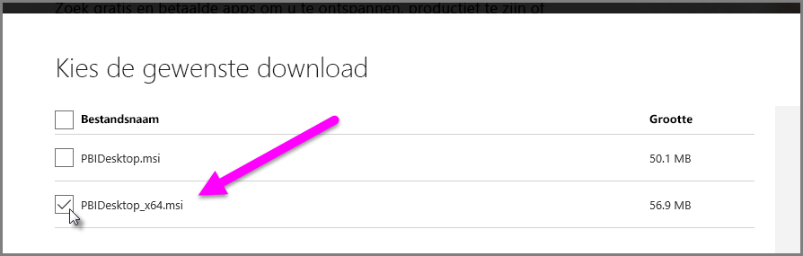

# Problemen met het importeren van Access- en XLS-bestanden oplossen in Power BI Desktop
In **Power BI Desktop** maken zowel **Access-databases** als vroege versies van **Excel-werkmappen** (XLS-bestanden van het type Excel 97-2003) gebruik van de *Access-database-engine*. Er zijn drie veelvoorkomende situaties die kunnen verhinderen dat de Access-database-engine niet goed werkt:

### Situatie 1: er is geen Access-database-engine geïnstalleerd
Als het foutbericht in Power BI Desktop aangeeft dat de Access-database-engine niet is geïnstalleerd, moet u de versie van de Access-database-engine (32- of 64-bits) installeren die overeenkomt met uw versie van Power BI Desktop. U kunt de Access-database-engine installeren vanaf de [downloadpagina](http://www.microsoft.com/en-us/download/details.aspx?id=13255).

>[!NOTE]
>Als de geïnstalleerde versie van de Access-database-engine niet overeenkomt met de geïnstalleerde versie van Microsoft Office, kunnen Office-toepassingen geen gebruik maken van de Access-database-engine.

### Situatie 2: de versie van de Access-database-engine (32-bits of 64-bits) komt niet overeen met de versie van Power BI Desktop
Deze situatie treedt vaak op wanneer de geïnstalleerde versie van Microsoft Office 32-bits is en de versie van Power BI Desktop 64-bits. Het omgekeerde komt ook voor (als u een Office 365-abonnement hebt raadpleegt u **Situatie 3** voor een ander probleem en een andere oplossing). Met een van de volgende oplossingen kunt u het probleem met de tegengestelde bitsversies oplossen:

1. Wijzig de versie van Power BI Desktop zodat deze overeenkomt met de bitsversie van het geïnstalleerde Microsoft Office. Als u de bitsversie van Power BI Desktop wilt wijzigen, verwijdert u Power BI Desktop en installeert u de versie van Power BI Desktop die overeenkomt met uw Office-installatie. Selecteer **Geavanceerde downloadopties** op de downloadpagina voor desktop als u een versie van Power BI Desktop wilt selecteren.
   
   
   
   Kies uw taal en selecteer de knop **Downloaden**. Schakel in het scherm dat verschijnt het selectievakje naast PBIDesktop.msi in voor de 32-bits versie, of naast PBIDesktop_x64.msi voor de 64-bits versie. In het volgende scherm is de 64-bits versie geselecteerd.
   
   
   
   >[!NOTE]
   >Als u de 32-bitsversie van Power BI Desktop gebruikt, kunt u geheugenproblemen ondervinden bij het maken van zeer grote gegevensmodellen.
2. Wijzig de versie van Microsoft Office zodat dit overeenkomt met de bitsversie van uw Power BI Desktop. Als u de bitsversie van Microsoft Office wilt wijzigen, verwijdert u Microsoft Office en installeert u de versie van Microsoft Office die overeenkomt met uw Power BI Desktop.
3. Als de fout is opgetreden bij het openen van een XLS-bestand (een werkmap in Excel 97-2003), dan kunt u het gebruik van de Access-database-engine vermijden door het XLS-bestand in Excel te openen en het op te slaan als een XLSX-bestand.
4. Als u het probleem niet kunt oplossen met een van deze drie oplossingen, kunt u mogelijk beide versies van de Access-database-engine verwijderen. Dit is echter *geen* aanbevolen tijdelijke oplossing. Als u beide versies installeert, wordt het probleem met Power Query voor Excel en Power BI Desktop weliswaar opgelost, maar worden er fouten geïntroduceerd voor alle toepassingen die automatisch (standaard) gebruikmaken van de bitsversie van de Access-database-engine die oorspronkelijk is geïnstalleerd. Als u beide bitsversies van de Access-database-engine wilt installeren, [download](http://www.microsoft.com/en-us/download/details.aspx?id=13255) u beide versies en voert u ze beide uit met behulp van de */passive*-schakelaar. Bijvoorbeeld:
   
       c:\users\joe\downloads\AccessDatabaseEngine.exe /passive
   
       c:\users\joe\downloads\AccessDatabaseEngine_x64.exe /passive

### Situatie 3: problemen met Access- of XLS-bestanden bij een Office 365-abonnement
Als u een Office 365-abonnement hebt (dit kan **Office 2013** of **Office 2016** zijn), is de provider van de Access Database Engine geregistreerd in een locatie voor virtuele registers die *alleen* toegankelijk is voor Office-processen. Het gevolg is dat de Mashup-engine (die verantwoordelijk is voor het uitvoeren van niet-Office 365 Excel en Power BI Desktop), die geen Office-proces is, geen gebruik kan maken van de provider van de Access-database-engine.

U kunt deze situatie oplossen door de [herdistribueerbare versie van de Access-database-engine te downloaden](http://www.microsoft.com/en-us/download/details.aspx?id=13255) en installeren die overeenkomt met de bitsversie van uw Power BI Desktop (zie eerdere secties voor meer informatie over bitsversies).

### Andere situaties die problemen met importeren kunnen geven
Wij proberen zo veel mogelijk problemen met Access- of XLS-bestanden te behandelen. Als u een probleem hebt dat niet in dit artikel wordt behandeld, dien dan een vraag over het probleem in bij [Power BI Support](https://powerbi.microsoft.com/support/) (Ondersteuning van Power BI). Wij kijken regelmatig naar problemen waar veel klanten last van hebben en nemen ze in onze artikelen op.

