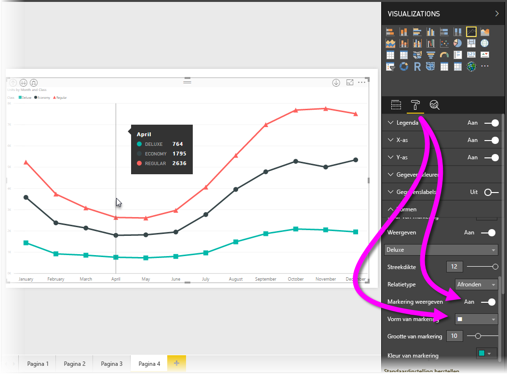
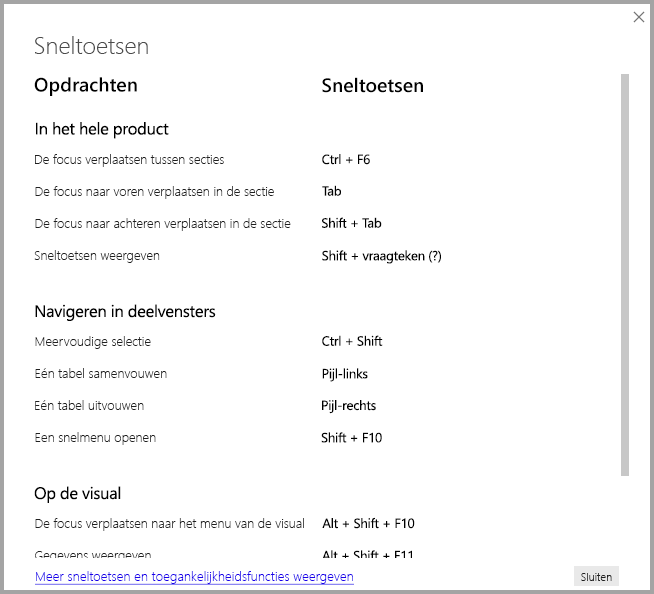
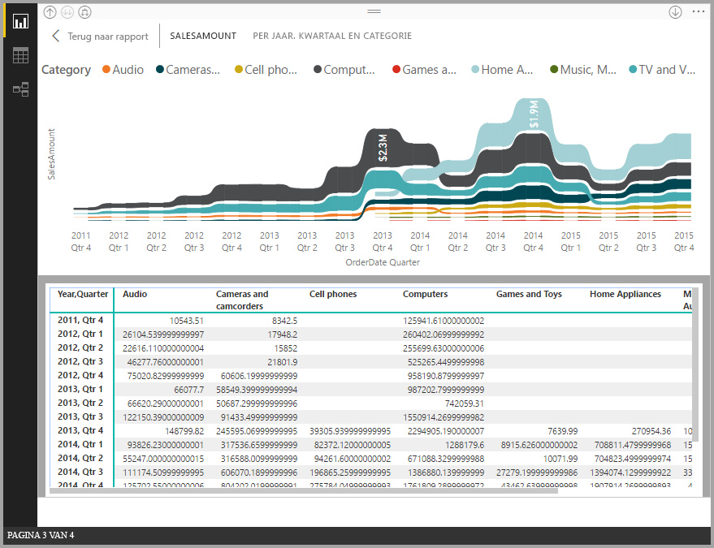
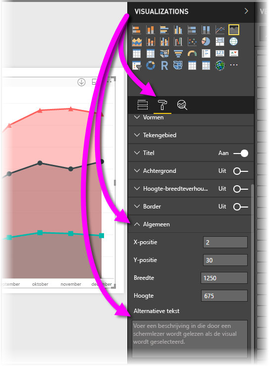

# Toegankelijkheid in Power BI Desktop-rapporten
Power BI bevat functies die het gebruikers met een handicap gemakkelijker maken om Power BI-rapporten te gebruiken en ermee te werken. Deze functies omvatten de mogelijkheid om een rapport te gebruiken met het toetsenbord of een schermlezer, de focus te verplaatsen naar verschillende objecten op een pagina met de tabtoets, en handig gebruik te maken van markeringen in visualisaties.

> [!NOTE]
> Deze toegankelijkheidsfuncties zijn beschikbaar in de versie van **Power BI Desktop** van juni 2017 en hoger. Voor toekomstige versies zijn nog meer toegankelijkheidsfuncties gepland.
> 
> 

## Een Power BI Desktop-rapport gebruiken met een toetsenbord of schermlezer
Vanaf de versie van **Power BI Desktop** van september 2017 kunt u op de toets **?** drukken om een venster weer te geven met een beschrijving van de beschikbare sneltoetsen voor toegankelijkheid in **Power BI Desktop**.

Dankzij deze verbeteringen voor toegankelijkheid, kunt u een Power BI-rapport gebruiken met een toetsenbord of een schermlezer. Dit kan met behulp van de volgende technieken:

U kunt de focus verplaatsen tussen de tabbladen van het rapport of de objecten op een rapportpagina met **Ctrl+F6**.

* Als een van de *rapportpaginatabs* de focus heeft, kunt u focus van de ene naar de andere rapportpagina verplaatsen met de *tabtoets* of de *pijltoetsen*. De titel van de rapportpagina wordt gelezen door de schermlezer, en ook of de rapportpagina momenteel is geselecteerd. Om de rapportpagina met de focus te laden, drukt u op *Enter* of de *spatiebalk*.
* Wanneer een geladen *rapportpagina* de focus heeft, drukt u op de *tabtoets* om de focus te verplaatsen tussen alle objecten op de pagina, zoals tekstvakken, afbeeldingen, vormen en diagrammen. De schermlezer leest het type object, de eventuele titel van het object en een beschrijving van dat object als deze door de auteur van het rapport is opgegeven. 

Als u tussen visuals navigeert en hier verder interactief mee wilt werken, drukt u op **Alt+Shift+F10** om de focus naar de visuele kop te verplaatsen. Deze kop bevat verschillende opties zoals het sorteren en exporteren van de gegevens achter de grafiek en de Focus-modus. 

U kunt op **Alt+Shift+F11** drukken om een toegankelijke versie van het venster *Gegevens weergeven* weer te geven. Hiermee kunt u de gegevens die in de visual worden gebruikt in een HTML-tabel bekijken, met behulp van dezelfde sneltoetsen die u normaal gesproken met de schermlezer gebruikt. 

> [!NOTE]
> De functie Gegevens weergeven is alleen toegankelijk voor een schermlezer via deze sneltoets. Als u Gegevens weergeven opent via de optie weergeven in de visuele kop, is deze optie niet toegankelijk voor een schermlezer.
> 
> 

Deze toegankelijkheidsfuncties zijn toegevoegd zodat gebruikers volledig gebruik kunnen maken van Power BI-rapporten met een schermlezer en toetsenbordnavigatie.

## Tips voor het maken van toegankelijke rapporten
De volgende tips kunt u helpen bij het maken van **Power BI Desktop**-rapporten die beter toegankelijk zijn.

* Schakel markeringen in voor visuele elementen (zoals een **regel**, **gebied** en **keuzelijst met invoervak**) en voor **spreidingsdiagrammen** en **beldiagrammen**, enzovoort, en gebruik een andere *vorm van markering* voor elke regel.
  
  * Om *markeringen* in te schakelen, selecteert u de sectie **Opmaak** in het deelvenster **Visualisaties** en vouwt u de sectie **Vormen** uit. Schuif vervolgens omlaag naar de schakeloptie **Markeringen** en zet deze op *Aan*.
  * Selecteer vervolgens de naam van elke regel (of elk gebied, als u een **vlakdiagram** gebruikt) in de vervolgkeuzelijst in de sectie **Vormen**. Onder de vervolgkeuzelijst kunt u veel aspecten van de gebruikte markering voor de geselecteerde regel aanpassen, met inbegrip van de vorm, kleur en grootte.
  
  
  
  * Als u voor elke lijn een andere *vorm van markering* gebruikt, is het makkelijker voor gebruikers om verschillende lijnen (of vlakken) van elkaar te onderscheiden.
* Ter aanvulling op het vorige punt: vertrouw niet alleen op kleuren om informatie over te brengen. Naast het gebruik van vormen in lijn- en spreidingsdiagrammen hoeft u niet alleen te vertrouwen op voorwaardelijke opmaak om inzicht te krijgen in tabellen en matrices. 
* Kies een opzettelijke sorteervolgorde voor elke visual in uw rapport. Wanneer gebruikers van schermlezers door de gegevens achter de grafiek navigeren, wordt dezelfde volgorde als in de visual gebruikt.
* Selecteer in de themagalerie een *thema* met een hoog contrast dat geschikt is voor kleurenblinden, en importeer dit met behulp van de [preview-functie **Thema's**](desktop-report-themes.md).
* Geef voor elk object in een rapport *Alternatieve tekst* op. Hiermee zorgt u ervoor dat gebruikers van uw rapport begrijpen wat u probeert te communiceren met een visueel element, zelfs als ze een visueel element, afbeelding, vorm of tekstvak niet kunnen zien. U kunt als volgt *alternatieve tekst* opgeven voor elk gewenst object in een **Power BI Desktop**-rapport: selecteer het object (een visual, vorm enzovoort) en selecteer in het deelvenster **Visualisaties** de sectie **Opmaak**, vouw **Algemeen** uit, schuif naar beneden en vul het tekstvak **Alternatieve tekst** in.
  
  
* Zorg ervoor dat er in uw rapporten voldoende contrast is tussen tekst en de achtergrondkleuren. Er zijn verschillende hulpprogramma's zoals [Kleurcontrastanalyse](https://developer.paciellogroup.com/resources/contrastanalyser/) die u kunt gebruiken om de kleuren van uw rapport te controleren. 
* Gebruik tekengrootten en lettertypen die gemakkelijk kunnen worden gelezen. Teksten met een kleine tekengrootte of lettertypen die moeilijk leesbaar zijn, komen de toegankelijkheid niet ten goede.
* Neem een titel, aslabels en gegevenslabels op in alle visuele elementen.
* Gebruik zinvolle titels voor alle rapportpagina's.
* Vermijd indien mogelijk decoratieve vormen en afbeeldingen in uw rapport, aangezien deze in de tabvolgorde van het rapport worden ingesloten. Als u decoratieve objecten in uw rapport moet opnemen, werkt u de alternatieve tekst van het object bij zodat gebruikers van schermlezers weten dat dit voor de sier is.

## Ondersteuning voor hoge contrasten in rapporten

Als u modi met hoge contrasten gebruikt in Windows, worden de instellingen daarvoor en het kleurenpalet dat u selecteert ook toegepast op rapporten in **Power BI Desktop**. 

**Power BI Desktop** detecteert automatisch welk thema voor hoge contrasten in Windows wordt gebruikt. Deze instellingen worden vervolgens ook toegepast op uw rapporten. De kleuren in hoog contrast blijven zichtbaar in het rapport wanneer het via de Power BI-service of elders wordt gepubliceerd.

De Power BI-service probeert ook de instellingen voor hoge contrasten te detecteren die voor Windows zijn ingesteld, maar hoe effectief en nauwkeurig deze detectie verloopt, is afhankelijk van welke browser wordt gebruikt voor de Power BI-service. Als u het thema handmatig wilt instellen in de Power BI-service, selecteert u **Weergave > Kleuren met hoog contrast**. Selecteer vervolgens het thema dat u wilt toepassen op het rapport.

In **Power BI Desktop** ziet u dat enkele gedeelten, zoals de velden **Visualisaties** en **Velden** niet zijn bijgewerkt op basis van de geselecteerde Windows-kleuren in hoog contrast.

## Overwegingen en beperkingen
Er zijn enkele bekende problemen en beperkingen met betrekking tot de toegankelijkheidsfuncties, zoals beschreven in de volgende lijst:

* Als u schermlezers met **Power BI Desktop** gebruikt, krijgt u de beste ervaring als u de gewenste schermlezer opent voordat u bestanden opent in Power BI Desktop.
* Als u Narrator gebruikt, zijn er enkele beperkingen wanneer u Gegevens weergeven als HTML-tabel bekijkt.

## Volgende stappen
* [Rapportthema's gebruiken in Power BI Desktop (preview)](desktop-report-themes.md)

