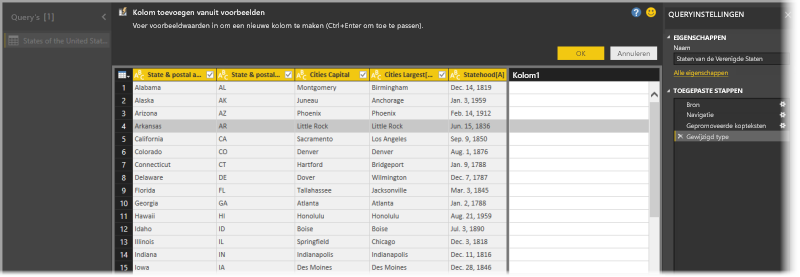
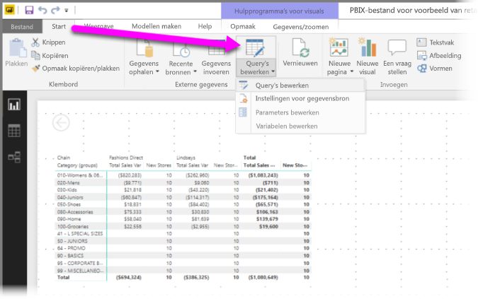
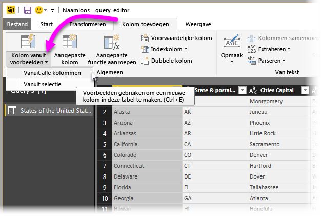
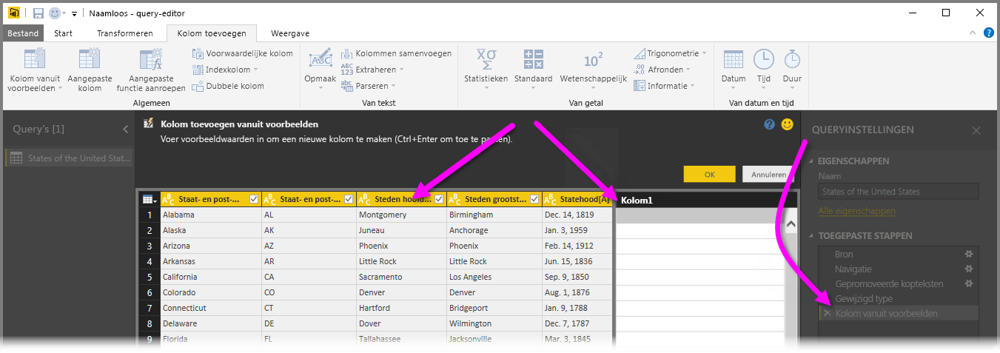
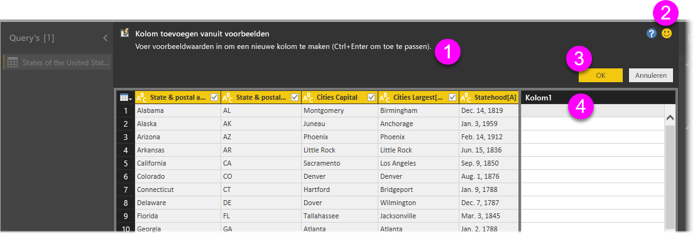
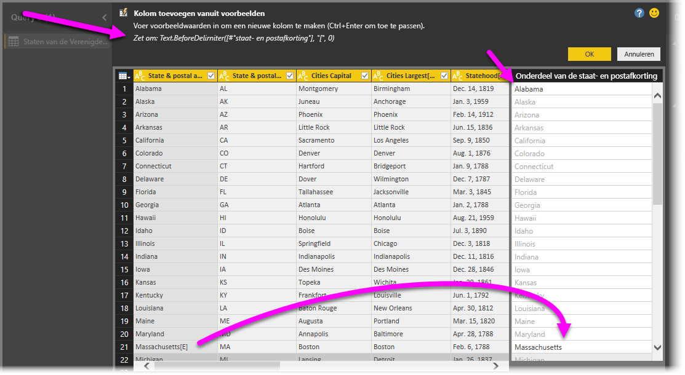

# Een kolom uit een voorbeeld toevoegen in Power BI Desktop
Vanaf de versie van **Power BI Desktop** van april 2017 kunt u nieuwe kolommen met gegevens aan uw model toevoegen met **Query-editor**. Dit doet u door eenvoudigweg een of meer voorbeeldwaarden voor de nieuwe kolom op te geven. U kunt een voorbeeld van een nieuwe kolom maken door gebruik te maken van de huidige selectie of invoer opgeven die is gebaseerd op alle (of geselecteerde) kolommen in een bepaalde tabel.

Op deze manier kunt u snel en eenvoudig nieuwe kolommen maken. Dit is handig in de volgende gevallen:

* U weet het gewenste gegevensresultaat in uw nieuwe kolom, maar u weet niet met welke transformatie(s) u dat resultaat bereikt.
* U weet al welke transformaties u nodig hebt, maar weet niet zeker wat u in de gebruikersinterface moet aanklikken of selecteren om die transformaties te bewerkstelligen.
* U weet alles over de benodigde transformaties met behulp van een *Aangepaste kolom*-expressie in **M**, maar een of meer expressies komen niet voor in de gebruikersinterface.

Werken met de functie **Een kolom uit een voorbeeld toevoegen** is heel eenvoudig. In de volgende secties ziet u precies hoe eenvoudig het is.

## Een nieuwe kolom uit een voorbeeld toevoegen met Query-editor
Start **Query-editor** om een nieuwe kolom te maken met behulp van een voorbeeld. U kunt dit doen door **Query's bewerken** te selecteren in het lint **Start** van **Power BI Desktop**.

Als u gegevens wilt ophalen van een webpagina, gaat u naar het tabblad **Start**, klikt u op **Gegevens ophalen > Web** en plakt u de URL in het dialoogvenster dat wordt weergegeven. In dit artikel worden gegevens uit een Wikipedia-artikel gebruikt. Als u op de volgende koppeling klikt, kunt u de gegevens zelf ophalen en de stappen volgen:

* [**Lijst met staten en gebieden van de Verenigde Staten**](https://wikipedia.org/wiki/List_of_states_and_territories_of_the_United_States)

Als u **Query-editor** hebt gestart en enkele gegevens hebt geladen, kunt u aan de slag gaan met het toevoegen van een kolom vanuit voorbeelden. Om een nieuwe kolom toe te voegen, selecteert u in het lint van **Query-editor** het tabblad **Kolom toevoegen** en selecteert u **Kolom vanuit voorbeelden**. Als u de vervolgkeuzelijst kiest, kunt u **Vanuit alle kolommen** (de standaardwaarde, als u de knop selecteert in plaats van de vervolgkeuzelijst) of **Vanuit selectie** selecteren. In dit artikel behandelen we **Vanuit alle kolommen**.

## Het deelvenster Kolom toevoegen vanuit voorbeelden
Wanneer u een selectie voor het toevoegen van een nieuwe kolom vanuit voorbeelden hebt gemaakt, verschijnt er een nieuw deelvenster met de kolommen in de huidige tabel (mogelijk moet u schuiven om ze allemaal te kunnen zien). De nieuwe **Kolom1** wordt ook weergegeven aan de rechterkant. Dit is de kolom die in **Power BI Desktop** wordt gemaakt op basis van de voorbeelden. Onder de kop van de nieuwe **Kolom1** bevinden zich lege cellen. Hier kunt u de voorbeeldwaarden invoeren die door Power BI worden gebruikt om regels en transformaties te maken die overeenkomen met uw voorbeeld.

Deze stap wordt vastgelegd onder **Toegepaste stappen** in het deelvenster **Query-instellingen**. Zoals altijd worden uw transformatiestappen vastgelegd in **Query-editor** en op de query toegepast in de volgorde waarin ze zijn vastgelegd.

Dit is het deelvenster **Kolommen toevoegen vanuit voorbeelden** en het bestaat uit vier hoofdgebieden:

1. De **opdrachtbalk** bevat een korte beschrijving van de functie of de transformatie.
2. Met de optie **Feedback verzenden** kunt u helpen om deze functie van Power BI te verbeteren.
3. Met de knoppen **OK** en **Annuleren** kunt u de transformaties doorvoeren en de kolom toevoegen, of de transformaties annuleren.
4. In het gebied van de nieuwe kolom kunt u voorbeeldwaarden typen op een of meer rijen (om Power BI te voorzien van uw voorbeeld), die gerelateerd zijn aan andere kolommen in die rij.

Terwijl u uw voorbeeld in de nieuwe kolom typt, wordt in Power BI getoond hoe de nieuwe kolom eruit komt te zien op basis van de gedetecteerde transformaties. Bijvoorbeeld: als u op de eerste rij *Alabama* typt, komt dit overeen met de waarde *Alabama* in de eerste kolom van de tabel. Zodra u op *Enter* drukt, wordt de kolom in Power BI ingevuld op basis van die waarde.

Maar vervolgens gaat u naar de rij met *Massachusetts[E]* en verwijdert u die laatste *[E]* (omdat u dit deel niet meer wilt). De wijziging wordt gedetecteerd door Power BI en het voorbeeld wordt gebruikt om een transformatie te maken. U ziet de uitleg van de transformatie in het deelvenster bovenaan in het midden.

Elk voorbeeld dat u opgeeft, wordt in **Query-Editor** toegevoegd aan de transformaties. Wanneer u tevreden bent, selecteert u **OK** om uw wijzigingen op te slaan.

## Zie hoe Kolom toevoegen vanuit voorbeelden werkt
Wilt u zien hoe deze functie werkt? In de volgende video ziet u hoe deze functie wordt gebruikt met de gegevensbron die eerder in dit voorbeeld is opgegeven. Bekijk en volg elke stap van het proces.

<iframe width="560" height="315" src="https://www.youtube.com/embed/-ykbVW9wQfw" frameborder="0" allowfullscreen></iframe>

## Overwegingen en beperkingen
Er zijn veel transformaties beschikbaar wanneer u **Kolom toevoegen vanuit voorbeelden** gebruikt, maar niet elke transformatie wordt opgenomen. De volgende lijst bevat alle ondersteunde transformaties.

* **Verwijzing**
  
  * Verwijzing naar een specifieke kolom (inclusief transformaties zoals het inkorten of verwijderen van tekst en het wijzigen van hoofdletters in kleine letters of omgekeerd)

* **Teksttransformaties**
  
  * Combineren (ondersteunt het combineren van letterlijke waarden en hele-kolomwaarden)
  * Vervangen
  * Lengte
  * Extraheren   
    * Eerste tekens
    * Laatste tekens
    * Bereik
    * Tekst voor scheidingsteken
    * Tekst na scheidingsteken
    * Tekst tussen scheidingstekens
    * Lengte

* De volgende ondersteunde **teksttransformaties** zijn beschikbaar in de versie van **Power BI Desktop** van november 2017:
    
  * Tekens verwijderen
  * Tekens behouden

> [!NOTE]
> Bij alle *tekst*transformaties wordt rekening gehouden met de mogelijke noodzaak tot inkorting, verwijdering of wijziging van hoofdletters in kleine letters of omgekeerd.
> 
> 

* **Gegevenstransformaties**
  
  * Dag
  * Dag van de week
  * Naam van de dag van de week
  * Dag van het jaar
  * Maand
  * Naam van de maand
  * Kwartaal van het jaar
  * Week van de maand
  * Week van het jaar
  * Jaar
  * Ouderdom
  * Begin van het jaar
  * Einde van het jaar
  * Begin van de maand
  * Einde van de maand
  * Begin van het kwartaal
  * Dagen in de maand
  * Einde van het kwartaal
  * Begin van de week
  * Einde van de week
  * Dag van de maand
  * Begin van de dag
  * Einde van de dag

* **Tijdstransformaties**
  
  * Uur
  * Minuut
  * Seconde  
  * Naar lokale tijd

> [!NOTE]
> Bij alle transformaties van *datum* en *tijd* wordt rekening gehouden met de mogelijke noodzaak tot conversie van de kolomwaarde naar een *datum* of *tijd* of *datum en tijd*.
> 
> 

* **Getaltransformaties** 

  * Absolute waarde
  * Arccosinus
  * Arcsinus
  * Arctangens
  * Converteren naar getal
  * Cosinus
  * Kubus
  * Delen
  * Exponent
  * Faculteit
  * Delen door geheel getal
  * Is even
  * Is oneven
  * Ln
  * Logaritme met grondtal 10
  * Modulo
  * Vermenigvuldigen
  * Naar beneden afronden
  * Naar boven afronden
  * Teken
  * Sinus
  * Vierkantswortel
  * Kwadraat
  * Aftrekken
  * Optellen
  * Tangens

* De volgende ondersteunde **getaltransformatie** is beschikbaar in de versie van **Power BI Desktop** van november 2017:

  * Bucketing/Bereiken

* **Algemeen**
  
  * Voorwaardelijke kolom