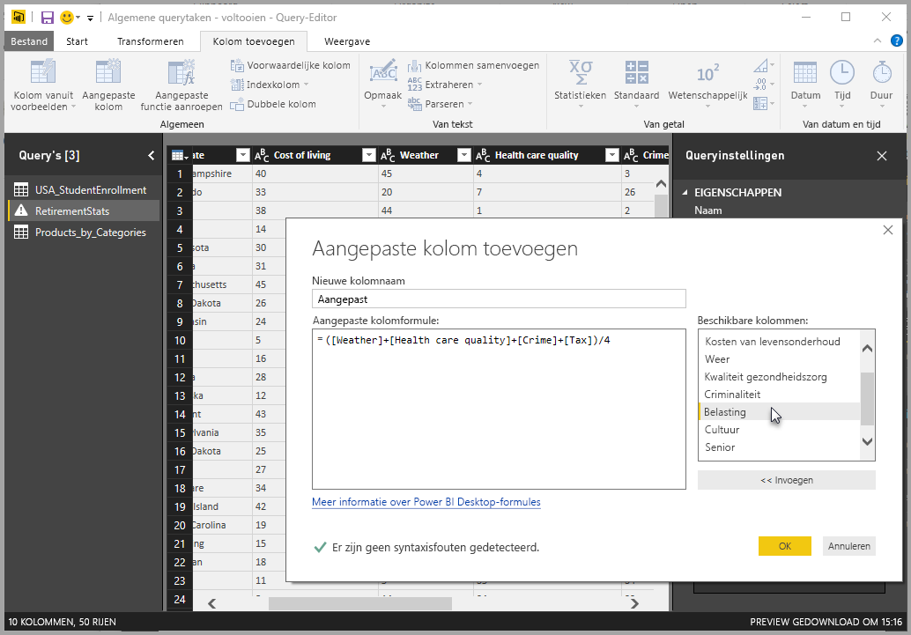
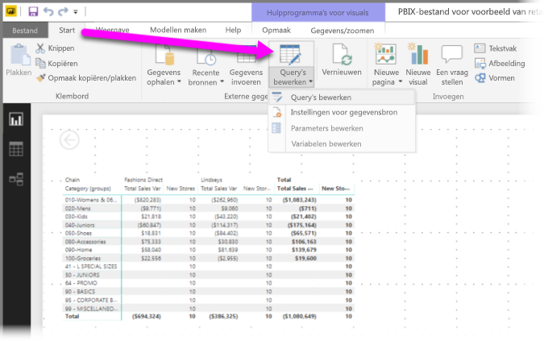
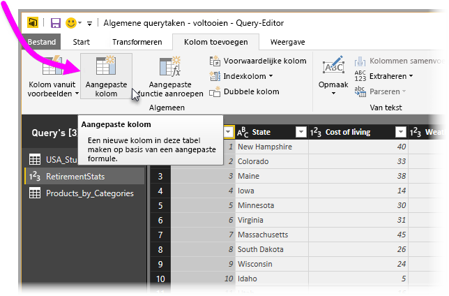
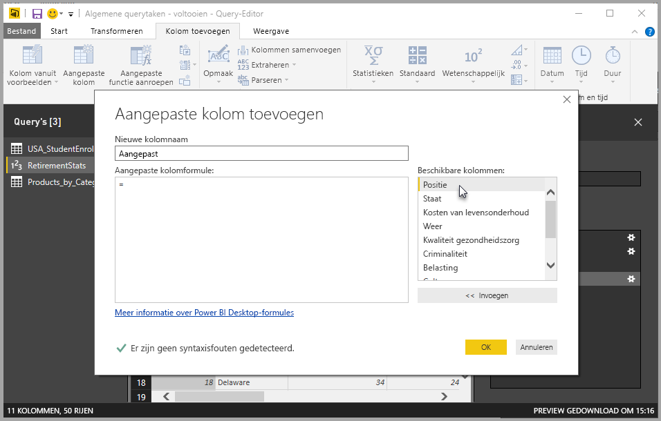
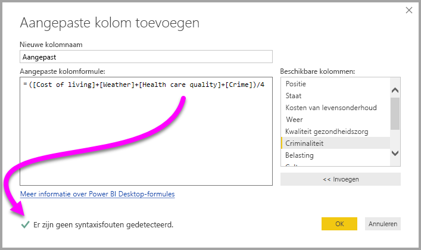
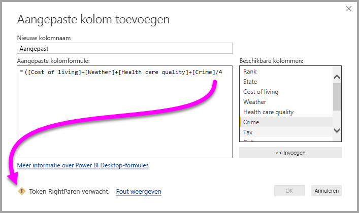
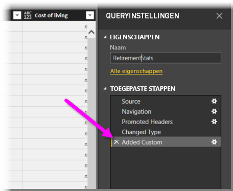
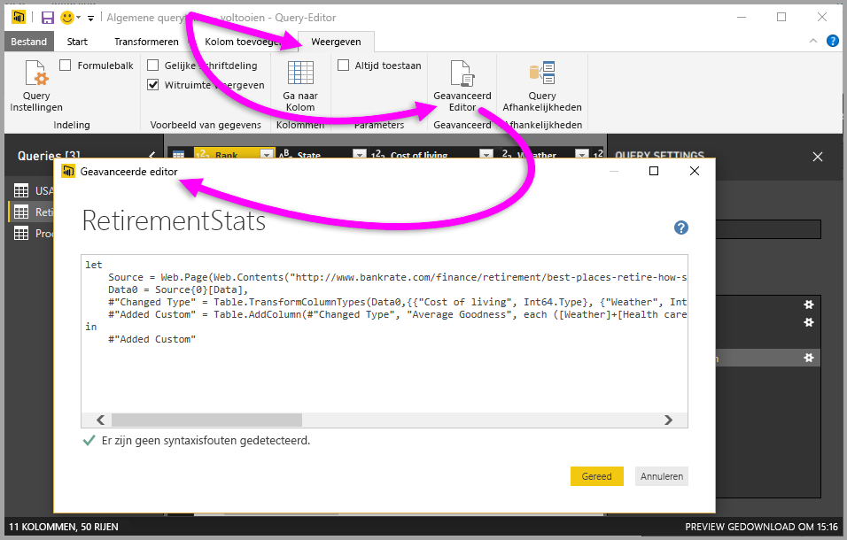

# Aangepaste kolommen toevoegen in Power BI Desktop
Met **Query-editor** in **Power BI Desktop** kunt u eenvoudig een nieuwe, aangepaste kolom met gegevens aan uw model toevoegen. De aangepaste kolom kan worden gemaakt en de naam ervan gewijzigd met behulp van handige knoppen om [M-formules](https://msdn.microsoft.com/library/mt270235.aspx) te maken waarmee de aangepaste kolom wordt gedefinieerd. De M-formule bevat een [uitgebreide naslag met functiebeschrijvingen](https://msdn.microsoft.com/library/mt779182.aspx) (Engelstalig). 

Het maken van een aangepaste kolom is nog een **toegepaste stap** voor de query die u in **Query-editor** maakt. Dit houdt in dat de query op elk moment kan worden gewijzigd of eerder of later verplaatst.

## Query-editor gebruiken om een nieuwe, aangepaste kolom toe te voegen
Start **Query-editor** als u een nieuwe, aangepaste kolom wilt maken. U kunt dit doen door **Query's bewerken** te selecteren in het lint **Start** van **Power BI Desktop**.

Als **Query-editor** is gestart en er al gegevens zijn geladen, kunt u een aangepaste kolom toevoegen door op het lint het tabblad **Kolom toevoegen** te selecteren en vervolgens de optie **Aangepaste kolom**.

Het venster **Aangepaste kolom toevoegen** verschijnt. Dit wordt in de volgende sectie omschreven.

## Het venster Aangepaste kolom toevoegen
In het venster **Aangepaste kolom toevoegen** ziet u in het deelvenster aan de rechterkant de lijst met de beschikbare velden; bovenaan ziet u de naam van de aangepaste kolom (deze kunt u een andere naam geven door een naam in het tekstvak te typen). U ziet ook de [**M**-formule](https://msdn.microsoft.com/library/mt779182.aspx), die u maakt (of schrijft) op basis van het invoegen van velden vanaf de rechterkant, het toevoegen van operatoren en overige zaken voor het bouwen van de formule waarop de nieuwe, aangepaste kolom wordt gedefinieerd. 

## Formules maken voor de aangepaste kolom
U kunt een veld selecteren in de lijst **Beschikbare kolommen:** aan de rechterkant en **<<Invoegen** selecteren om een kolom toe te voegen aan de formule voor de aangepaste kolom. U kunt een kolom ook toevoegen door erop te dubbelklikken.

Als u de formule typt en de kolom bouwt, ziet u onderin het venster een indicator die in realtime (terwijl u typt) aangeeft of er syntaxisfouten zijn gemaakt. Als alles goed is gegaan, ziet u een groen vinkje.

Als er een fout in de syntaxis is gemaakt, verschijnt er een geel waarschuwingspictogram met de gedetecteerde fout en een koppeling die de cursor (in de formule) op de positie zet waar de fout is gedetecteerd.

Als u **OK** selecteert, wordt de aangepaste kolom toegevoegd aan het model en wordt de stap **Aangepaste kolom toegevoegd** toegevoegd aan **Toegepaste stappen** van uw query.

Als u in het deelvenster **Toegepaste stappen** op de stap **Aangepaste kolom toegevoegd** dubbelklikt, verschijnt opnieuw het venster **Aangepaste kolom toevoegen** met de formule voor de aangepaste kolom die is geladen en desnoods kan worden aangepast.

## Geavanceerde editor voor aangepaste kolommen gebruiken
U kunt een aangepaste kolom ook maken met **Geavanceerde editor** (en er elke stap van de query trouwens ook mee wijzigen). In **Query-editor** selecteert u het tabblad **Weergave** en vervolgens **Geavanceerde editor** om **Geavanceerde editor** weer te geven.

Met **Geavanceerde editor** hebt u volledige controle over uw query.

## Volgende stappen
Er zijn nog een paar manieren waarop u een aangepaste kolom kunt maken, waaronder het maken van een kolom op basis van voorbeelden die u opgeeft aan **Query-editor**. Zie het volgende artikel voor meer informatie over het maken van aangepaste kommen op basis van voorbeelden:

* [Add a column from an example in Power BI Desktop](desktop-add-column-from-example.md) (Een kolom uit een voorbeeld toevoegen in Power BI Desktop)
* [Introduction to M formula language](https://msdn.microsoft.com/library/mt270235.aspx) (Inleiding tot de taal voor M-formule)
* [M function reference](https://msdn.microsoft.com/library/mt779182.aspx) (Naslag voor M-functies)  

