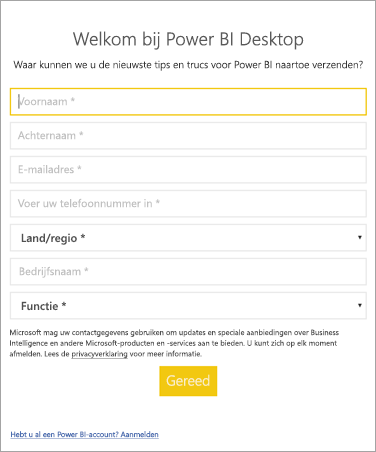

# <a name="how-administrators-can-manage-the-power-bi-desktop-sign-in-form"></a>Hoe beheerders het Power BI Desktop-aanmeldingsformulier kunnen beheren
De eerste keer dat Power BI Desktop wordt gestart, wordt een aanmeldingsformulier weergegeven. Er kunnen gegevens in worden ingevuld, of u kunt zich aanmelden bij Power BI om door te gaan. Beheerders kunnen dit formulier beheren met behulp van een registersleutel. 



Beheerders kunnen de volgende registersleutel gebruiken om het aanmeldingsformulier uit te schakelen. Dit kan ook worden geactiveerd met behulp van globaal beleid voor de gehele organisatie.

```
Key: HKEY_LOCAL_MACHINE\SOFTWARE\Policies\Microsoft\Power BI Desktop
valueName: ShowLeadGenDialog
```

Met een waarde van 0 wordt het dialoogvenster uitgeschakeld.

Hebt u nog vragen? [Misschien dat de Power BI-community het antwoord weet](http://community.powerbi.com/)

