# Aggregaties in Power BI Desktop (preview-versie)

Met behulp van **aggregaties** in Power BI kunt u interactieve analyses uitvoeren op big data op een manier die eerder niet mogelijk was. **Aggregaties** kunnen de kosten van het ontgrendelen van grote gegevenssets voor besluitvorming aanzienlijk verminderen.

In de volgende lijst staan de voordelen van het gebruiken van **aggregaties**:

* **Queryprestaties voor big data**: wanneer gebruikers werken met visuals in Power BI-rapporten, worden DAX-query's verzonden naar de gegevensset. Verhoog de querysnelheden door gegevens te cachen op het geaggregeerde niveau, met behulp van een fractie van de resources die vereist zijn tijdens het detailniveau in. Ontgrendel big data op een manier die anders niet mogelijk zou zijn.
* **Optimalisatie van gegevensvernieuwing**: beperk de cachegrootte en vernieuwingstijden door gegevens te cachen op het geaggregeerde niveau. Versnel de tijd om gegevens beschikbaar maken voor gebruikers.
* **Bereik architecturen met gelijke taakverdeling**: laat de Power BI-geheugencache geaggregeerde query's verwerken, wat het op een effectieve manier doet. Beperk query's verzonden naar de gegevensbron in de modus DirectQuery, zodat u binnen de limieten voor gelijktijdigheid blijft. Query's die er wel doorheen komen, zijn vaak gefilterde query's op transactioneel niveau, die datawarehouses en big data-systemen normaal gesproken goed verwerken.

### Opslag op tabelniveau
Opslag op tabelniveau wordt meestal gebruikt met de aggregatiefunctie. Raadpleeg voor meer informatie het artikel [Opslagmodus in Power BI Desktop](desktop-storage-mode.md).

### Typen gegevensbronnen
Aggregaties worden gebruikt met gegevensbronnen die dimensionale modellen, zoals datawarehouses, datamarts en op Hadoop gebaseerde big data-bronnen, vertegenwoordigen. In dit artikel worden typische modelleringsverschillen in Power BI voor elk type gegevensbron beschreven.

Alle Power BI Import- en DirectQuery-bronnen (niet-multidimensionaal) werken met aggregaties.

## De aggregatiefunctie (preview) inschakelen

De voorziening **Aggregaties** is nog in preview en moet afzonderlijk worden ingeschakeld in **Power BI Desktop**. U kunt **aggregaties** inschakelen door **Bestand > Opties en instellingen > Opties > Preview-functies** te selecteren en vervolgens de selectievakjes **Samengestelde modellen** en **Aggregaties beheren** in te schakelen. 

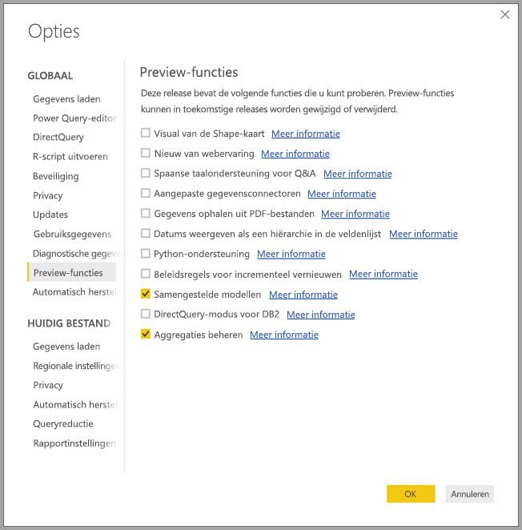

U moet **Power BI Desktop** opnieuw starten om de voorziening in te schakelen.

## Aggregaties op basis van relaties

**Aggregaties** op basis van relaties worden meestal gebruikt met dimensionale modellen. Power BI-gegevenssets die gegevens halen uit datawarehouses en datamarts lijken op ster-/snowflake-schema's met relaties tussen dimensietabellen en feitentabellen.

Kijk eens naar het volgende model, dat afkomstig is van één gegevensbron. Stel dat alle tabellen DirectQuery gebruiken om mee te beginnen. De feitentabel **Sales** bevat miljarden rijen. Wanneer de opslagmodus van **Sales** voor caching zou worden ingesteld op **Import**, zou dat een aanzienlijke hoeveelheid geheugen gebruiken en leiden tot beheeroverhead.

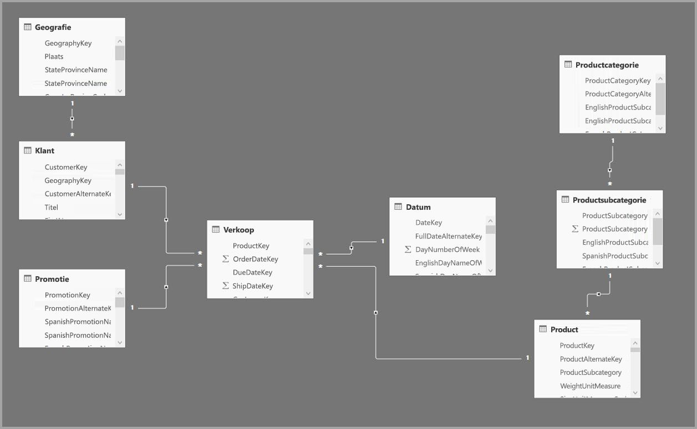

In plaats daarvan maken we de tabel **Sales Agg** (Verkoopaggregatie) als een aggregatietabel. Deze heeft een hogere granulariteit dan **Sales** en bevat dus veel minder rijen. Het aantal rijen moet gelijk zijn aan de som van **SalesAmount** gegroepeerd op **CustomerKey**, **DateKey** en **ProductSubcategoryKey**. In plaats van miljarden zijn er nu mogelijk miljoenen rijen, die veel gemakkelijker te beheren zijn.

Stel dat de volgende dimensietabellen het meest worden gebruikt voor de query's met hoge bedrijfswaarde. Dit zijn de tabellen die **Sales Agg** kunnen filteren met behulp van *een-op-veel* (of *veel-op-een*) -relaties.

* Geografie
* Klant
* Datum
* Productsubcategorie
* Productcategorie

De volgende afbeelding geeft een indruk van hoe dit model eruitziet.

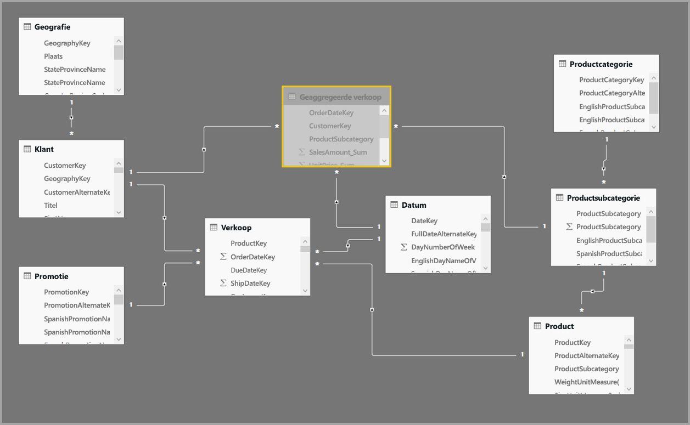

> [!NOTE]
> De tabel **Sales Agg** is gewoon een tabel en kan daarom op verschillende manieren worden geladen. Aggregatie kan bijvoorbeeld worden uitgevoerd in de brondatabase met ETL/ELT-processen of door de [M-expressie](https://msdn.microsoft.com/query-bi/m/power-query-m-reference) voor de tabel. De tabel kan de Import-opslagmodus gebruiken met of zonder [incrementeel vernieuwen in Power BI Premium](service-premium-incremental-refresh.md) of de tabel kan DirectQuery zijn en geoptimaliseerd voor snelle query's met behulp van [columnstore-indexen](https://docs.microsoft.com/sql/relational-databases/indexes/columnstore-indexes-overview). Deze flexibiliteit maakt architecturen met gelijke taakverdeling mogelijk die querybelasting verspreiden om knelpunten te voorkomen.

### Opslagmodus 
Laten we doorgaan met het voorbeeld dat we gebruiken. We stellen de opslagmodus van **Sales Agg** in op **Import** om query's te versnellen.

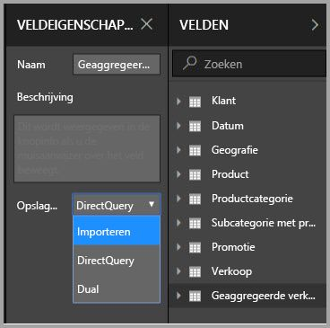

Wanneer we dit doen, wordt het volgende dialoogvenster weergegeven dat ons laat weten dat de gerelateerde dimensietabellen kunnen worden ingesteld op de opslagmodus **Dual**. 

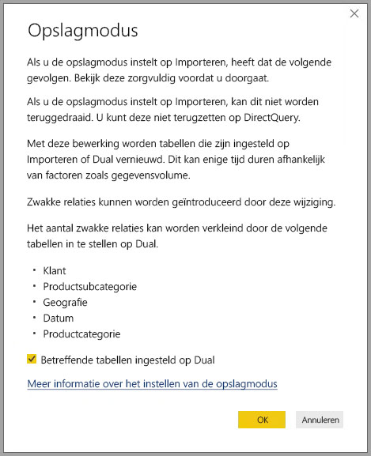

Als u ze instelt op **Dual**, kunnen de gerelateerde dimensietabellen fungeren als Import of als DirectQuery, afhankelijk van de subquery.

* Query's die metrische gegevens van de tabel **Sales Agg** aggregeren, wat Import is, en groeperen op kenmerk(en) van de gerelateerde Dual-tabellen, kunnen worden geretourneerd uit het cachegeheugen.
* Query's die metrische gegevens in de tabel **Sales** aggregeren, wat DirectQuery is, en groeperen op kenmerk(en) van de gerelateerde Dual-tabellen kunnen worden geretourneerd in DirectQuery-modus. De querylogica inclusief de group by-bewerking wordt doorgegeven aan de brondatabase.

Zie voor meer informatie over de opslagmodus **Dual** het artikel [opslagmodus](desktop-storage-mode.md).

### Sterke versus zwakke relaties
Aggregatietreffers op basis van relaties vereisen sterke relaties.

Sterke relaties betreffen bijvoorbeeld de volgende combinaties, waarbij beide tabellen afkomstig zijn uit *één bron*.

| Tabel aan de *many-zijden | Tabel aan de *1*-zijde |
| ------------- |----------------------| 
| Dual          | Dual                 | 
| Importeren        | Importeren of Dual       | 
| DirectQuery   | DirectQuery of Dual  | 

Een relatie tussen *meerdere bronnen* wordt alleen als sterk beschouwd wanneer beide tabellen van het type Import zijn. Veel-op-veel-relaties worden altijd als zwak beschouwd.

Voor aggregatietreffers gebaseerd op *meerdere bronnen* die niet afhankelijk zijn van relaties, raadpleegt u het gedeelte hieronder over aggregaties op basis van group by-kolommen.

### Aggregatietabel is verborgen
De tabel **Sales Agg** is verborgen. Aggregatietabellen moeten altijd worden verborgen voor gebruikers van de gegevensset. Gebruikers en query's verwijzen naar de tabel met details, niet naar de aggregatietabel; ze hoeven niet eens te weten dat de aggregatietabel bestaat.

### Dialoogvenster Aggregaties beheren
Vervolgens definiëren we de aggregaties. Selecteer het contextmenu**Aggregaties beheren** voor de tabel **Sales Agg** door met de rechtermuisknop op de tabel te klikken.

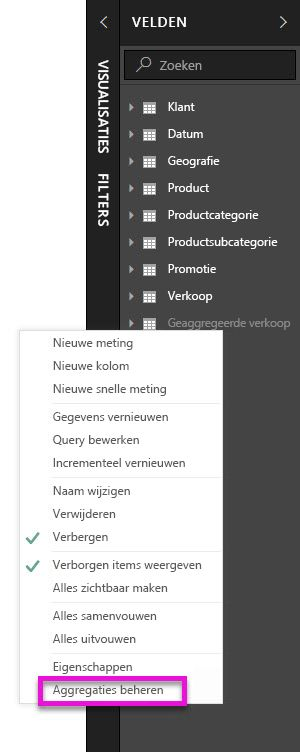

Het dialoogvenster **Aggregaties beheren** wordt weergegeven. Hier ziet u een rij voor elke kolom in de tabel **Sales Agg**, waar we het aggregatiegedrag kunnen opgeven. Query's verzonden naar de Power BI-gegevensset die verwijst naar de tabel **Sales**, worden intern omgeleid naar de tabel **Sales Agg**. Gebruikers van de gegevensset hoeven zelfs niet eens te weten dat de tabel **Sales Agg** bestaat.

In de volgende tabel ziet u de aggregaties voor de tabel **Sales Agg**.

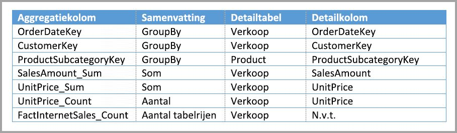

#### Samenvattingsfunctie

In de vervolgkeuzelijst Samenvatting staan de volgende waarden voor selectie.
* Aantal
* GroupBy
* Max
* Min
* Som
* Aantal tabelrijen

#### Validaties

De volgende belangrijke validaties worden afgedwongen door het dialoogvenster:

* De geselecteerde detailkolom moet hetzelfde gegevenstype hebben als de aggregatiekolom, met uitzondering van de samenvattingsfuncties Aantal en Aantal tabelrijen. Aantal en Aantal tabelrijen worden alleen aangeboden voor integere aggregatiekolommen en vereisen geen overeenkomend gegevenstype.
* Gekoppelde aggregaties die betrekking hebben op drie of meer tabellen zijn niet toegestaan. Het is bijvoorbeeld niet mogelijk om aggregaties in te stellen op **Tabel A** die verwijst naar **Tabel B** die aggregaties heeft die verwijzen naar **Tabel C**.
* Dubbele aggregaties waarbij twee vermeldingen dezelfde samenvattingsfunctie gebruiken en verwijzen naar dezelfde detailtabel/-kolom zijn niet toegestaan.

Tijdens deze openbare preview voor **aggregaties** worden de volgende validaties ook afgedwongen. We gaan deze controles verwijderen wanneer het algemeen beschikbaar wordt gesteld.

* Aggregaties kunnen niet worden gebruikt met beveiliging op rijniveau (RLS). *Beperking van de openbare preview.*
* Tabel met details moet DirectQuery zijn, niet Import. *Beperking van de openbare preview.*

De meeste van dergelijke validaties worden afgedwongen door het uitschakelen van de waarden van de vervolgkeuzelijst en door verklarende tekst weer te geven in de knopinfo, zoals in de volgende afbeelding.

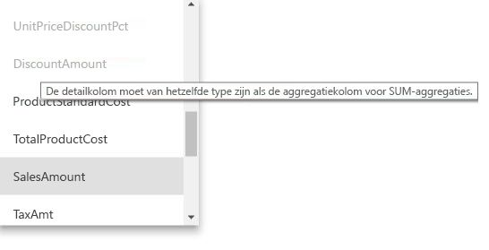

### Groeperen op kolommen

In dit voorbeeld zijn de drie GroupBy-vermeldingen optioneel; ze hebben geen invloed op het aggregatiegedrag (met uitzondering van de DISTINCTCOUNT-voorbeeldquery, die in de volgende afbeelding wordt weergegeven). Ze zijn voornamelijk omwille van de leesbaarheid opgenomen. Zonder deze GroupBy-vermeldingen worden de aggregaties nog steeds geraakt op basis van de relaties. Dit wijkt af van het gebruik van aggregaties zonder relaties, wat wordt behandeld in het big data-voorbeeld later in dit artikel.

### Detecteren of aggregaties zijn geraakt of gemist door query's

Zie het artikel [opslagmodus](desktop-storage-mode.md) voor meer informatie over het detecteren van of query's nu wel of niet worden geretourneerd vanuit de geheugencache (opslag-engine) of DirectQuery (naar de gegevensbron gepusht) met behulp van SQL Profiler. Dit proces kan ook worden gebruikt om te detecteren of aggregaties worden geraakt.

Verder wordt de volgende uitgebreide gebeurtenis opgegeven in SQL Profiler.

    Query Processing\Aggregate Table Rewrite Query

Het volgende JSON-codefragment toont een voorbeeld van de uitvoer van de gebeurtenis wanneer een aggregatie wordt gebruikt.

* **matchingResult** geeft aan dat een aggregatie is gebruikt voor de subquery.
* **dataRequest** toont de group by-kolom(men) en geaggregeerde kolom(men) die worden gebruikt door de subquery.
* **toewijzing** toont de kolommen in de aggregatietabel waaraan is toegewezen.

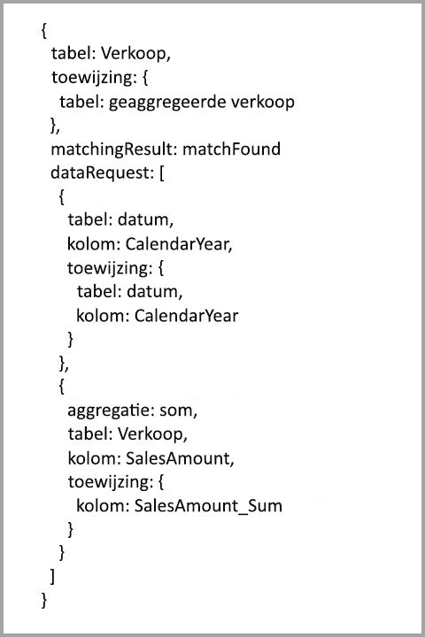

### Queryvoorbeelden
De volgende query raakt de aggregatie, omdat kolommen in de tabel *Date* op de granulariteit zijn die de aggregatie kan raken. De aggregatie **Som** voor **SalesAmount** wordt gebruikt.

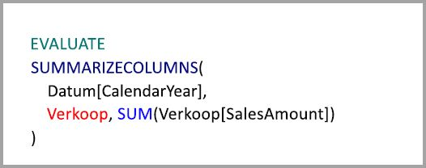

De volgende query raakt de aggregatie niet. Ondanks het feit dat de som van **SalesAmount** wordt aangevraagd, voert deze query een group by-bewerking uit op een kolom in de tabel **Product**, die zich niet op de granulariteit bevindt die de aggregatie kan raken. Als u de relaties in het model bestudeert, ziet u dat productsubcategorie meerdere **Product**-rijen kan hebben. De query kan dan niet bepalen naar welk product moet worden geaggregeerd. In dit geval wordt de query teruggezet op DirectQuery en verzendt een SQL-query naar de gegevensbron.

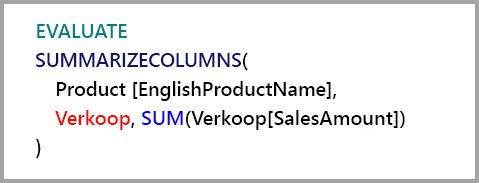

Aggregaties zijn niet alleen geschikt voor eenvoudige berekeningen die een eenvoudige som uitvoeren. Complexe berekeningen kunnen ook profiteren. Conceptueel gezien wordt een complexe berekening onderverdeeld in subquery's voor elke SUM, MIN, MAX en COUNT, en wordt elke subquery geëvalueerd om te bepalen of de aggregatie kan worden bereikt. Deze logica geldt niet voor alle gevallen vanwege optimalisatie van het queryplan, maar in het algemeen kan die worden toegepast. Het volgende voorbeeld raakt de aggregatie:

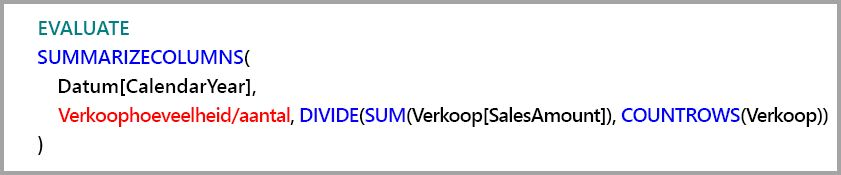

De functie COUNTROWS kan profiteren van aggregaties. De volgende query raakt de aggregatie, omdat er een **Count**-tabelrijenaggregatie is gedefinieerd voor de tabel **Sales**.

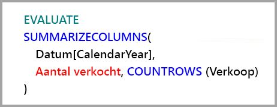

De functie AVERAGE kan profiteren van aggregaties. De volgende query raakt de aggregatie, omdat AVERAGE intern wordt gevouwen tot een SUM gedeeld door een COUNT. Omdat de kolom **UnitPrice** aggregaties heeft gedefinieerd voor zowel SUM als COUNT, wordt de aggregatie geraakt.

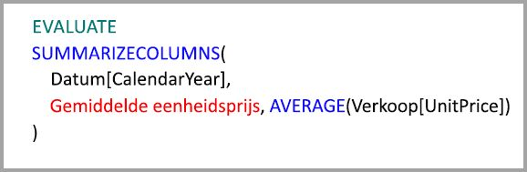

In sommige gevallen kan de functie DISTINCTCOUNT profiteren van aggregaties. De volgende query raakt de aggregatie omdat er een group by-vermelding is voor **CustomerKey**, die de onderscheidbaarheid van **CustomerKey** in de aggregatietabel behoudt. Deze techniek is nog steeds onderworpen aan de drempelwaarde voor prestaties waarbij ongeveer twee tot vijf miljoen afzonderlijke waarden invloed kunnen hebben op de queryprestaties. Het kan echter nuttig zijn in scenario's waarbij er miljarden rijen in de detailtabel staan en twee tot vijf miljoen afzonderlijke waarden in de kolom. In dit geval kan de afzonderlijke telling sneller worden uitgevoerd dan het scannen van de tabel met miljarden rijen, zelfs als deze in het cachegeheugen zijn opgeslagen.

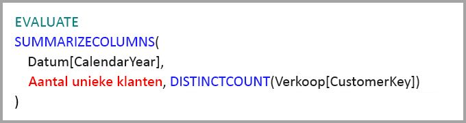

## Aggregaties op basis van group by-kolommen 

Op Hadoop gebaseerde big data-modellen hebben andere kenmerken dan dimensionale modellen. Om joins tussen grote tabellen te voorkomen, zijn ze vaak niet gebaseerd op relaties. In plaats daarvan worden dimensiekenmerken vaak gedenormaliseerd naar feitentabellen. Dergelijke big data-modellen kunnen worden ontgrendeld voor interactieve analyses door **aggregaties** op basis van group by-kolommen te gebruiken.

De volgende tabel bevat de numerieke kolom **Movement** die moet worden geaggregeerd. Alle andere kolommen zijn kenmerken van group by. De tabel bevat IoT-gegevens en een enorm groot aantal rijen. De opslagmodus is DirectQuery. Vanwege het enorme volume zijn query's op de gegevensbron die worden samengevoegd in de hele gegevensset traag.

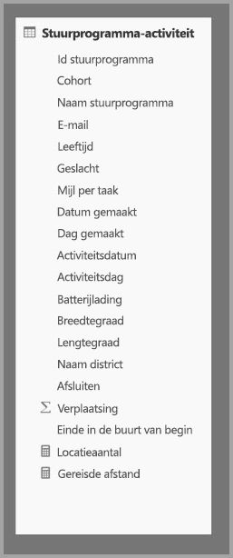

Om interactieve analyses op deze gegevensset in te schakelen, voegen we een aggregatietabel toe die groepeert op de meeste kenmerken, maar kenmerken van hoge kardinaliteit, zoals lengtegraad en breedtegraad, uitsluit. Dit vermindert het aantal rijen aanzienlijk en is klein genoeg om eenvoudig in een geheugencache te passen. De opslagmodus van **Driver Activity Agg** is Import.

Vervolgens definiëren we de aggregatietoewijzingen in het dialoogvenster **Aggregaties beheren**. Hier ziet u een rij voor elke kolom in de tabel **Driver Activity Agg**, waar we het aggregatiegedrag kunnen opgeven.

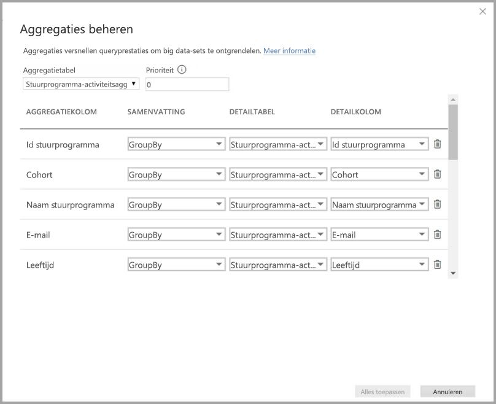

In de volgende tabel ziet u de aggregaties voor de tabel **Driver Activity Agg**.

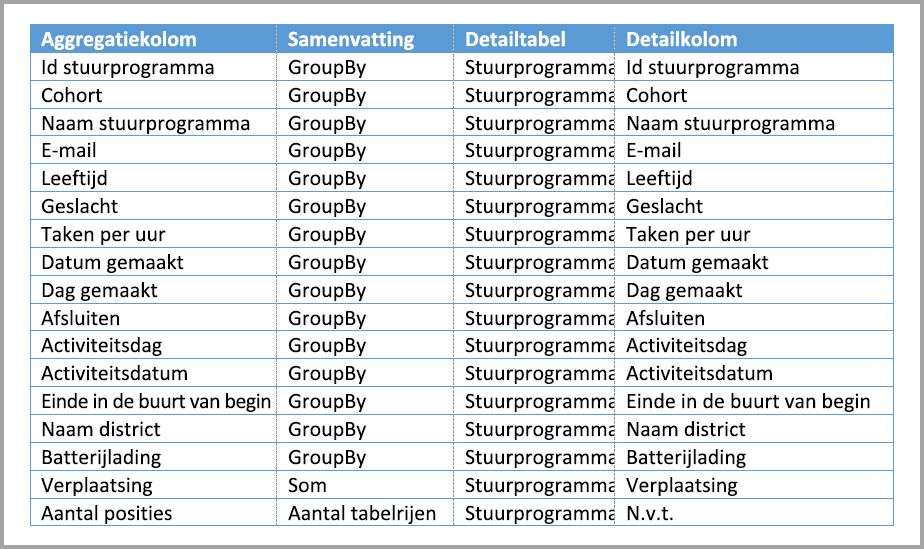

### Groeperen op kolommen

In dit voorbeeld zijn de **GroupBy**-vermeldingen **niet optioneel**. De aggregaties zouden niet worden geraakt zonder deze vermeldingen. Dit is anders dan wanneer aggregaties op basis van relaties worden gebruikt; dit wordt beschreven in het dimensiemodelvoorbeeld dat eerder in dit artikel werd behandeld.

### Queryvoorbeelden

De volgende query raakt de aggregatie, omdat de kolom **Activity Date** wordt gedekt door de aggregatietabel. De rijenaggregatie van de tabel Count wordt gebruikt door de functie COUNTROWS.

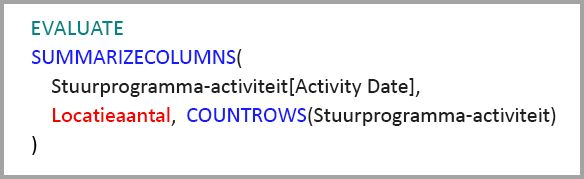

Met name voor modellen die filterkenmerken in feitentabellen bevatten, is het een goed idee om Count tabelrijenaggregaties te gebruiken. Power BI kan query's indienen bij de gegevensset met behulp van COUNTROWS in gevallen waarin het niet expliciet wordt aangevraagd door de gebruiker. Het filterdialoogvenster geeft bijvoorbeeld het aantal rijen voor elke waarde aan.

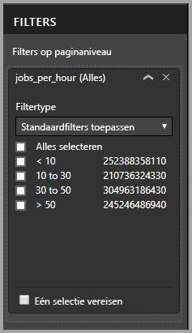

## Aggregatieprioriteit

Dankzij aggregatieprioriteit kunnen meerdere aggregatietabellen worden meegenomen door een enkele subquery.

Kijk eens naar het volgende voorbeeld. Dit is een [samengesteld model](desktop-composite-models.md) met meerdere DirectQuery-bronnen.

* De Import-tabel **Driver Activity Agg2** heeft een hoge granulatie, omdat er weinig group by-kenmerken zijn en lage kardinaliteit. Het aantal rijen kan zo laag als duizenden zijn, zodat deze gemakkelijk in een geheugencache passen. Deze kenmerken blijken te worden gebruikt door een hoogwaardig geavanceerd dashboard, zodat query's die ernaar verwijzen zo snel mogelijk zouden moeten zijn.
* De tabel **Driver Activity Agg** is een tussenliggende aggregatietabel in de modus DirectQuery. Het bevat meer dan een miljard rijen en is geoptimaliseerd bij de bron met behulp van columnstore-indexen.
* De tabel **Driver Activity** is DirectQuery en bevat meer dan een miljard rijen met IoT-gegevens afkomstig van een big data-systeem. Het levert drillthrough-query's om afzonderlijke IoT-readings in gecontroleerde filtercontexten weer te geven.

De geheugen-footprint van dit model is relatief klein, maar het ontgrendelt een enorme gegevensset. Het vertegenwoordigt een architectuur met gelijke taakverdeling, omdat deze de querybelasting verspreidt over de onderdelen van de architectuur en ze benut op basis van hun sterke punten.

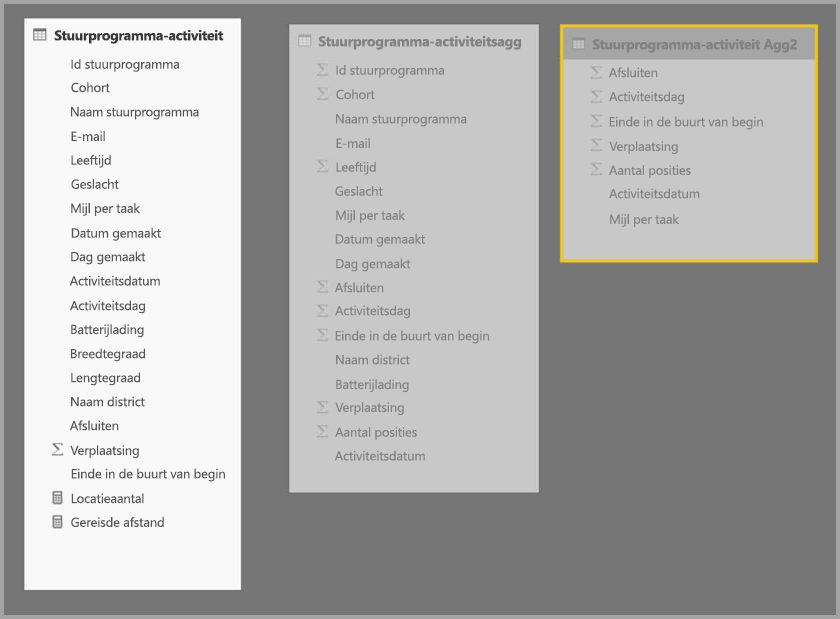

Het dialoogvenster **Aggregaties beheren** voor **Driver Activity Agg2** laat zien dat het veld *Prioriteit* 10 is. Dit is hoger dan die van **Driver Activity Agg**, wat betekent dat deze eerst wordt meegenomen door query's die aggregaties gebruiken. Subquery's die niet de granulariteit hebben die kan worden beantwoord door **Driver Activity Agg2** kijken in plaats daarvan naar **Driver Activity Agg**. Detailquery's die niet kunnen worden beantwoord door een van beide aggregatietabellen, worden omgeleid naar **Driver Activity**.

De tabel die is opgegeven in de kolom **Tabel met details** is **Driver Activity** en niet  **Driver Activity Agg**, omdat ketenaggregaties niet zijn toegestaan (zie [ validaties](#validations) eerder in dit artikel).

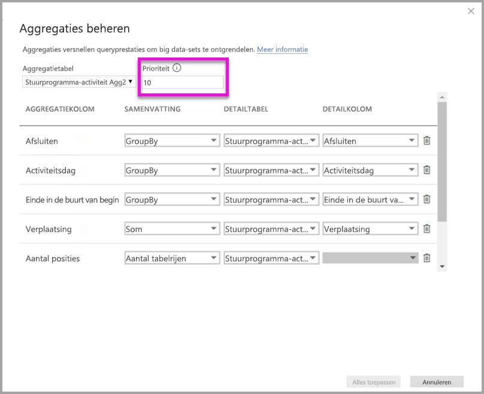

In de volgende tabel ziet u de aggregaties voor de tabel **Driver Activity Agg2**.

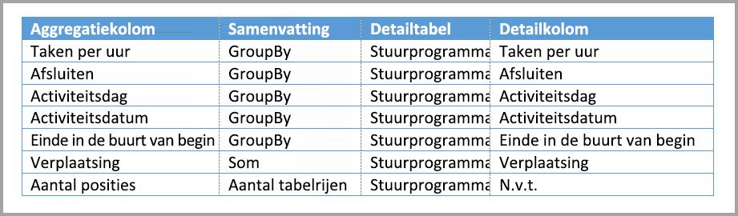

## Aggregaties op basis van group by-kolommen in combinatie met relaties

U kunt zelfs de twee methoden voor aggregaties eerder in dit artikel beschreven, combineren. **Aggregaties** op basis van relaties kunnen mogelijk vereisen dat de gedenormaliseerde dimensietabellen worden gesplitst in meerdere tabellen. Als dit te kostbaar wordt of niet praktisch is voor bepaalde dimensietabellen, kunnen de juiste kenmerken worden gerepliceerd in de aggregatietabel voor bepaalde dimensie (s) en relaties die worden gebruikt voor andere.

Het volgende model repliceert *Maand*, *Kwartaal*, *Semester* en *Jaar* in de tabel **Sales Agg**. Er is geen relatie tussen **Sales Agg** en de tabel **Datum**. Er zijn relaties met **Klant** en **Subcategorie met producten**. De opslagmodus van **Sales Agg** is Import.

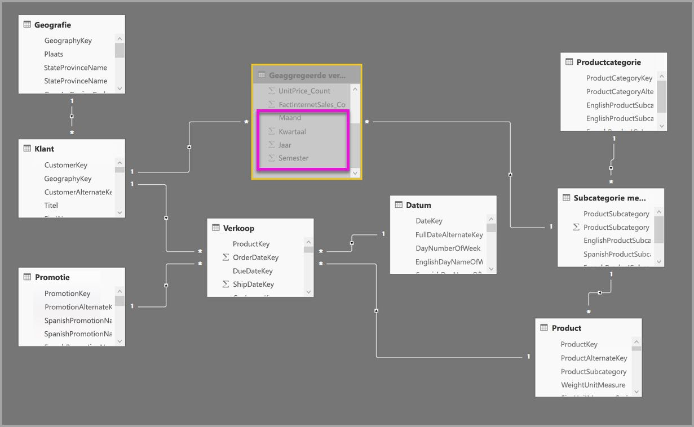

In de volgende tabel ziet u de vermeldingen die zijn ingesteld in het dialoogvenster **Aggregaties beheren** voor de tabel **Sales Agg**. De GroupBy-vermeldingen waarbij **Datum** de tabel met details is, zijn verplicht om aggregaties te raken voor query's die de Datum-kenmerken groeperen. Zoals in het vorige voorbeeld hebben de GroupBy-vermeldingen voor CustomerKey en ProductSubcategoryKey geen invloed op aggregatietreffers vanwege de aanwezigheid van relaties (ook nu weer met uitzondering van DISTINCTCOUNT).

> Opmerking: dit model vereist dat de tabel **Datum** in de DirectQuery-modus is om het dialoogvenster Aggregaties beheren in te vullen, omdat het een tabel met details is. Dit is een Preview-beperking die we voor Algemene beschikbaarheid gaan verwijderen.

### Queryvoorbeelden

De volgende query raakt de aggregatie, omdat CalendarMonth wordt gedekt door de aggregatietabel en CategoryName toegankelijk is via een-op-veel-relaties. De Sum-aggregatie voor **SalesAmount** wordt gebruikt.

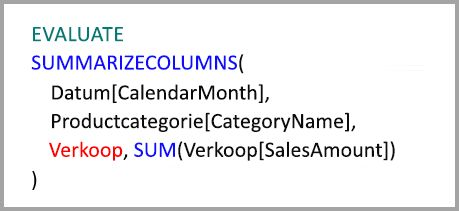

De volgende query raakt de aggregatie niet, omdat de kolom CalendarDay niet wordt gedekt door de aggregatietabel.

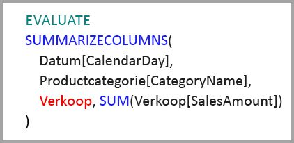

De volgende tijdintelligentie query raakt de aggregatie niet, omdat de functie DATESYTD een tabel met CalendarDay-waarden genereert, die niet wordt gedekt door de aggregatietabel.

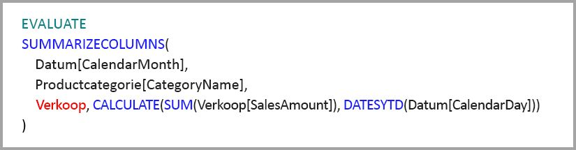

## Caches moeten steeds worden gesynchroniseerd

**Aggregaties** die DirectQuery en Import en/of Dual-opslagmodus combineren, kunnen mogelijk verschillende gegevens retourneren als de geheugencache niet synchroon wordt gehouden met de brongegevens. Bij het uitvoeren van query's wordt er niet geprobeerd om gegevensproblemen te maskeren, bijvoorbeeld door DirectQuery resultaten te filteren zodat deze overeenkomen met de waarden in de cache. Deze functies zijn prestatieoptimalisaties en moeten alleen worden gebruikt op een manier waardoor u uw zakelijke vereisten niet in gevaar brengt. Het is uw verantwoordelijkheid om uw gegevensstromen te kennen, dus stem uw ontwerp hierop af. Er zijn in de praktijk bewezen technieken om dergelijke problemen bij de bron af te handelen, indien nodig.

## Volgende stappen

De volgende artikelen bevatten meer informatie over samengestelde modellen, evenals een gedetailleerde beschrijving van DirectQuery.

* [Samengestelde modellen in Power BI Desktop (preview-versie)](desktop-composite-models.md)
* [Veel-op-veel-relaties in Power BI Desktop (preview-versie)](desktop-many-to-many-relationships.md)
* [Opslagmodus in Power BI Desktop (preview-versie)](desktop-storage-mode.md)

DirectQuery-artikelen:

* [DirectQuery gebruiken in Power BI](desktop-directquery-about.md)
* [Gegevensbronnen die worden ondersteund door DirectQuery in Power BI](desktop-directquery-data-sources.md)
