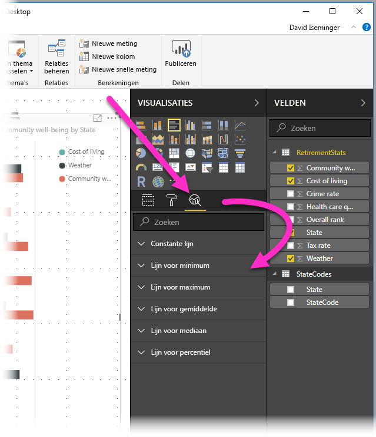
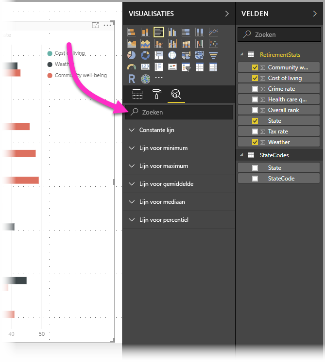
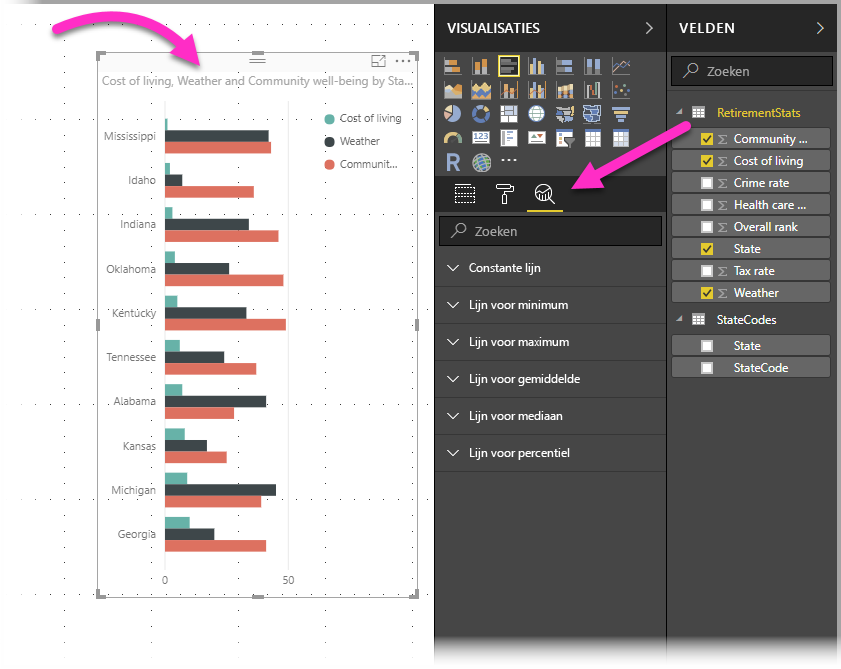
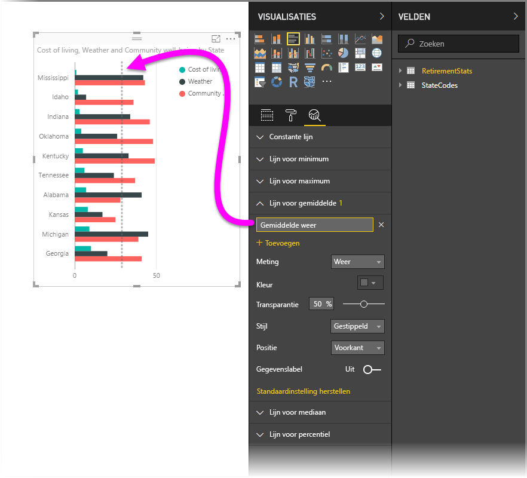
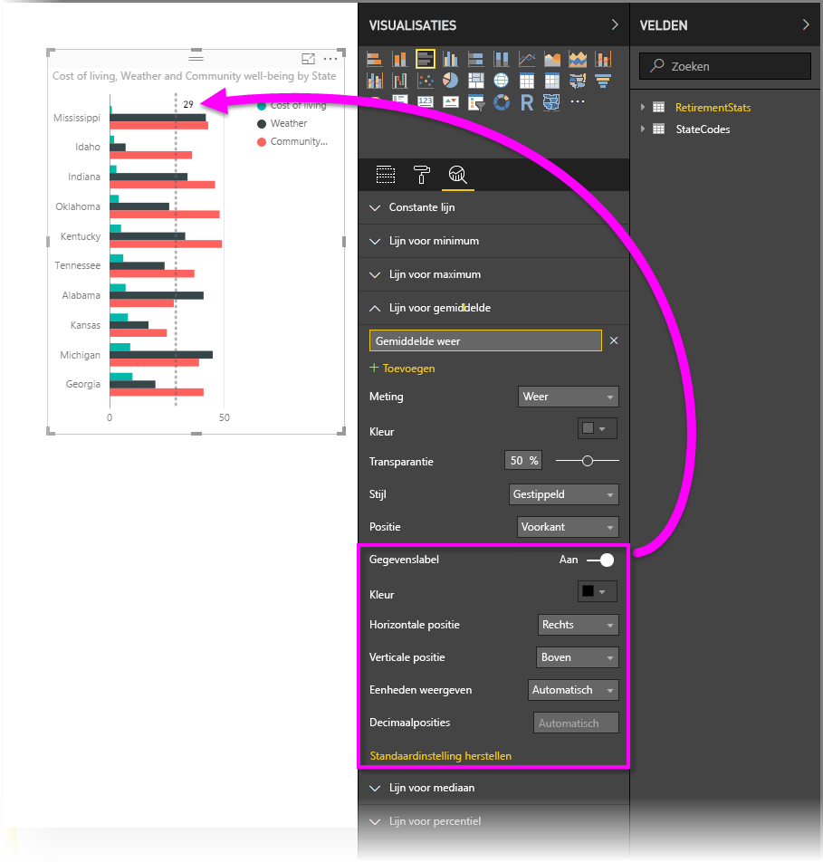
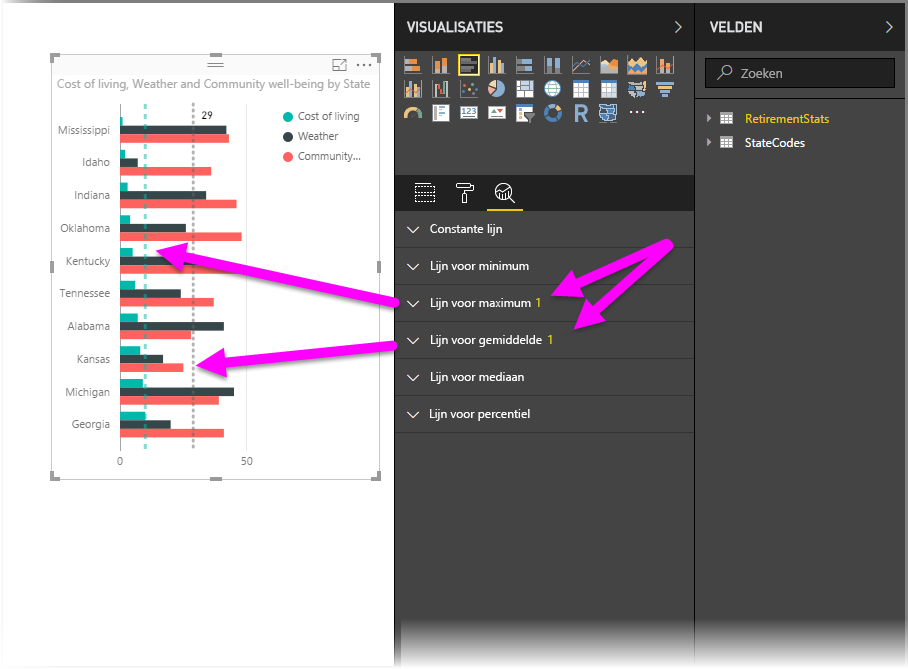
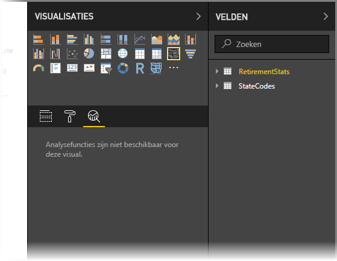
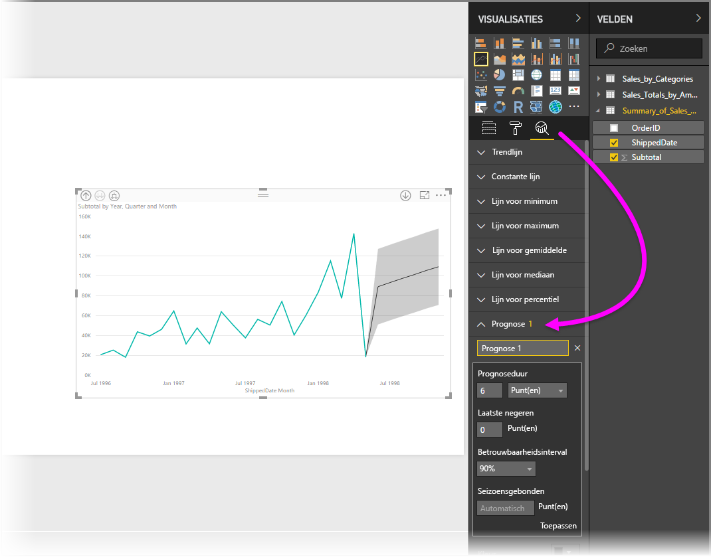

# Het deelvenster Analyse in Power BI Desktop gebruiken
Met het deelvenster **Analyse** in **Power BI Desktop** kunt u dynamische *referentielijnen* toevoegen aan visuele elementen en de aandacht richten op belangrijke trends of inzichten. Het deelvenster **Analyse** is te vinden in het gedeelte **Visualisaties** van Power BI Desktop.

> [!NOTE]
> Het deelvenster **Analyse** wordt alleen weergegeven wanneer u een visueel element op het canvas van Power BI Desktop selecteert.

## Zoeken binnen het deelvenster Analyse
Vanaf de release van **Power BI Desktop** van februari 2018 (versie 2.55.5010.201 of hoger), kunt u zoeken binnen het deelvenster **Analyse**, dat een subsectie is van het deelvenster **Visualisaties**. Zoals in de onderstaande afbeelding te zien is, verschijnt het zoekvak wanneer het deelvenster **Analyse** is geselecteerd.

## Het deelvenster Analyse gebruiken
Met het deelvenster **Analyse** kunt u de volgende soorten dynamische referentielijnen maken (niet alle lijnen zijn beschikbaar voor alle soorten visuals):

* Constante lijn voor de X-as
* Constante lijn voor de Y-as
* Lijn voor minimum
* Lijn voor maximum
* Lijn voor gemiddelde
* Lijn voor mediaan
* Lijn voor percentiel

In de volgende secties ziet u hoe u het deelvenster **Analyse** en dynamische referentielijnen kunt gebruiken in uw visualisaties.

Voer de volgende stappen uit als u de beschikbare dynamische referentielijnen voor een visueel element wilt weergeven:

1. Selecteer of maak een visueel element en selecteer vervolgens het pictogram **Analyse** in het gedeelte **Visualisaties**.
   
   
2. Selecteer de pijl-omlaag voor het type lijn dat u wilt maken om de opties ervoor uit te breiden. In dit geval selecteren we **Lijn voor gemiddelde**.
   
   
3. U voegt een nieuwe lijn toe door **+ Toevoegen** te selecteren. U kunt vervolgens een naam voor de lijn opgeven door te dubbelklikken op het tekstvak en daarna de naam te typen.
   
   U beschikt over allerlei opties voor de lijn, zoals *kleur*, *transparantie*, *stijl* en *positie* (ten opzichte van de gegevenselementen van de visual) selecteren en aangeven of een label moet worden toegevoegd. Maar nog belangrijker: u kunt selecteren op welke **meting** in de visual u de lijn wilt baseren door de vervolgkeuzelijst **Meting** te selecteren. Deze wordt automatisch gevuld met gegevenselementen uit de visual. In dit geval selecteren we *Weather* (Weer) als meting, voegen we het label *Average Weather* (Gemiddelde weer) toe en passen we enkele van de andere opties toe zoals hieronder wordt weergegeven.
   
   
4. Als u een gegevenslabel wilt weergeven, schakelt u de schuifregelaar **Gegevenslabel** in. Als u doet dit, krijgt u allerlei extra opties voor uw gegevenslabel, zoals wordt weergegeven in de volgende afbeelding.
   
   
5. Let op het getal dat wordt weergegeven naast het item **Lijn voor gemiddelde** in het deelvenster **Analyse**. Zo weet u hoeveel dynamische lijnen het visuele element momenteel bevat en van welk type. Als we een **Lijn voor maximum** toevoegen voor *Cost of Living* (Kosten van levensonderhoud), ziet u dat het deelvenster **Analyse** nu aangeeft dat ook een dynamische referentielijn van het type **Lijn voor maximum** is toegepast op dit visuele element.
   
   

Als op het visuele element dat u hebt geselecteerd (in dit geval een **kaart**) geen dynamische referentielijnen kunnen worden toegepast, ziet u het volgende wanneer u het deelvenster **Analyse** selecteert.

Er zijn allerlei interessante inzichten die u kunt benadrukken door dynamische referentielijnen te maken met het deelvenster **Analyse**.

We plannen meer functies en mogelijkheden, zoals uitbreiden op welke visuele elementen dynamische referentielijnen kunnen worden toegepast, dus kom regelmatig terug om te kijken wat er nieuw is.

## Prognose toepassen
U kunt de functie **Prognose** gebruiken door een visueel element te selecteren en vervolgens de sectie **Prognose** van het deelvenster **Analyse** uit te breiden. U kunt allerlei soorten invoer opgeven om de prognose te wijzigen, zoals *Prognoseduur*, *Betrouwbaarheidsinterval* en andere. In de volgende afbeelding ziet u een visueel element met een eenvoudige lijn waarop een prognose is toegepast, maar u kunt ook uw eigen verbeelding gebruiken (en experimenteren met de functie *Prognose*) om te zien hoe u deze kunt toepassen op uw modellen.

## Beperkingen
De mogelijkheid om dynamische referentielijnen te gebruiken is gebaseerd op het type visual dat wordt gebruikt. In de volgende lijst wordt aangegeven welke dynamische lijnen momenteel beschikbaar zijn voor welke visuele elementen:

Volledig gebruik van dynamische lijnen is beschikbaar voor de volgende visuals:

* Vlakdiagram
* Lijndiagram
* Spreidingsdiagram
* Gegroepeerd kolomdiagram
* Gegroepeerd staafdiagram

De volgende visuals kunnen alleen een *constante lijn* uit het deelvenster **Analyse** gebruiken:

* Gestapeld vlakdiagram
* Gestapeld staafdiagram
* Gestapeld kolomdiagram
* 100% gestapeld staafdiagram
* 100% gestapeld kolomdiagram

Voor de volgende visuals is een *trendlijn* momenteel de enige optie:

* Niet-gestapeld lijndiagram
* Gegroepeerd kolomdiagram

Tot slot kunnen voor niet-Cartesische visuals momenteel geen dynamische lijnen uit het deelvenster **Analyse** worden toegepast, zoals:

* Matrix
* Cirkeldiagram
* Ringdiagram
* Tabel

De percentiellijn is alleen beschikbaar wanneer geïmporteerde gegevens worden gebruikt in **Power BI Desktop** of wanneer er live verbinding is met een model op een server waarop **Analysis Service 2016** of hoger, **Azure Analysis Services** of een gegevensset op de Power BI-service wordt uitgevoerd. 

## Volgende stappen
U kunt allerlei handelingen uitvoeren met Power BI Desktop. Bekijk de volgende bronnen voor meer informatie over de vele mogelijkheden:

* [Wat is er nieuw in Power BI Desktop](desktop-latest-update.md)
* [Power BI Desktop downloaden](desktop-get-the-desktop.md)
* [Aan de slag met Power BI Desktop](desktop-getting-started.md)
* [Queryoverzicht met Power BI Desktop](desktop-query-overview.md)
* [Gegevenstypen in Power BI Desktop](desktop-data-types.md)
* [Gegevens vormgeven en combineren met Power BI Desktop](desktop-shape-and-combine-data.md)
* [Common Query Tasks in Power BI Desktop](desktop-common-query-tasks.md) (Algemene querytaken in Power BI Desktop)    

