# Bladwijzers gebruiken om inzichten te delen en verhalen te vertellen in Power BI 
Met behulp van **bladwijzers** in Power BI kunt u de momenteel geconfigureerde weergave van een rapportpagina vastleggen, inclusief filters en de status van visuals, en later terugkeren naar deze staat door eenvoudig de opgeslagen bladwijzer te selecteren. 

U kunt ook een verzameling bladwijzers maken, deze rangschikken in de gewenste volgorde en vervolgens de bladwijzers doorlopen in een presentatie om een reeks inzichten te markeren of uw verhaal te vertellen aan de hand van visuele elementen en rapporten. 

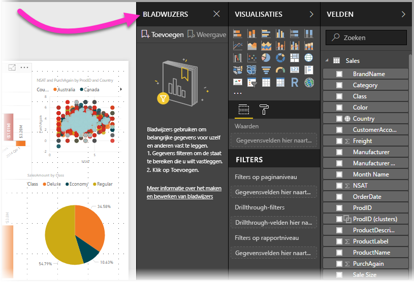

Er zijn vele toepassingen voor bladwijzers. U kunt ze gebruiken om uw eigen voortgang bij het maken van rapporten bij te houden (u kunt bladwijzers eenvoudig toevoegen, verwijderen en wijzigen) en u kunt bladwijzers maken om een PowerPoint-achtige presentatie te maken, waarbij u bladwijzers op volgorde doorloopt om zo met uw rapport een verhaal te vertellen. Er zijn mogelijk ook andere toepassingen, afhankelijk van hoe u bladwijzers het beste denkt te kunnen gebruiken.

### Preview-functie voor bladwijzers inschakelen (versies vóór maart 2018)
Met ingang van de versie van maart 2018 van Power BI Desktop zijn bladwijzers algemeen beschikbaar. 

We raden altijd aan om een upgrade naar de meest recente versie uit te voeren. Maar als uw Power BI Desktop-versie van vóór deze release is, kunt u de functie voor **bladwijzers** uitproberen vanaf de release van **oktober 2017** van **Power BI Desktop** en ook voor rapporten waarvoor bladwijzers zijn ingeschakeld in de **Power BI-service**. Als u de preview-functie wilt inschakelen, selecteert u **Bestand > Opties en instellingen > Opties > Voorbeeldfuncties** en schakelt u vervolgens het selectievakje naast **Bladwijzers** in. 

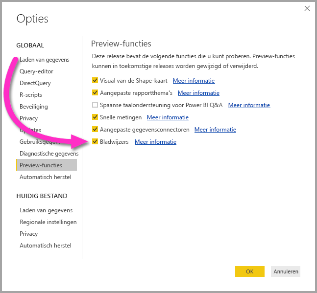

U moet **Power BI Desktop** opnieuw opstarten nadat u de selectie hebt gemaakt om de preview-versie in te schakelen voor bladwijzers.

## Bladwijzers gebruiken
Als u bladwijzers wilt gebruiken, selecteert u **Beeld** op het lint en schakelt u het selectievakje voor **Beeldvenster Bladwijzers** in. 

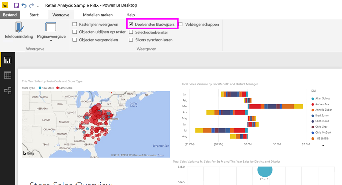

Wanneer u een bladwijzer maakt, worden de volgende elementen opgeslagen met de bladwijzer:

* De huidige pagina
* Filters
* Slicers, met inbegrip van het type slicer (bijvoorbeeld vervolgkeuzelijst of lijst) en de status van de slicer
* Selectiestatus van visual (zoals filters voor kruislings markeren)
* Sorteervolgorde
* Zoomlocatie
* Zichtbaarheid (van een object via het deelvenster **Selectie**)
* De focus- of **Spotlight**-modus van een zichtbaar object

Configureer een rapportpagina zoals u deze wilt weergeven in de bladwijzer. Zodra de rapportpagina en visuele elementen naar wens zijn gerangschikt, selecteert u **Toevoegen** in het deelvenster **Bladwijzers** om een bladwijzer toe te voegen. 

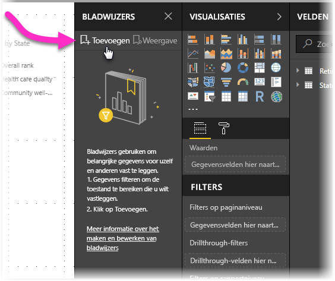

**Power BI Desktop** maakt een bladwijzer en geeft deze een algemene naam. U kunt gemakkelijk de *naam wijzigen* van een bladwijzer, een bladwijzer *verwijderen* of een bladwijzer *bijwerken* door de drie puntjes naast de naam van de bladwijzer te selecteren en een bewerking te selecteren in het menu dat wordt weergegeven.

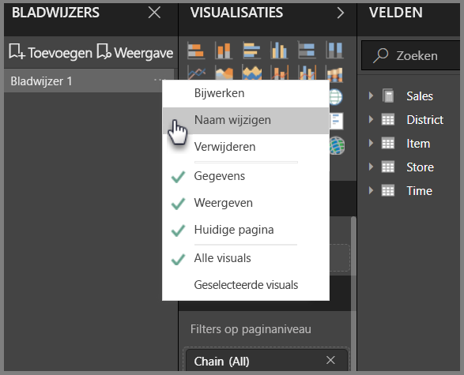

Nadat u een bladwijzer hebt gemaakt, kunt u deze weergeven door eenvoudig te klikken op de bladwijzer in het deelvenster **Bladwijzers**. 

U kunt ook kiezen of elke bladwijzer *gegevens*eigenschapen zal toepassen, zoals filters en slicers, de *weergave*-eigenschappen zoals spotlight en de zichtbaarheid ervan, en paginawijzigingen die de pagina tonen die zichtbaar was toen de bladwijzer werd toegevoegd. Deze mogelijkheden zijn nuttig wanneer u bladwijzers gebruikt om tussen rapportweergaven of visualisatieselecties te schakelen. In dat geval wilt u waarschijnlijk de gegevenseigenschappen uitschakelen, zodat filters niet opnieuw worden ingesteld als gebruikers wisselen van weergave door de selectie van een bladwijzer. 

Als u dergelijke wijzigingen wilt aanbrengen, kiest u de drie puntjes naast de naam van de bladwijzer, zoals in de vorige afbeelding, en (de)selecteert u de vinkjes bij *Gegevens*, *Weergave* en andere besturingselementen. 

## Bladwijzers ordenen
Wanneer u bladwijzers maakt, is de volgorde waarin u ze maakt mogelijk niet dezelfde volgorde waarin u ze aan uw publiek wilt laten zien. Geen probleem. U kunt eenvoudig de volgorde van bladwijzers wijzigen.

Versleep de bladwijzers in het deelvenster **Bladwijzers** om de volgorde te wijzigen, zoals in de volgende afbeelding. De gele balk tussen bladwijzers geeft aan waar de gesleepte bladwijzer wordt geplaatst.

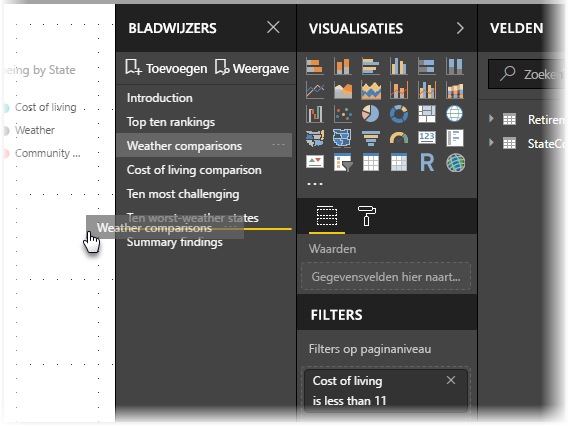

De volgorde van uw bladwijzers kan belangrijk zijn wanneer u de functie **Weergave** van bladwijzers gebruikt, zoals wordt beschreven in de volgende sectie.

## Bladwijzers als een diavoorstelling
Wanneer u een verzameling bladwijzers hebt die u in een bepaalde volgorde wilt presenteren, kunt u **Weergave** selecteren in het deelvenster **Bladwijzers** om een diavoorstelling te starten.

In de **weergavemodus** moet u op enkele dingen letten:

1. De naam van de bladwijzer wordt weergegeven in de bladwijzerbalk, onderaan op het canvas.
2. De bladwijzerbalk bevat pijlen waarmee u naar de volgende of vorige bladwijzer kunt gaan.
3. U kunt de **Weergavemodus** afsluiten door **Afsluiten** te selecteren in het deelvenster **Bladwijzers** of door de **X** op de bladwijzerbalk te selecteren. 

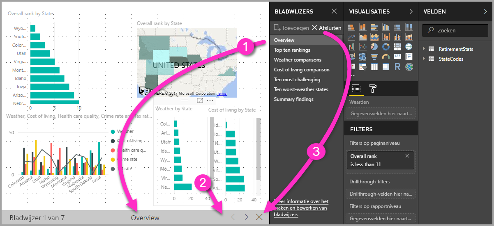

In de **weergavemodus** kunt u het deelvenster **Bladwijzers** sluiten (door te klikken op de X in dit deelvenster) om meer ruimte vrij te maken voor de presentatie. In de **Weergavemodus** zijn alle visuele elementen interactief en beschikbaar voor kruislingse markering, net zoals wanneer u er normaal mee werkt. 

## Zichtbaarheid via het selectiedeelvenster
Met de introductie van bladwijzers is tevens het nieuwe **selectiedeelvenster** geïntroduceerd. Het **Selectiedeelvenster** bevat een lijst met alle objecten op de huidige pagina. Hier kunt u het object selecteren en opgeven of een bepaald object zichtbaar is. 

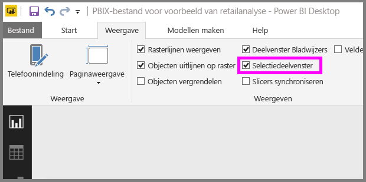

U kunt een object selecteren via het **selectiedeelvenster**. U kunt ook instellen of het object momenteel zichtbaar is door te klikken op het oogpictogram rechts van het visuele element. 

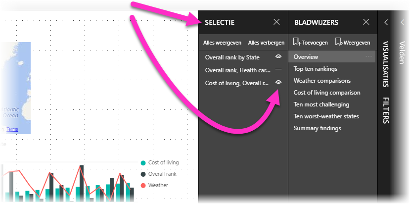

Wanneer een bladwijzer wordt toegevoegd, wordt de zichtbaarheidsstatus van elk object ook opgeslagen op basis van de instelling in het **selectiedeelvenster**. 

Het is belangrijk te weten dat **slicers** een rapportpagina blijven filteren, ongeacht of ze zichtbaar zijn. U kunt daardoor verschillende bladwijzers met verschillende slicerinstellingen maken en één rapportpagina maken die er verschillend uitziet (met verschillende inzichten) in meerdere bladwijzers.

## Bladwijzers voor vormen en afbeeldingen
U kunt ook vormen en afbeeldingen koppelen aan bladwijzers. Als u via deze functie op een object klikt, wordt de bladwijzer weergegeven die aan dat object is gekoppeld. Dit is vooral handig bij het werken met knoppen. U kunt meer te weten komen door het artikel over [knoppen gebruiken in Power BI](desktop-buttons.md) te lezen. 

Als u een bladwijzer wilt toewijzen aan een object, selecteert u het object en vouwt u vervolgens de sectie **Actie** in het deelvenster **Vorm opmaken** uit, zoals in de volgende afbeelding.

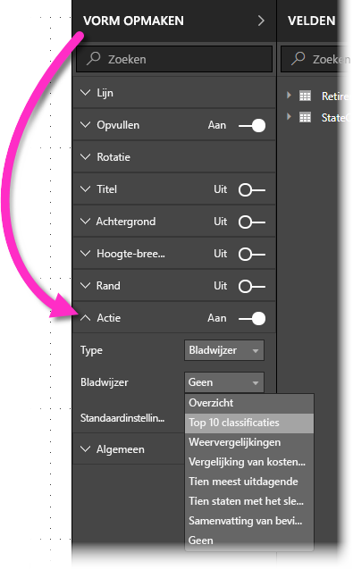

Nadat u de schuifregelaar **Actie** op **Aan** hebt gezet, kunt u selecteren of het object een terugknop, een bladwijzer of een Q&A-knop is. Als u bladwijzer selecteert, kunt u vervolgens de bladwijzer selecteren waaraan het object is gekoppeld.

U kunt allerlei interessante dingen doen met bladwijzers die aan objecten zijn gekoppeld. U kunt een visuele inhoudsopgave op de rapportpagina maken of u kunt verschillende weergaven (zoals visuele) van dezelfde gegevens maken door eenvoudig te klikken op een object.

In de bewerkingsmodus kunt u met ingedrukte CTRL-toets klikken om de koppeling te volgen. Als u niet in de bewerkingsmodus werkt, klikt u op het object om de koppeling te volgen. 

## Bladwijzergroepen

Sinds de release van augustus 2018 van **Power BI Desktop** kunt u bladwijzergroepen maken en gebruiken. De bladwijzergroep is een door u opgegeven verzameling bladwijzers, die kan worden weergegeven en ingedeeld als een groep. 

Als u een bladwijzergroep wilt maken, houdt u de CTRL-toets ingedrukt, selecteert u de bladwijzers die u wilt opnemen in de groep, klikt u vervolgens op de drie puntjes naast een van de geselecteerde bladwijzers en selecteert u **Groep** in het menu dat wordt weergegeven.

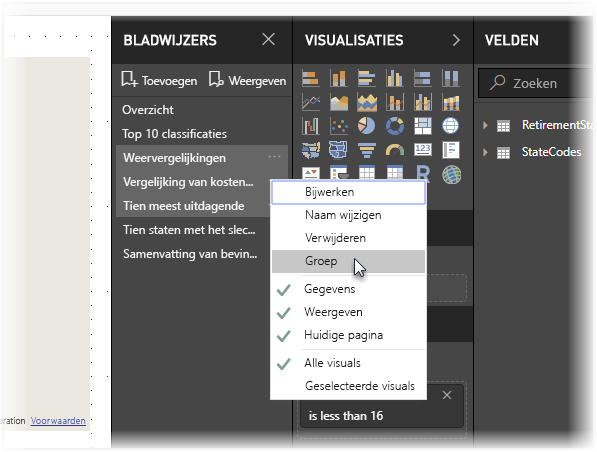

**Power BI Desktop** noemt de groep automatisch *Groep 1*. Gelukkig kunt u op de naam dubbelklikken en de naam wijzigen in wat u wilt.

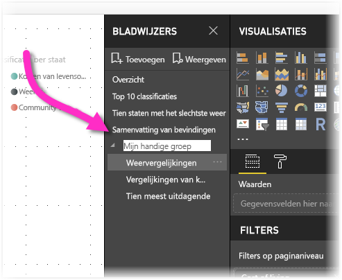

Wanneer u bij een bladwijzergroep op de naam van de bladwijzergroep klikt, wordt de bladwijzergroep alleen uitgevouwen of samengevouwen. De groep vormt op zichzelf geen bladwijzer. 

Wanneer u de functie **Weergeven** voor bladwijzers gebruikt, is het volgende van toepassing:

* Als de geselecteerde bladwijzer zich in een groep bevindt wanneer u **Weergeven** selecteert in Bladwijzers, worden alleen de bladwijzers *in die groep* weergegeven in de weergavesessie. 

* Als de geselecteerde bladwijzer zich niet in een groep bevindt, of als deze zich op het hoogste niveau bevindt (zoals de naam van een bladwijzergroep), dan worden alle bladwijzers voor het gehele rapport afgespeeld, met inbegrip van bladwijzers in een groep. 

Als u een bladwijzergroep wilt opheffen, selecteert u gewoon een bladwijzer in een groep, klikt u op het beletselteken en selecteert u vervolgens **Groep opheffen** in het menu dat wordt weergegeven. 

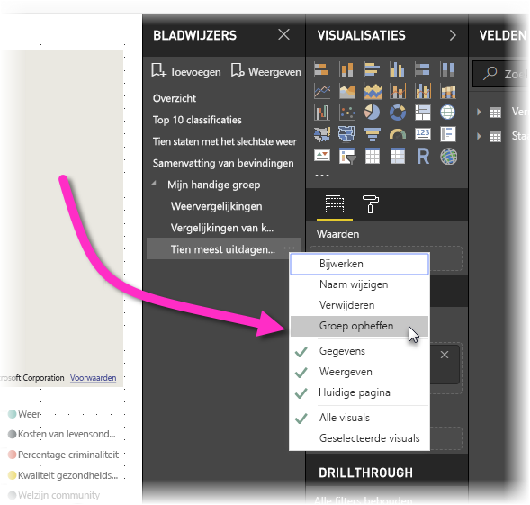

Houd er rekening mee dat, wanneer u **Groep opheffen** selecteert in een groep, alle bladwijzers uit de groep worden gehaald (de groep wordt verwijderd, maar niet de bladwijzers zelf). Als u dus een afzonderlijke bladwijzer uit een groep wilt verwijderen, moet u de **groep opheffen** voor alle leden van die groep, waarmee de groep wordt verwijderd. Daarna selecteert u de leden die u aan de nieuwe groep wilt toevoegen (houd CTRL ingedrukt terwijl u op elke bladwijzer klikt) en selecteert u opnieuw **Groep**. 

## Spotlight gebruiken
Een andere functie die is uitgebracht samen met bladwijzers, is **Spotlight**. Met **Spotlight** kunt u de aandacht vestigen op een specifieke grafiek, bijvoorbeeld wanneer u bladwijzers presenteert in de **weergavemodus**.

We vergelijken **Spotlight** met de **focusmodus** om te zien hoe ze verschillen.

1. In de **focusmodus** kunt u ervoor zorgen dat één visueel element het volledige canvas vult door het pictogram voor de **focusmodus** te selecteren.
2. Met **Spotlight** kunt u één visual in de oorspronkelijke grootte benadrukken door alle andere visuals op de pagina te laten vervagen, zodat ze bijna helemaal transparant zijn. 

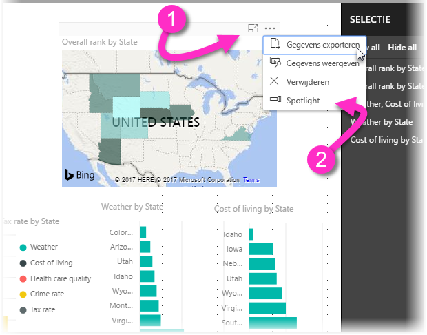

Wanneer wordt geklikt op het **focuspictogram** van het visuele element in de vorige afbeelding, ziet de pagina ziet er als volgt:

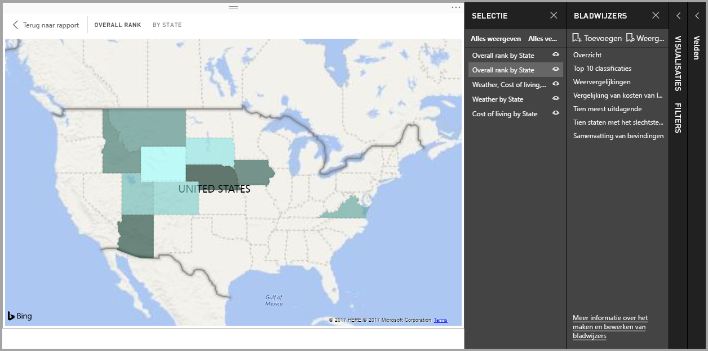

Als daarentegen **Spotlight** wordt geselecteerd in het menu van de visual, ziet de pagina er zo uit:

Als een van beide modi is geselecteerd wanneer een bladwijzer wordt toegevoegd, blijft die modus (focus of Spotlight) bewaard in de bladwijzer.

## Bladwijzers in de Power BI-service
Wanneer u een rapport met ten minste één bladwijzer publiceert naar de **Power BI-service**, kunt die bladwijzers zien en gebruiken in de **Power BI-service**. Als bladwijzers beschikbaar zijn in een rapport, kunt u **Beeld > Selectiedeelvenster** of **Beeld > Deelvenster Bladwijzers** selecteren om een van die deelvensters weer te geven.

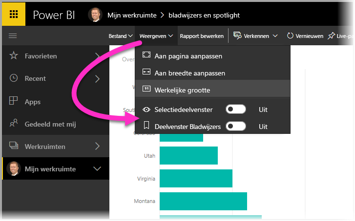

In de **Power BI-service** werkt het deelvenster **Bladwijzers** hetzelfde als in **Power BI Desktop**, inclusief de mogelijkheid om **Weergave** te selecteren om uw bladwijzers op volgorde weer te geven, zoals een diavoorstelling.

Let erop dat u de grijze bladwijzerbalk moet gebruiken om te navigeren door de bladwijzers en niet de zwarte pijlen (met de zwarte pijlen doorloopt u rapportpagina's, geen bladwijzers).

## Beperkingen en overwegingen
Houd rekening met de volgende beperkingen en overwegingen in deze release van **bladwijzers**.

* De meeste aangepaste visualisaties zouden goed met bladwijzers moeten werken. Als u problemen ondervindt met bladwijzers en een aangepaste visual, neem dan contact op met de maker van die aangepaste visual en vraag deze om ondersteuning voor bladwijzers toe te voegen. 
* Als u een visueel element toevoegt aan een rapportpagina nadat u een bladwijzer hebt gemaakt, wordt het visuele element weergegeven in de standaardstaat. Dit betekent ook dat als u een slicer toevoegt aan een pagina waarop u eerder bladwijzers hebt gemaakt, de slicer in de standaardstaat wordt uitgevoerd.
* Als visuele elementen worden verplaatst nadat een bladwijzer is gemaakt, wordt dit weerspiegeld in de bladwijzer. 

## Volgende stappen
Raadpleeg de volgende artikelen voor meer informatie over functies die vergelijkbaar zijn of samenwerken met bladwijzers:

* [Drillthrough gebruiken in Power BI Desktop](desktop-drillthrough.md)
* [Een dashboardtegel of rapportvisual weergeven in de focusmodus](consumer/end-user-focus.md)

