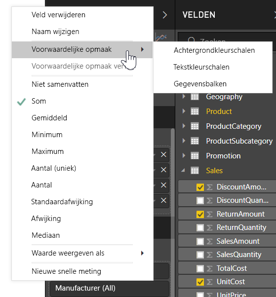
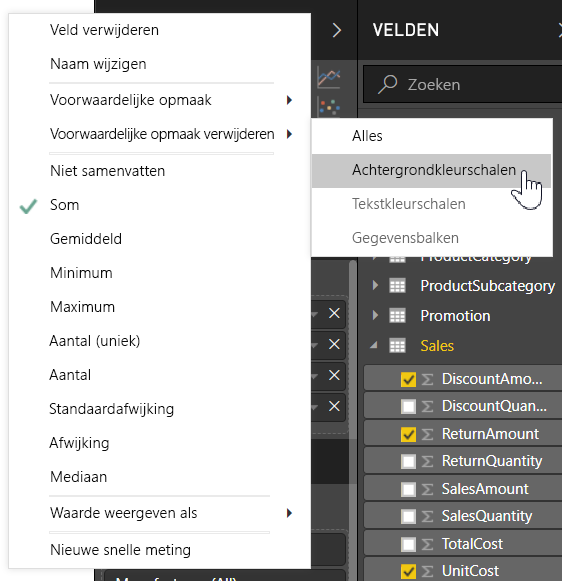
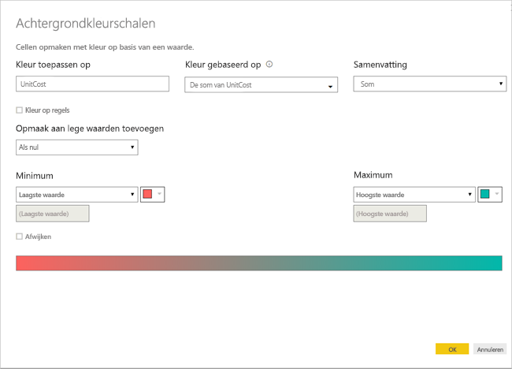
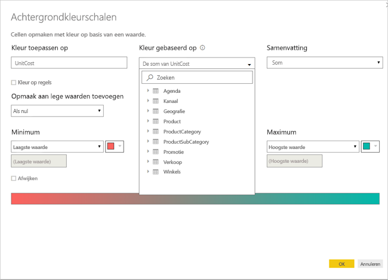
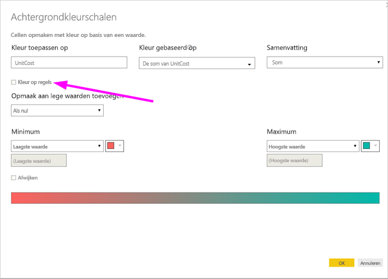
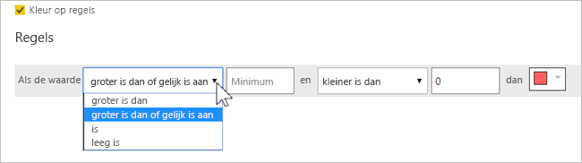
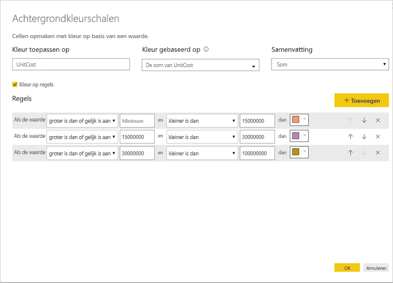
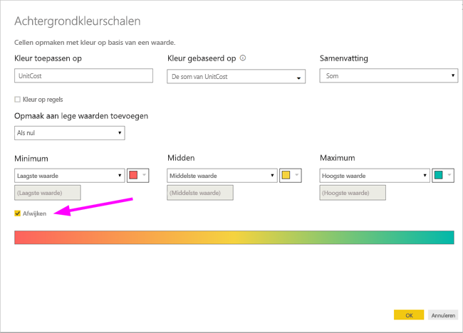
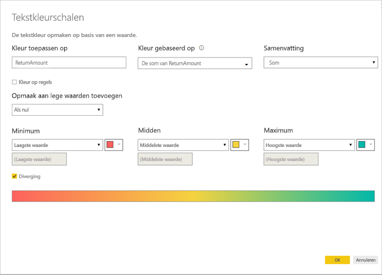
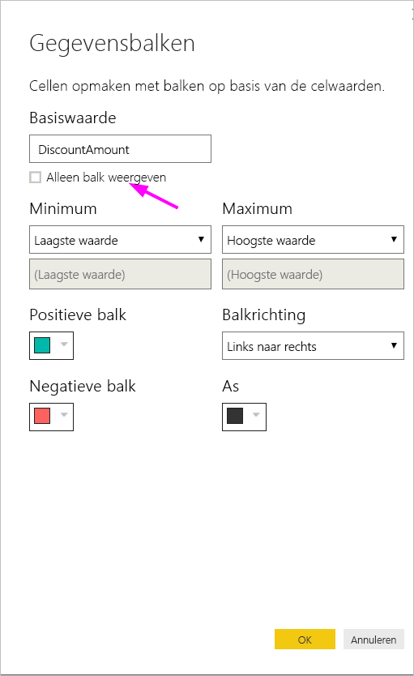

# Voorwaardelijke opmaak in tabellen 
Met voorwaardelijke opmaak voor tabellen kunt u aangepaste celkleuren opgeven op basis van celwaarden of op basis van andere waarden of velden, waaronder het gebruik van kleurovergangen. U kunt ook celwaarden met gegevensbalken weergeven. 

Selecteer voor toegang tot voorwaardelijke opmaak in het venster **Velden** van het deelvenster **Visualisaties** in Power BI Desktop de pijl omlaag naast de waarde in het venster **Waarden** die u wilt opmaken (of klik met de rechtermuisknop op het veld). U kunt voorwaardelijke opmaak alleen beheren voor velden in het gebied **Waarden** van het venster **Velden**.

In de volgende gedeelten worden deze drie voorwaardelijke opmaakopties behandeld. U kunt een of meer opties combineren in een afzonderlijke tabelkolom.

> [!NOTE]
> Wanneer voorwaardelijke opmaak wordt toegepast op een tabel, worden alle aangepaste tabelstijlen die zijn toegepast op de voorwaardelijk opgemaakte cellen overschreven.

Als u voorwaardelijke opmaak uit een visualisatie wilt verwijderen, klikt u eenvoudigweg opnieuw met de rechtermuisknop op het veld en selecteert u **Voorwaardelijke opmaak verwijderen**. Selecteer vervolgens het type opmaak dat u wilt verwijderen.

## Achtergrondkleurschalen

Wanneer u **Voorwaardelijke opmaak** en vervolgens **Achtergrondkleurschalen** selecteert, wordt het volgende dialoogvenster geopend.

U kunt een veld selecteren via uw gegevensmodel om daar de kleuren op te baseren door **Kleur gebaseerd op** in te stellen op dat veld. Daarnaast kunt u het aggregatietype opgeven voor het geselecteerde veld met de waarde **Samenvatting**. Het veld dat moet worden ingekleurd, wordt opgegeven in het veld **Kleur toepassen op**, zodat u dit kunt bijhouden. U kunt voorwaardelijke opmaak toepassen op tekst- en datumvelden, zo lang u maar een numerieke waarde als basis van de opmaak kiest.

Als u discrete kleurwaarden wilt gebruiken voor bepaalde waardebereiken, selecteert u **Kleur op regels**. Als u een kleurspectrum wilt gebruiken, laat u de optie **Kleur op regels** uitgeschakeld. 

### Kleur op regels

Wanneer u **Kleur op regels** selecteert, kunt u een of meer waardebereiken invoeren, elk met een ingestelde kleur.  Elk waardebereik begint met een voorwaarde met een *Als-waarde*, een voorwaarde met een *en*-waarde en een kleur.

Tabelcellen met waarden in elk bereik worden gevuld met de opgegeven kleur. De volgende afbeelding bevat drie regels.

De voorbeeldtabel ziet er nu als volgt uit:

### Minimum- tot maximumkleur

U kunt de waarden *Minimum* en *Maximum* en de bijbehorende kleuren configureren. Als u het vak **Afwijken** selecteert, kunt u desgewenst ook een waarde voor *Centreren* configureren.

De voorbeeldtabel ziet er nu als volgt uit:

## Tekstkleurschalen

Als u **Voorwaardelijke opmaak** en vervolgens **Tekstkleurschalen** selecteert, wordt het volgende dialoogvenster geopend. Dit dialoogvenster is vergelijkbaar met het dialoogvenster**Achtergrondkleurschalen**. Hiermee kunt u echter de tekstkleur wijzigen in plaats van de achtergrondkleur van de cel.

De voorbeeldtabel ziet er nu als volgt uit:

## Gegevensbalken

Als u **Voorwaardelijke opmaak** en vervolgens **Gegevensbalken** selecteert, wordt het volgende dialoogvenster geopend. 

Standaard is de optie **Alleen balk weergeven** niet ingeschakeld; de tabelcel toont dus zowel de balk als de daadwerkelijke waarde.

Als de optie **Alleen balk weergeven** is ingeschakeld, toont de tabelcel alleen de balk.

