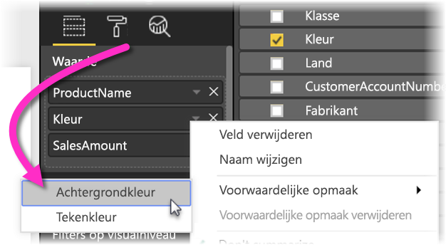
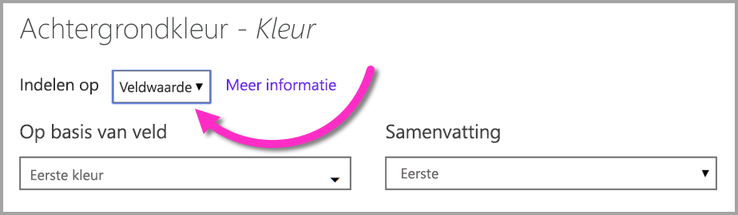
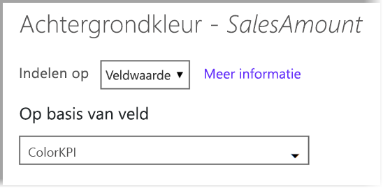

# Voorwaardelijke opmaak in tabellen 
Met voorwaardelijke opmaak voor tabellen kunt u aangepaste celkleuren opgeven op basis van celwaarden of op basis van andere waarden of velden, waaronder het gebruik van kleurovergangen. U kunt ook celwaarden met gegevensbalken weergeven. 

Selecteer voor toegang tot voorwaardelijke opmaak in het venster **Velden** van het deelvenster **Visualisaties** in Power BI Desktop de pijl omlaag naast de waarde in het venster **Waarden** die u wilt opmaken (of klik met de rechtermuisknop op het veld). U kunt voorwaardelijke opmaak alleen beheren voor velden in het gebied **Waarden** van het venster **Velden**.

In de volgende gedeelten worden deze voorwaardelijke opmaakopties behandeld. U kunt een of meer opties combineren in een afzonderlijke tabelkolom.

> [!NOTE]
> Wanneer voorwaardelijke opmaak wordt toegepast op een tabel, worden alle aangepaste tabelstijlen die zijn toegepast op de voorwaardelijk opgemaakte cellen overschreven.

Als u voorwaardelijke opmaak uit een visualisatie wilt verwijderen, klikt u eenvoudigweg opnieuw met de rechtermuisknop op het veld en selecteert u **Voorwaardelijke opmaak verwijderen**. Selecteer vervolgens het type opmaak dat u wilt verwijderen.

## Achtergrondkleurschalen

Wanneer u **Voorwaardelijke opmaak** en vervolgens **Achtergrondkleurschalen** selecteert, wordt het volgende dialoogvenster geopend.

U kunt een veld selecteren via uw gegevensmodel om daar de kleuren op te baseren door **Kleur gebaseerd op** in te stellen op dat veld. Daarnaast kunt u het aggregatietype opgeven voor het geselecteerde veld met de waarde **Samenvatting**. Het veld dat moet worden ingekleurd, wordt opgegeven in het veld **Kleur toepassen op**, zodat u dit kunt bijhouden. U kunt voorwaardelijke opmaak toepassen op tekst- en datumvelden, zo lang u maar een numerieke waarde als basis van de opmaak kiest.

Als u discrete kleurwaarden wilt gebruiken voor bepaalde waardebereiken, selecteert u **Kleur op regels**. Als u een kleurspectrum wilt gebruiken, laat u de optie **Kleur op regels** uitgeschakeld. 

### Kleur op regels

Wanneer u **Kleur op regels** selecteert, kunt u een of meer waardebereiken invoeren, elk met een ingestelde kleur.  Elk waardebereik begint met een voorwaarde met een *Als-waarde*, een voorwaarde met een *en*-waarde en een kleur.

Tabelcellen met waarden in elk bereik worden gevuld met de opgegeven kleur. De volgende afbeelding bevat drie regels.

De voorbeeldtabel ziet er nu als volgt uit:

### Minimum- tot maximumkleur

U kunt de waarden *Minimum* en *Maximum* en de bijbehorende kleuren configureren. Als u het vak **Afwijken** selecteert, kunt u desgewenst ook een waarde voor *Centreren* configureren.

De voorbeeldtabel ziet er nu als volgt uit:

## Tekstkleurschalen

Als u **Voorwaardelijke opmaak** en vervolgens **Tekstkleurschalen** selecteert, wordt het volgende dialoogvenster geopend. Dit dialoogvenster is vergelijkbaar met het dialoogvenster**Achtergrondkleurschalen**. Hiermee kunt u echter de tekstkleur wijzigen in plaats van de achtergrondkleur van de cel.

De voorbeeldtabel ziet er nu als volgt uit:

## Gegevensbalken

Als u **Voorwaardelijke opmaak** en vervolgens **Gegevensbalken** selecteert, wordt het volgende dialoogvenster geopend. 

Standaard is de optie **Alleen balk weergeven** niet ingeschakeld; de tabelcel toont dus zowel de balk als de daadwerkelijke waarde.

Als de optie **Alleen balk weergeven** is ingeschakeld, toont de tabelcel alleen de balk.

## Kleuropmaak op veldwaarde

U kunt een meting of een kolom waarin een kleur is opgegeven, gebruiken om die kleur via een tekstwaarde of een hex-code toe te passen op de achtergrond van de tekenkleur van een tabel of een matrixvisual. U kunt ook aangepaste logica voor een bepaald veld maken en ervoor zorgen dat deze logica de gewenste kleur toepast op het lettertype of de achtergrond.

Er is bijvoorbeeld in de volgende tabel een kleur gekoppeld aan elk productmodel. 

Als u die cel wilt opmaken op basis van de veldwaarde, selecteert u het dialoogvenster **Voorwaardelijke opmaak** door met de rechtermuisknop op de kolom *Kleur* te klikken voor deze visual en in dit geval in het menu **Achtergrondkleur** te selecteren. 

Selecteer in het dialoogvenster dat wordt weergegeven **Veldwaarde** in het vervolgkeuzevak **Opmaken door**, zoals wordt weergegeven in de volgende afbeelding.

U kunt deze procedure herhalen voor de tekenkleur, waarna het resultaat in de visual een effen kleur in de kolom **Kleur** wordt, zoals wordt weergegeven in het volgende scherm.

U kunt ook een DAX-berekening maken op basis van bedrijfslogica die verschillende hex-codes oplevert op basis van de voorwaarden van uw voorkeur. Dit is meestal gemakkelijker dan het maken van meerdere regels in het dialoogvenster voor voorwaardelijke opmaak. Bekijk het veld *ColorKPI* in de volgende voorbeeldafbeelding.

U kunt vervolgens de veldwaarde voor **Achtergrondkleur** op de volgende manier instellen.

En u kunt vervolgens resultaten als de volgende matrix krijgen.

Er zijn veel meer variaties die u kunt maken door gewoon gebruik te maken van uw eigen verbeelding en een beetje DAX.

## Volgende stappen
Raadpleeg voor meer informatie hete volgende artikel:  

* [Tips en trucs voor het gebruik van opmaak in Power BI](visuals/service-tips-and-tricks-for-color-formatting.md)  

