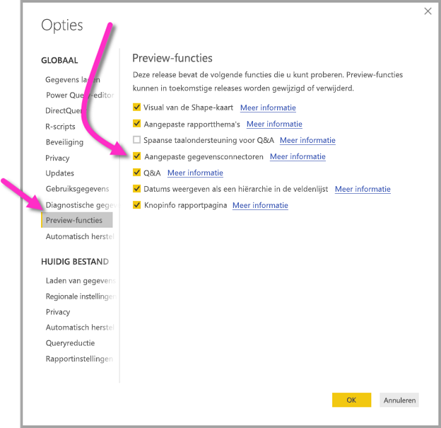

# Verbinding maken met gegevens die zijn gemaakt door Power BI-gegevensstromen in Power BI Desktop (preview)
In **Power BI Desktop** kunt u verbinding maken met gegevens die zijn gemaakt door **Power BI-gegevensstromen**, zoals met elke andere gegevensbron in Power BI Desktop.

Met de **Power BI-gegevensstromen (preview)** -connector kunt u verbinding maken met de entiteiten die zijn gemaakt door gegevensstromen in de Power BI-service. Aangezien gegevensstromen in preview zijn, zijn er enkele stappen die u moet uitvoeren om de connector gegevensstromen beschikbaar te maken op uw systeem. 

## De Power BI-gegevensstromen-connector (preview) downloaden en inschakelen

U moet een kopie van de **Power BI-gegevensstromen** -connector downloaden en vervolgens kopiëren naar een specifieke locatie op uw computer. In een geplande maandelijkse update voor Power BI Desktop, wordt de connector, automatisch opgenomen in de lijst met gegevensconnectors; deze stappen zijn dan niet meer nodig.

U kunt de **connector voor Power BI-gegevensstromen** hier downloaden: [connector voor Power BI-gegevensstromen](https://visuals.azureedge.net/cds-analytics/PublicPreview/CDSA.mez)

Voer de volgende stappen uit om de **Power BI-gegevensstromen**-connector (preview) beschikbaar te maken op uw computer:

1. Download een exemplaar van het .MEZ-bestand (het gegevensconnectorbestand). Privé-preview-klanten ontvangen informatie over het downloaden van het .MEZ-bestand rechtstreeks van Microsoft.

2. Plaats het gedownloade connectorbestand in de volgende map op uw computer: **Documenten > Power BI Desktop > Map voor aangepaste connectors**

3. Selecteer in Power BI Desktop **Bestand > Opties en Instellingen > opties** en selecteer vervolgens **Preview-functies** in het linkerdeelvenster.

    

4. Selecteer het vak **Aangepaste gegevensconnectors** als dit niet is geselecteerd. 

5. Start **Power BI Desktop** opnieuw op om de connector weer te geven.

## De connector voor Power BI-gegevensstromen (preview) gebruiken
Wanneer **Power BI Desktop** opnieuw is opgestart, wordt de connector weergegeven als een beschikbare gegevensbron. Om verbinding te maken met een datapool, selecteert u **Gegevens ophalen > Online Services > Power BI-gegevensstromen (bèta)**, zoals wordt weergegeven in de volgende afbeelding:

## Overwegingen en beperkingen

Om deze preview-versie van de **connector voor Power BI-gegevensstromen** te gebruiken, moet u de meest recente versie van **Power BI Desktop** uitvoeren. U kunt altijd [Power BI Desktop downloaden](desktop-get-the-desktop.md) en op uw computer installeren om ervoor te zorgen dat u de meest recente versie hebt.  

Opmerking: wanneer de connector voor Power BI-gegevensstromen wordt weergegeven in een geplande maandelijkse update van **Power BI Desktop**, *moet* u dit gedownload. MEZ-bestand verwijderen uit de map **Documenten > Power BI Desktop > Aangepaste connectors** om conflicten te voorkomen. 

## Volgende stappen
U kunt allerlei interessante dingen doen met Power BI-gegevensverbindingen. Er zijn ook artikelen over **Power BI Desktop** die handig kunnen zijn:

* [Data Sources in Power BI Desktop](desktop-data-sources.md) (Gegevensbronnen in Power BI Desktop)
* [Shape and Combine Data with Power BI Desktop](desktop-shape-and-combine-data.md) (Gegevens vormgeven en combineren met Power BI Desktop)
* [Enter data directly into Power BI Desktop](desktop-enter-data-directly-into-desktop.md) (Rechtstreeks gegevens in Power BI Desktop invoeren)   

