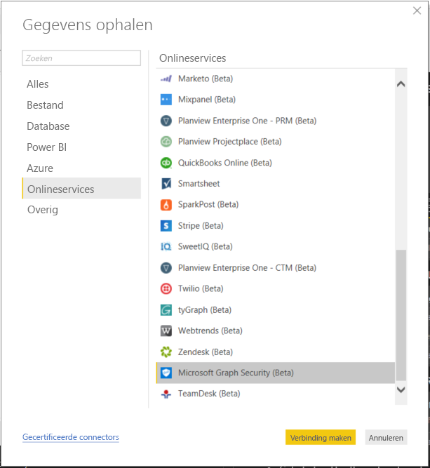
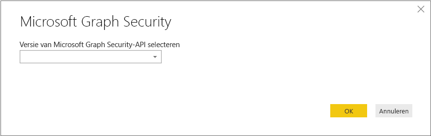
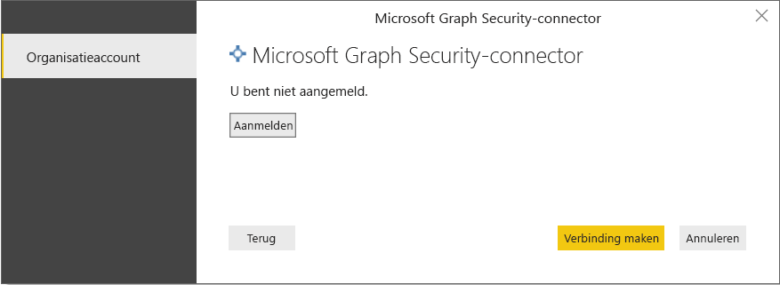
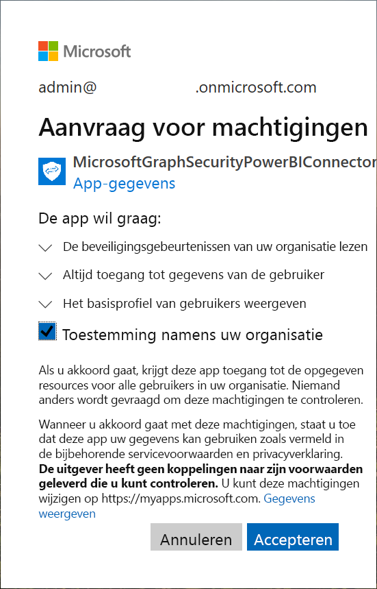
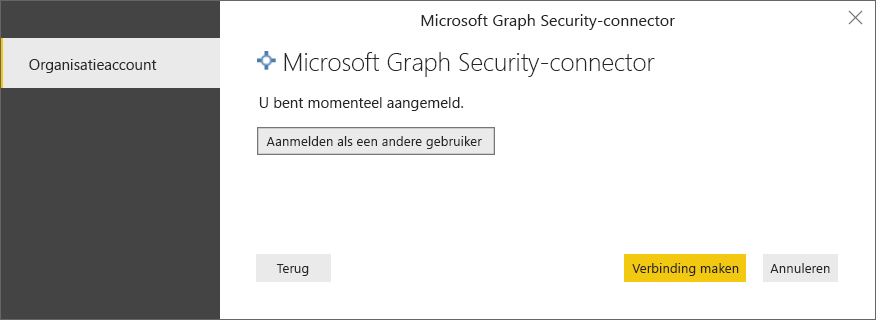
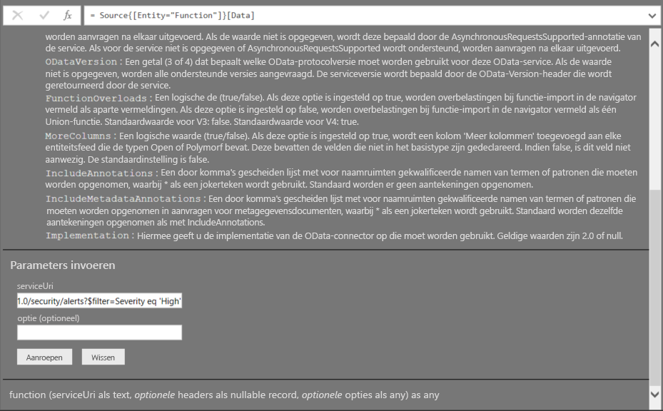
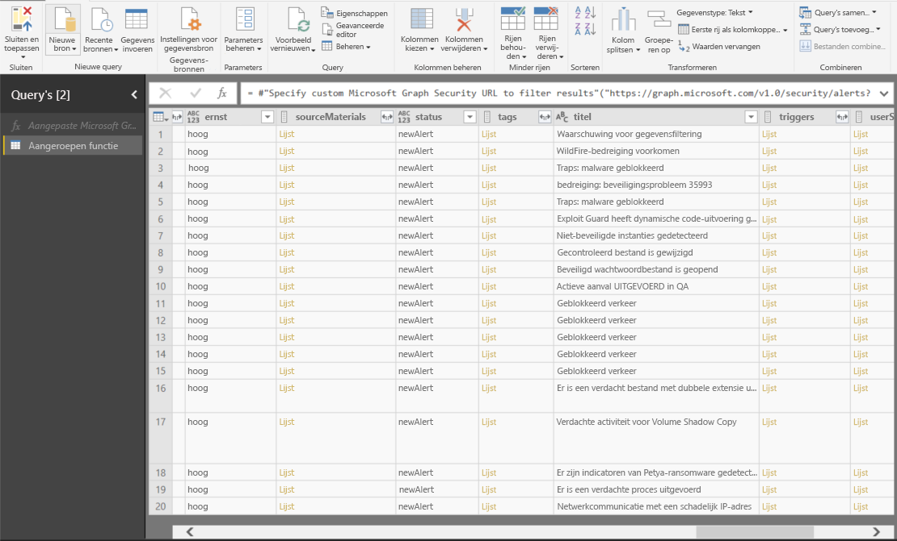

# Verbinding maken met Microsoft Graph Security in Power BI Desktop

U kunt Power BI Desktop gebruiken om met behulp van de Microsoft Graph Security Power BI-connector verbinding te maken met de Microsoft Graph Security-API. Hierdoor kunt u dashboards en rapporten maken om inzicht te krijgen in uw [beveiligingswaarschuwingen](https://docs.microsoft.com/graph/api/resources/alert?view=graph-rest-1.0) en [beveiligingsscore](https://docs.microsoft.com/graph/api/resources/securescores?view=graph-rest-beta). Met de [Microsoft Graph Security-API](https://aka.ms/graphsecuritydocs) verbindt u [meerdere beveiligingsoplossingen](https://aka.ms/graphsecurityalerts) van Microsoft en ecosysteempartners met elkaar om waarschuwingen eenvoudig te correleren, toegang te bieden tot uitgebreide contextuele informatie en automatisering te vereenvoudigen. Organisaties kunnen hierdoor snel inzicht krijgen in al hun beveiligingsproducten en actie ondernemen terwijl ze de kosten en complexiteit van het bouwen en onderhouden van meerdere integraties beperken.

## Vereisten om verbinding te maken met de Microsoft Graph Security-connector

* Als u de Microsoft Graph Security-connector wilt gebruiken, moet u de Azure Active Directory (AD) *expliciet tenantbeheerderstoestemming hebben gegeven*, als onderdeel van de [Microsoft Graph Security-verificatievereisten](https://aka.ms/graphsecurityauth). Voor deze toestemming hebt u de toepassings-id en naam van de Microsoft Graph Security Power BI-connector nodig, die u ook kunt vinden in [Azure Portal](https://portal.azure.com):

   | Eigenschap | Waarde |
   |----------|-------|
   | **Toepassingsnaam** | `MicrosoftGraphSecurityPowerBIConnector` |
   | **Toepassings-id** | `cab163b7-247d-4cb9-be32-39b6056d4189` |
   |||

   Uw Microsoft Azure Active Directory-tenantbeheerder kan een van de volgende stappen volgen om toestemming te geven voor de connector:

   * [Geef toestemming van de tenant-beheerder voor Azure AD-toepassingen](https://docs.microsoft.com/azure/active-directory/develop/v2-permissions-and-consent).

   * Tijdens de eerste uitvoering van uw logische app, kan uw app toestemming vragen aan uw Azure AD-tenantbeheerder via de [toestemmingservaring van de toepassing](https://docs.microsoft.com/azure/active-directory/develop/application-consent-experience).
   
* Het gebruikersaccount dat is gebruikt voor aanmelding om verbinding te maken met de Microsoft Graph Security Power BI-connector moet lid zijn van de rol Beperkte beheerder-beveiligingslezer in Azure AD (ofwel beveiligingslezer ofwel beveiligingsbeheerder). Volg de stappen in de sectie [Azure AD-rollen toewijzen aan gebruikers](https://docs.microsoft.com/graph/security-authorization#assign-azure-ad-roles-to-users). 

## De Microsoft Graph-Security-connector gebruiken

Volg deze stappen om gebruik te maken van de connector **Microsoft Graph Security**:

1. Selecteer **Gegevens ophalen -> Meer...** in het lint **Start** van Power BI Desktop.
2. Selecteer **Onlineservices** in de categorieën aan de linkerkant.
3. Klik op **Microsoft Graph Security (Bèta)**.

    
    
4. Selecteer in het venster **Microsoft Graph Security** dat wordt geopend, de Microsoft Graph API-versie waarop query's moeten worden uitgevoerd. De opties zijn v1.0 en bèta.

    
    
5. Meld u desgevraagd aan bij uw Azure Active Directory-account. Dit account moet de rol **Beveiligingslezer** hebben, zoals vermeld in de bovenstaande sectie met vereisten.

    
    
6. Als u de tenantbeheerder bent **en** als u de Microsoft Graph Security Power BI-connector (toepassing) nog geen toestemming hebt gegeven overeenkomstig de vereisten, wordt het volgende dialoogvenster geopend. Selecteer **Toestemming namens uw organisatie**.

    
    
7. Wanneer u bent aangemeld, wordt in het volgende venster aangegeven dat u bent geverifieerd. Selecteer **Verbinding maken**.

    
    
8. Nadat u bent verbonden, wordt er als volgt een **Navigator**-venster geopend met de entiteiten, zoals waarschuwingen, die beschikbaar zijn in de [Microsoft Graph Security-API](https://aka.ms/graphsecuritydocs) voor de versie die u in de vorige stappen hebt geselecteerd. Selecteer een of meer entiteiten die u wilt importeren en gebruiken in **Power BI Desktop**. Klik op **Laden** om het resultaat van stap 10 te krijgen.

   
    
9. Als u een geavanceerde query wilt maken voor de Microsoft Graph Security-API, selecteert u de functie **Aangepaste Microsoft Graph Security-URL opgeven om resultaten te filteren**. Hierdoor kunt u een [OData.Feed](https://docs.microsoft.com/power-bi/desktop-connect-odata)-query voor de Microsoft Graph Security-API maken met de vereiste machtigingen voor toegang tot de API.

   > [!NOTE]
   > De hieronder gebruikte voorbeeld-serviceUri is `https://graph.microsoft.com/v1.0/security/alerts?$filter=Severity eq 'High'`. Raadpleeg de [Door Graph ondersteunde ODATA-queryparameters](https://docs.microsoft.com/graph/query-parameters) om query's te maken om de nieuwste resultaten te filteren, te rangschikken of op te halen.

   
    
   Wanneer u **Aanroepen** selecteert, wordt via de functie OData.Feed de API aangeroepen. Hiermee wordt de Query-editor geopend zodat u de te gebruiken gegevensset kunt filteren en verfijnen en u deze verfijnde gegevensset vervolgens in Power BI Desktop kunt laden.

10. De volgende afbeelding toont het resultaatvenster voor de Microsoft Graph Security-entiteit(en) waarvoor u een query hebt uitgevoerd.

   
    

U bent nu klaar om de geïmporteerde gegevens uit de Microsoft Graph Security-connector in Power BI Desktop te gebruiken om visuals of rapporten te maken of te werken met andere gegevens waarmee u verbinding wilt maken en die u wilt importeren, zoals andere Excel-werkmappen, databases of een andere gegevensbron.

## Volgende stappen
* Bekijk met behulp van deze connector Power BI-voorbeelden en -sjablonen in de [Microsoft Graph Security GitHub Power BI-voorbeeldopslagplaats](https://aka.ms/graphsecuritypowerbiconnectorsamples).

* Bekijk enkele gebruikersscenario's en aanvullende informatie in het [Blogbericht over de Microsoft Graph Security Power BI-connector](https://aka.ms/graphsecuritypowerbiconnectorblogpost).

* Met Power BI Desktop kunt u verbinding maken met allerlei andere gegevens. Bekijk de volgende bronnen voor meer informatie over gegevensbronnen:

    * [Wat is Power BI Desktop?](desktop-what-is-desktop.md)
    * [Data Sources in Power BI Desktop](desktop-data-sources.md) (Gegevensbronnen in Power BI Desktop)
    * [Shape and Combine Data with Power BI Desktop](desktop-shape-and-combine-data.md) (Gegevens vormgeven en combineren met Power BI Desktop)
    * [Connect to Excel workbooks in Power BI Desktop](desktop-connect-excel.md) (Verbinding maken met Excel-werkmappen in Power BI Desktop)
    * [Enter data directly into Power BI Desktop](desktop-enter-data-directly-into-desktop.md) (Rechtstreeks gegevens in Power BI Desktop invoeren)
